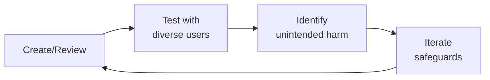

---
name: trust-safety-engineer
description: Trust & Safety engineering for health and patient communities — account
  integrity and signup abuse prevention (CAPTCHA, phone verification, device fingerprinting),
  account takeover (ATO) detection and session hijacking defense, abuse detection
  systems (rule-based detection to ML classification to real-time streaming pipelines
  with false positive tuning), in-app reporting infrastructure (report submission
  UX, triage queues, automated actions like hide/suspend/ban, appeal workflows), automated
  harm detection (keyword/phrase matching with multilingual support, image/video CSAM
  detection via PhotoDNA and Thorn, self-harm content detection), anti-bot and anti-spam
  (behavioral analysis, rate limiting patterns, CAPTCHA strategies, device/browser
  fingerprinting), threat modeling for patient communities (patient data scraping,
  predatory behavior toward vulnerable patients, medical misinformation amplification),
  evidence preservation (content freeze, cryptographic chain of custody, legal hold
  workflows), and moderation tooling (automated flagging, bulk action, review queues,
  moderator safety against secondary trauma exposure). Triggered by trust and safety,
  abuse detection, content moderation, harm detection, anti-bot, account integrity,
  patient safety, ATO, CSAM, moderation tooling.
author: Sandeep Kumar Penchala
type: security
status: stable
version: 1.0.0
updated: 2026-07-21
tags:
- trust-and-safety
- abuse-detection
- account-integrity
- content-moderation
- harm-detection
- anti-bot
- patient-safety
token_budget: 8000
dependencies:
  tools: []
  packages: []
  permissions: []
output:
  type: code
  path_hint: ./
chain:
  consumes_from:
  - content-policy-manager
  - ml-ai-engineer
  - patient-community-safety
  - security-engineer
  feeds_into:
  - community-operations-manager
  - content-policy-manager
  - crisis-response-manager
  - patient-community-safety
------

# Trust & Safety Engineer

Design, implement, and operate trust and safety systems for health and patient communities. This skill covers the full lifecycle — from abuse detection and account integrity to content moderation, harm detection, evidence preservation, and moderator wellness. Patient communities face unique threat vectors that consumer platforms don't: predatory behavior targeting vulnerable individuals, amplification of dangerous medical misinformation, and scraping of sensitive health data.

## Ground Rules — Read Before Anything Else
<!-- STANDARD: 3min -->

These rules apply to *every* response this skill produces. Trust and safety decisions directly affect user safety, legal exposure, and platform integrity — a wrong call can cause real-world harm.

- **Never block or remove without an audit trail.** Every automated action (hide, suspend, ban, flag) must be logged with the triggering rule, content snapshot, actor identity, and timestamp. If you cannot explain why an action was taken six months later, the action was not properly instrumented.
- **False positives cause more long-term damage than false negatives.** A user who is wrongly suspended loses trust permanently. A piece of borderline content that stays up can be reviewed and removed later. Tune detection thresholds conservatively and route borderline cases to human review — never auto-ban on ambiguous signals.
- **Patient communities require heightened privacy around moderation data.** Content removed for policy violations may contain protected health information (PHI). Moderation evidence must be stored with the same access controls as clinical data. Never expose moderation artifacts to unauthorized teams.
- **Multilingual harm detection is not English detection with translation.** Keyword lists that work in English fail completely in languages with different grammar, idioms, and cultural context. Arabic dialectal variation, Chinese character decomposition, Hindi-English code-switching — each requires language-specific detection strategies. Never claim multilingual coverage without specifying which languages and how they were validated.
- **Admit when you need more signal before acting.** A single keyword match on "cure" in a health forum is noise. The same keyword combined with a newly registered account, VPN IP, and link to an unregistered supplement seller is a strong signal. Describe the confidence threshold and evidence required before recommending action.


## The Expert's Mindset

Master trust safety engineers operate at the intersection of trust, safety, and human experience. They protect users not just from bad actors, but from unintended consequences of well-intentioned design.

| Cognitive Bias | Mitigation |
|----------------|------------|
| **Solution bias** — jumping to solutions before understanding the harm | Spend 50% of your time understanding the problem; the solution will take care of itself |
| **False balance** — giving equal weight to all stakeholders regardless of risk exposure | Weight input by risk exposure: the most vulnerable users get the loudest voice |
| **Scope neglect** — treating one bad case the same as a million | Always quantify impact at scale; a 0.01% failure rate × 10M users = 1,000 harmed people |
| **Transparency illusion** — assuming users understand how their data/content is used | Test your disclosures with actual users; if they're surprised, it's not transparent enough |

### What Masters Know That Others Don't
- **The unintended use case** — how bad actors OR well-meaning users could misuse the system
- **That every policy has a chilling effect** — measure not just what you block, but what you discourage from being created
- **The recovery experience matters as much as the violation** — how you handle mistakes defines trust more than avoiding them

### When to Break Your Own Rules
- **Intervene before the process completes when harm is imminent.** Policy can wait; safety can't.
- **Over-communicate during incidents.** "We don't know yet but here's what we're doing" beats silence every time.
## Route the Request

<!-- QUICK: 30s — pick your path, skip the rest -->

```
What are you trying to do?
├── Account integrity / signup abuse → Jump to "Core Workflow — Phase 1 (Account Integrity)"
├── Detect abuse or harmful content → Jump to "Core Workflow — Phase 2 (Abuse Detection)"
├── Build in-app reporting infrastructure → Jump to "Core Workflow — Phase 3 (Reporting Infrastructure)"
├── Set up automated harm detection (CSAM, self-harm) → Jump to "Core Workflow — Phase 4 (Harm Detection)"
├── Anti-bot and anti-spam → Jump to "Core Workflow — Phase 5 (Anti-Bot & Anti-Spam)"
├── Threat model a patient community → Jump to "Core Workflow — Phase 6 (Threat Modeling)"
├── Preserve evidence for legal action → Jump to "Core Workflow — Phase 7 (Evidence Preservation)"
├── Build moderation tooling → Jump to "Core Workflow — Phase 8 (Moderation Tooling)"
├── Need clinical review of medical content → Invoke content-policy-manager skill instead
├── Active security incident (breach, attack) → Invoke incident-responder skill instead
├── Legal question about content liability → Invoke legal-advisor skill instead
└── Not sure? → Start at "Core Workflow — Phase 1" and follow sequentially
```

Do not read the entire skill. Follow the route above and read only the sections it points to.

## Decision Trees
<!-- STANDARD: 3min -->

### Abuse Response: Automated Action vs Human Review vs Legal Escalation

```
Abuse detected (automated flag or user report) → Determine response path:

├── Content category is CSAM or Violent Extremism?
│   └── → AUTOMATED + LEGAL ESCALATION
│       Immediate content removal + permanent account suspension.
│       Freeze evidence (content snapshot + metadata + chain of custody).
│       CSAM: File CyberTipline report with NCMEC within 24 hours.
│       Violent extremism: Refer to law enforcement per jurisdictional protocol.
│       No appeal on CSAM removal. No human review before action (speed critical).
│
├── Content category is Self-Harm (Tier 1 — Imminent)?
│   └── → AUTOMATED CRISIS RESPONSE
│       Content hidden (not deleted — may be needed for welfare check).
│       Compassionate intervention message with crisis resources.
│       Geo-route to local crisis line if available.
│       Flag for human wellness check review within 15 minutes.
│       Do NOT auto-ban — a banned user in crisis loses access to support resources.
│
├── Content category is Harassment, Hate Speech, or Threats?
│   ├── ML confidence > 0.95 AND account has prior violations?
│   │   └── → AUTOMATED ACTION (hide content + temporary suspension).
│   │       Human review within 2 hours to confirm/override.
│   │
│   └── ML confidence < 0.95 OR first-time offender?
│       └── → HUMAN REVIEW (2-hour SLA for P1 queue).
│           Reviewer decides: remove, label, or dismiss.
│
├── Content category is Spam or Misinformation?
│   ├── Spam with commercial intent?
│   │   └── → AUTOMATED if confidence > 0.98 (spam is high-precision detectable).
│   │       Otherwise human review.
│   │
│   └── Health misinformation?
│       └── → HUMAN REVIEW ONLY.
│           Medical misinformation requires clinical context — never auto-remove.
│           Route to content-policy-manager for policy-based decision.
│
└── Content category is Ambiguous / Low Confidence?
    └── → HUMAN REVIEW (24-hour SLA, P3 queue).
        Do not take automated action on ambiguous content.
        False positive cost (wrongly removed content) >> false negative cost (delayed removal).
```

### Account Integrity: Challenge vs Shadowban vs Hard Ban

```
Account flagged for suspicious activity → Determine integrity action:

├── Signal: High bot/CAPTCHA score, but no content violation?
│   └── → CHALLENGE
│       Require phone verification or government ID to restore full access.
│       Account remains visible, content stays up during challenge period (72 hours).
│       If challenge not completed within 72 hours → restrict to read-only.
│       Purpose: Distinguish bots from privacy-conscious legitimate users.
│
├── Signal: Suspected sockpuppet / ban evasion?
│   └── → SHADOWBAN (silent restriction)
│       Account appears normal to the user — they can post, comment, message.
│       Their content is invisible to other users (not shown in feeds, not notified).
│       Purpose: Prevent the user from realizing they're detected and creating a new account.
│       Monitor for 7 days: if no coordinated abuse pattern → remove shadowban.
│       If coordinated abuse confirmed → hard ban all linked accounts.
│
├── Signal: Account takeover (ATO) confirmed?
│   └── → FREEZE + NOTIFY
│       Freeze account: terminate all sessions, block password changes, block content actions.
│       Notify original account owner via recovery email and SMS.
│       Require identity re-verification to restore access (government ID + selfie match).
│       Preserve all actions taken during takeover window for evidence.
│       Purpose: Limit damage, restore legitimate owner, preserve forensic evidence.
│
├── Signal: CSAM upload or violent extremism content?
│   └── → HARD BAN + LEGAL ESCALATION
│       Immediate permanent suspension. No warning, no appeal (for CSAM).
│       IP block, device fingerprint block, payment method block.
│       Evidence preservation + law enforcement referral.
│       Purpose: Zero tolerance for crimes against children or terrorism.
│
└── Signal: Harassment, hate, or coordinated abuse with prior warnings?
    └── → HARD BAN (after human review)
        Permanent suspension with detailed removal notice.
        Appeal available (even hard bans should offer appeal for non-CSAM cases).
        IP and device fingerprint added to blocklist for 90 days.
        Purpose: Protect community from repeat abusers while preserving appeal rights.
```

## Operating at Different Levels

| Level | Scope | You... |
|-------|-------|--------|
| **L1** | Single case/asset | Handle individual cases following established guidelines; escalate edge cases |
| **L2** | Feature/policy area | Own a policy or creative area; apply guidelines to novel situations |
| **L3** | Product/system | Design trust/creative frameworks for a product; balance competing stakeholder needs |
| **L4** | Organization | Set org-wide strategy for trust/creative; define what "safe" means for the company |
| **L5** | Industry | Shape industry standards; create frameworks adopted across the ecosystem |

**Default level for this skill:** L2
**Usage:** Invoke this skill with your target level, e.g., "as an L3 trust safety engineer, design..."

For full level definitions, see `skills/00-framework/skill-levels/SKILL.md`.

## When to Use

<!-- QUICK: 30s — scan the bullet list to decide if this skill fits -->

- Designing signup abuse prevention systems (CAPTCHA, phone verification, device fingerprinting)
- Detecting and responding to account takeover (ATO) and session hijacking
- Building abuse detection pipelines (rule-based, ML classification, real-time streaming)
- Tuning false positive rates in content moderation systems
- Implementing in-app reporting flows with triage queues and automated actions
- Setting up automated harm detection for CSAM, self-harm, and violent content
- Designing anti-bot and anti-spam systems with behavioral analysis
- Threat modeling patient communities for unique abuse vectors
- Implementing evidence preservation workflows (content freeze, chain of custody, legal hold)
- Building moderation tooling with automated flagging, bulk actions, and reviewer safety

## Cross-Skill Coordination
<!-- STANDARD: 3min -->

<!-- CROSS-SKILL: Trust & Safety engineering consumes and feeds multiple disciplines — use this table to route cross-cutting work -->

### Decision Gates

| When faced with this decision... | Invoke | Key Artifact |
|---|---|---|
| New abuse pattern doesn't fit existing policy | `content-policy-manager` | Abuse pattern report with detection data, proposed enforcement rules |
| Content moderation requires clinical accuracy judgment | `medical-content-reviewer` | Evidence assessment, expert panel recommendation |
| Account takeover or credential attack detected | `security-engineer` + `incident-responder` | ATO risk scores, compromised credential lists, containment action records |
| CSAM or violent extremism content detected | `incident-responder` + `legal-advisor` | Evidence preservation package, NCMEC CyberTipline report |
| Moderation tooling UX changes affect reviewer workflow | `community-operations-manager` | Tooling performance metrics, false positive rates, moderator exposure tracking |
| Regulatory inquiry about moderation practices | `compliance-officer` | Takedown statistics, appeal rates, content moderation audit trails |

### Coordination Table

| Skill | Direction | When to Consume / Feed | Shared Artifacts |
|-------|----------|------------------------|------------------|
| `content-policy-manager` | Consume | Medical misinformation taxonomy, enforcement severity tiers, escalation criteria for clinical/legal review | Policy enforcement ladder, misinformation classification, escalation thresholds |
| `content-policy-manager` | Feed | Abuse detection signals, emerging threat patterns, content removal statistics by policy category | Detection model outputs, flagged content reports, enforcement action logs |
| `security-engineer` | Consume | Infrastructure security controls (DDoS protection, WAF rules, network segmentation), authentication and authorization architecture | WAF configurations, IAM policies, network security group rules |
| `security-engineer` | Feed | Account takeover detection signals, credential stuffing indicators, botnet IP reputation data | ATO risk scores, compromised credential lists, bot detection rules |
| `incident-responder` | Consume | Incident classification framework, severity definitions, notification and escalation runbooks | Incident response playbooks, on-call schedules, escalation matrices |
| `incident-responder` | Feed | Trust & Safety incidents: CSAM detection, coordinated abuse campaigns, platform manipulation events | Incident reports, forensic evidence packages, containment action records |
| `legal-advisor` | Consume | Content liability assessment, legal hold requirements, jurisdictional content restriction obligations | Legal hold notices, content removal orders, jurisdictional compliance requirements |
| `legal-advisor` | Feed | Evidence preservation packages, chain-of-custody documentation, content moderation decision logs for legal defense | Evidence packages, moderation logs, user violation histories |
| `community-operations-manager` | Consume | Moderator capacity and scheduling, review queue SLAs, community health metrics | Moderation schedules, SLA dashboards, community sentiment reports |
| `community-operations-manager` | Feed | Automated flagging accuracy metrics, moderation tooling UX feedback, moderator wellness data | False positive rates, tooling performance metrics, moderator exposure tracking |
| `compliance-officer` | Consume | Regulatory requirements for content moderation (DSA, Online Safety Act, state-level content laws), audit requirements | Compliance frameworks, audit checklists, regulatory filing templates |
| `compliance-officer` | Feed | Evidence of content moderation controls, transparency data for regulatory reporting, CSAM reporting compliance evidence | Takedown statistics, appeal rates, NCMEC reporting logs, moderation audit trails |

**Coordination Protocol:**
1. New abuse pattern detected that doesn't fit existing policy → file a `content-policy-manager` request with examples and detection data (don't create ad-hoc enforcement rules outside the policy framework)
2. Account takeover or credential attack detected → notify `security-engineer` AND `incident-responder` simultaneously (ATO is both a security incident and a trust issue)
3. CSAM or violent extremism content detected → follow the legal escalation pathway documented in `incident-responder`'s runbook; parallel-notify `legal-advisor` for evidence preservation
4. Moderation tooling changes that affect reviewer workflow → coordinate with `community-operations-manager` BEFORE deploying (don't surprise moderators with new tools mid-shift)
5. Regulatory inquiry about content moderation practices → route to `compliance-officer` with supporting evidence from T&S systems; do not respond to regulators directly

## Proactive Triggers

| Trigger | Action | Why |
|---|---|---|
| New abuse pattern detected that doesn't fit existing policy framework | File content-policy-manager request with examples and detection data within 24 hours; do not create ad-hoc enforcement rules outside the policy framework | Ad-hoc enforcement rules create inconsistent moderation and undermine policy integrity |
| New detection model completes shadow-mode evaluation with >0.1% false positive rate | Halt enforcement deployment; investigate root cause; tune precision-recall trade-off; re-evaluate in shadow mode before enabling automated actions | False positives erode community trust faster than missed violations — every successful appeal is a labeled example that should have prevented the error |
| CSAM or violent extremism content detected by any system | Follow legal escalation pathway immediately: preserve evidence with cryptographic chain of custody, notify incident-responder AND legal-advisor simultaneously, prepare NCMEC CyberTipline report | Minutes matter — chain of custody starts at detection, not at legal hold trigger; every action must be logged |
| Moderator wellness metrics indicate >2 hours/day on graphic content queues or signs of secondary trauma | Rotate moderator to low-severity queue immediately; trigger wellness check-in; review exposure time limits for all moderators on that queue | Secondary trauma is an occupational hazard — burnout represents system design failure, not individual resilience |
| Reporting infrastructure receives anomalous volume spike (10,000+ reports/hour from single source) | Investigate for denial-of-service attack on moderation system; check if reports are targeting specific user or content; activate rate limiting while maintaining legitimate report intake | Reporting flows are an attack surface — systems designed to protect users can be weaponized against them |
| Appeal rate for a specific automated enforcement category exceeds 5% | Sample 100 appealed decisions for human audit within 1 week; if >20% are overturned, disable automated enforcement for that category until model is retrained | High appeal + high overturn rate = detection model is causing systematic harm |
| Multi-language abuse detection trained only on English keyword lists | Audit per-language false positive rates; if any supported language lacks native-speaker-validated keyword lexicon, halt enforcement in that language until validated | "Supporting 20 languages" with English-only validation is a false claim that creates enforcement blind spots |
| Cross-platform threat intelligence indicates supplement scammer or health misinformation actor migrating to your platform | Query internal user graph for matching hashed identifiers (email, device fingerprint); proactively monitor accounts with similar behavioral patterns; share findings back to threat intelligence group | Bad actors operate across platforms — proactive monitoring prevents them from establishing a foothold | 

## Core Workflow
<!-- STANDARD: 3min -->

### Phase 1 — Account Integrity & Signup Abuse Prevention

**Goal:** Prevent fake, fraudulent, and abusive account creation while maintaining a low-friction experience for legitimate patients.

**Signup Abuse Prevention Layers:**

1. **Tier 1 — Invisible (always on):**
   - reCAPTCHA v3 / hCaptcha (score-based, no user interaction)
   - Device fingerprinting (canvas hash, WebGL fingerprint, font enumeration)
   - Browser fingerprinting (user agent consistency, header order, navigator properties)
   - Sessionless tracking via fingerprint JS SDKs (Fingerprint, ThreatMetrix)
   - Cookie-to-fingerprint correlation for returning bad actors

2. **Tier 2 — Conditional (triggered by Tier 1 anomalies):**
   - Email verification with time-limited tokens (no link-based verification — use OTP)
   - Phone verification via SMS OTP or silent verification (mobile carrier lookup)
   - reCAPTCHA v2 challenge (image selection) when risk score < 0.3

3. **Tier 3 — Manual review triggers:**
   - Automated review queue for accounts that pass Tier 2 but have high-risk signals
   - Signals: VPN/proxy IP, disposable email domain, IP-country mismatch with phone country code, registration velocity from IP block

**Account Takeover (ATO) Detection:**

```
ATO risk score = weighted_sum(
  impossible_travel (distance/time),      weight: 0.30
  new_device_or_browser,                    weight: 0.25
  unusual_activity_pattern (time, volume),  weight: 0.20
  credential_stuffing_indicator,            weight: 0.15
  known_compromised_credentials,            weight: 0.10
)
```

**Session Hijacking Defense:**
- Bind sessions to device fingerprint hash — invalidate on fingerprint change
- IP rotation detection: gradual rotation is normal (mobile); sudden continent jump is hijacking
- Session token rotation on sensitive actions (password change, email change, PHI access)
- Absolute session timeout (12 hours max for health platforms) with re-authentication
- Concurrent session limits with oldest-session-termination policy

### Phase 2 — Abuse Detection Systems

**Goal:** Build a detection pipeline that moves from static rules to adaptive ML while keeping false positive rates below 0.1%.

**Detection Architecture (Layered):**

```
Layer 1: Rule-Based Detection (sub-millisecond, pre-write)
  ├── Keyword/pattern blacklists (regex, Aho-Corasick)
  ├── Rate-based rules (N posts/minute, M flags/hour)
  ├── Reputation-based rules (new account + link = hold for review)
  └── Heuristic rules (caps ratio, emoji density, link-to-text ratio)

Layer 2: ML Classification (async, post-write, 100-500ms)
  ├── Binary classifier: harmful / not-harmful
  ├── Multi-label classifier: spam, harassment, self-harm, CSAM, misinformation
  ├── Ensemble: BERT-based + gradient boosting on metadata features
  └── Confidence threshold: > 0.95 auto-action, 0.70-0.95 human review, < 0.70 pass

Layer 3: Real-Time Streaming Pipeline
  ├── Apache Kafka / Amazon Kinesis for event ingestion
  ├── Stream processing: Apache Flink / Kafka Streams for sessionization
  ├── Feature extraction in-stream (user velocity, network graph features)
  └── Alert sink: PagerDuty for high-severity, Slack for low-severity
```

**False Positive Tuning:**

- Shadow mode deployment: run new model in shadow for 2 weeks, compare decisions against production
- Human review sampling: randomly sample 5% of auto-decisions for human audit
- Appeal-driven retraining: every successful appeal is a labeled training example
- Precision-recall trade-off matrix by content category
- A/B test framework: canary 1% traffic to new model, measure appeal rate delta

### Phase 3 — In-App Reporting Infrastructure

**Goal:** Build a reporting flow that captures high-quality evidence, enables efficient triage, and supports automated actions with appeal pathways.

**Report Submission UX Requirements:**
- Single-click "Report" on every piece of UGC (post, comment, message, profile)
- Categorized reason selection (mandatory, single-select): Harassment, Misinformation, Spam, Self-Harm, CSAM, Impersonation, Privacy Violation, Other
- Optional free-text description field (character-limited to 500 chars)
- Automatic evidence capture: content snapshot, timestamp, reporter ID, reportee ID, context (thread, group)
- Submission confirmation with expected review time SLA (2 hours for high-severity, 24 hours standard)

**Triage Queue Design:**

```
Queue Priority Levels:
  P0 — CSAM / Self-Harm / Imminent Danger → 15-minute SLA
  P1 — Harassment / Hate Speech / Threats → 2-hour SLA
  P2 — Spam / Misinformation / Impersonation → 8-hour SLA
  P3 — Low-Quality / Off-Topic / Minor → 24-hour SLA
```

**Automated Actions Matrix:**

| Severity | First Offense | Second Offense | Third+ Offense |
|----------|--------------|----------------|-----------------|
| Critical (CSAM, terror) | Permanent ban + report to NCMEC/authorities | — | — |
| High (harassment, hate) | 7-day suspension | 30-day suspension | Permanent ban |
| Medium (spam, impersonation) | Warning + content removal | 7-day suspension | Permanent ban |
| Low (off-topic) | Content removal notice | Warning | 3-day suspension |

**Appeal Workflow:**
- In-app appeal form (accessible even when suspended, via limited-access mode)
- Appeal categories: "I was wrongly banned," "Content was misclassified," "My account was compromised"
- Human review for all appeals (no automated appeal rejection)
- 48-hour appeal response SLA
- Appeal outcome: Uphold (with explanation), Overturn (with apology), Reduce (e.g., ban → suspension)

### Phase 4 — Automated Harm Detection

**Goal:** Detect harmful content — CSAM, self-harm, violent extremism — with high precision, recognizing that false negatives in this category have life-threatening consequences.

**Keyword/Phrase Matching (Multilingual):**

- Build language-specific keyword trees using Aho-Corasick for O(n) matching
- Maintain separate lexicons per language family: English, Spanish, Arabic, Mandarin, Hindi, French, Portuguese
- Support code-switching detection (Hindi-English, Arabic-French, Spanish-English)
- Regular lexicon updates from: law enforcement bulletins, academic research, community flags
- Levenshtein-distance fuzzy matching for obfuscated terms (e.g., "s3lf h4rm")

**Image/Video CSAM Detection:**

- **PhotoDNA integration:** Microsoft PhotoDNA for known CSAM hash matching — mandatory for any platform with image upload
- **Thorn / Safer integration:** Thorn's Safer tool for CSAM detection in images and video frames
- **Apple NeuralHash / Google CSAI Match:** For on-device or server-side matching (jurisdiction-dependent)
- **NCMEC reporting pipeline:** Automated CyberTipline reports with required fields (uploader IP, timestamp, content hash, uploader PII)
- **Hash sharing:** Participate in industry hash-sharing databases (IWF Hash List, YouTube CSAI Match)

**Self-Harm Content Detection:**

```
Risk Tier Assessment:
  Tier 1 (Imminent) — Specific plan + timeframe + means → Immediate crisis response
  Tier 2 (High) — Active ideation without specific plan → Compassionate intervention + resources
  Tier 3 (Moderate) — Past references, recovery discussion → Monitor, do not remove (survivor speech)
  Tier 4 (Low) — Metaphorical, artistic expression → No action
```

- Crisis text line / emergency services integration with geo-routing
- Compassionate intervention message template (non-clinical, supportive, resource-linking)
- Survivor speech protection: do not remove content where users discuss their own recovery experiences
- Clinician-reviewed escalation criteria (in partnership with clinical advisory board)

### Phase 5 — Anti-Bot & Anti-Spam

**Goal:** Prevent automated abuse — spam, scraping, coordinated inauthentic behavior — while minimizing friction for legitimate users.

**Behavioral Analysis:**
- Mouse movement entropy (bots have low entropy, linear trajectories)
- Keystroke dynamics (typing rhythm, pause patterns)
- Scroll behavior (instant scroll-to-bottom vs. human reading patterns)
- Time-on-page before action (bots submit instantly; humans read)
- Session-level behavioral fingerprinting

**Rate Limiting Patterns:**

```
Token Bucket Algorithm (per-entity):
  Anonymous (IP-based):       10 actions / minute
  Newly registered (< 24h):   20 actions / minute
  Email-verified:             60 actions / minute
  Phone-verified:            120 actions / minute
  Established (> 90 days):   300 actions / minute
  
  Hard limits (regardless of tier):
    Account creations: 3 / hour / IP
    Password resets: 5 / hour / account
    Report submissions: 20 / hour / account
```

**CAPTCHA Strategies:**
- reCAPTCHA v3 (invisible score) for all unauthenticated actions
- hCaptcha (challenge) as fallback when reCAPTCHA v3 score < 0.3
- Proof-of-work challenges (hashcash-style) for high-volume API endpoints
- Accessibility: audio CAPTCHA plus fallback to email verification for screen reader users

**Device/Browser Fingerprinting for Anti-Bot:**
- Collect: canvas fingerprint, WebGL renderer, audio context fingerprint, installed fonts, screen resolution, timezone, language, platform
- Cross-session correlation: same fingerprint + different account = potential sockpuppet
- Fingerprint mutation detection: rapid fingerprint changes indicate evasion attempts
- Privacy-preserving: hash fingerprints, do not store raw fingerprints, purge after 90 days

### Phase 6 — Threat Modeling for Patient Communities

**Goal:** Identify and mitigate threat vectors specific to health communities where users are vulnerable patients seeking support.

**Unique Threat Vectors:**

1. **Patient Data Scraping:**
   - Threat actor: data brokers, insurance companies, employers
   - Target: condition disclosures, treatment histories, medication lists
   - Mitigation: authenticated-only access, rate limiting on profile views, canary accounts to detect scraping, cease-and-desist pipeline

2. **Predatory Behavior Toward Vulnerable Patients:**
   - Threat actor: romance scammers targeting chronic illness communities, financial scammers offering "cures," cult recruiters
   - Pattern: grooming via DMs, followed by off-platform communication
   - Mitigation: DM restrictions for new accounts, predatory language detection models, "off-platform solicitation" detection

3. **Medical Misinformation Amplification:**
   - Threat actor: coordinated networks promoting disproven treatments, anti-vaccine groups
   - Pattern: brigading (coordinated upvoting/liking), cross-posting across health communities
   - Mitigation: brigading detection (vote velocity, user cluster analysis), source credibility scoring, fact-check overlay (link to authoritative sources)

4. **Clinician Impersonation:**
   - Threat actor: supplement sellers, alternative medicine promoters
   - Pattern: fake credentials ("Dr.", board certification claims)
   - Mitigation: verified clinician badge program, credential verification workflow, impersonation report category

**Threat Modeling Process (adapted STRIDE for patient communities):**

| STRIDE Category | Health Community Example |
|-----------------|-------------------------|
| Spoofing | Fake clinician account, impersonated patient |
| Tampering | Editing condition information on shared resources |
| Repudiation | Denying harassment DMs (no audit trail) |
| Information Disclosure | Scraping private health discussions |
| Denial of Service | Flooding support groups with spam |
| Elevation of Privilege | Gaining moderator access to view PHI |

### Phase 7 — Evidence Preservation

**Goal:** Preserve content and metadata in a forensically sound manner for potential legal proceedings.

**Content Freeze:**
- On legal hold trigger, freeze content in its current state — prevent deletion, editing, or purging
- Snapshot all associated metadata: timestamps (NTP-synchronized), IP addresses, user agent strings, device fingerprints
- Store snapshot in WORM (Write Once Read Many) storage — S3 Object Lock with Compliance mode
- Hash content with SHA-256 for integrity verification
- Maintain separate legal hold index mapping content IDs to hold case numbers

**Cryptographic Chain of Custody:**

```
Evidence Package Structure:
  evidence_package/
  ├── manifest.json (SHA-256 of all evidence items + timestamp)
  ├── content_snapshot/
  │   ├── post_12345.json (full content + metadata)
  │   ├── post_12345.sig (Ed25519 signature)
  │   └── post_12345.timestamp (RFC 3161 trusted timestamp)
  ├── chain_of_custody.json (every access: who, when, why, hash before/after)
  └── package.sig (manifest signature by custodian)
```

**Legal Hold Workflows:**
- Legal hold API: accept case number, content IDs, hold reason → freeze content
- Hold notification: notify content owner that content has been preserved (if legally permissible)
- Hold release: unfreeze content when hold is lifted, log release reason and authority
- Hold audit: quarterly audit of all active holds to ensure none have expired without review
- Integration with e-discovery tools: export in EDRM-standard formats (load file + native files)

### Phase 8 — Moderation Tooling

**Goal:** Equip human moderators with efficient, safe tools that minimize secondary trauma exposure.

**Automated Flagging:**
- ML-based pre-flagging: highlight likely-violating segments within content
- Priority scoring: surface highest-risk content first in review queues
- Batch flagging: allow rule-based bulk flagging (e.g., "all posts with link X") with confirmation preview
- Flag rationale: always show which rule/classifier triggered the flag

**Bulk Action Interface:**
- Multi-select content items with keyboard shortcuts
- Bulk actions: hide, delete, suspend authors, ban authors
- Confirmation dialog showing impact count: "This will suspend 47 accounts and hide 312 posts"
- Undo capability (30-minute window) for bulk actions
- Bulk action audit log: who, what action, how many items, timestamp, IP

**Review Queue UX Requirements:**
- Blurred media by default (images, videos) — click to reveal
- Grayscale mode for graphic content
- Keyboard shortcuts for common actions (A=approve, R=remove, S=skip, E=escalate)
- Time-on-queue tracking: flag reviewers who spend < 5 seconds per item (speed-reviewing) or > 2 minutes (distress)
- Mandatory breaks: enforce 45-minute review sessions with 15-minute breaks

**Moderator Safety (Secondary Trauma Exposure):**
- Psychological support: access to counseling services (EAP), mandatory wellness check-ins
- Content rotation: rotate moderators between high-severity and low-severity queues
- Exposure limits: maximum 2 hours/day on CSAM/self-harm/violent content queues
- Trigger warning before graphic content display
- Debriefing sessions: group or individual after reviewing particularly disturbing content
- Exit pathway: moderator can permanently opt out of graphic content review with no career penalty

## Best Practices
<!-- DEEP: 10+min -->

<!-- BEST PRACTICES: Trust & Safety engineering patterns that prevent the most common failures -->

1. **False Positive Minimization as a Metric, Not an Afterthought.** Every automated action (hide, suspend, ban) must have a measured false positive rate with a target below 0.1%. Run new detection models in shadow mode for 2+ weeks before enabling enforcement. Sample 5% of automated decisions for human audit. Every successful appeal is a labeled training example that improves the model. A false positive doesn't just frustrate one user — it erodes trust across the entire community. Users talk to each other. "I was banned for nothing" spreads faster than "this platform is safe."

2. **Moderator Wellness: Secondary Trauma Is an Occupational Hazard.** Moderators reviewing CSAM, self-harm, violent extremism, and graphic medical content are exposed to the same psychological stressors as first responders — but without the same institutional support. Mandatory wellness check-ins, exposure time limits (max 2 hours/day on graphic queues), content rotation between high-severity and low-severity queues, and access to counseling services are operational requirements, not employee perks. A moderator who burns out after six months represents a failure of system design, not individual resilience.

3. **Evidence Preservation Chain of Custody from the First Byte.** When content may become evidence in a criminal proceeding, every action on that content from the moment of detection must be logged: who accessed it, when, from where, and what action was taken. Use cryptographic chaining (each log entry hashes the previous) and WORM storage (write once, read many). If the defense can challenge the integrity of your evidence in court, months of investigative work are wasted. Chain of custody starts at detection, not at the legal hold trigger.

4. **Automated Harm Detection Thresholds: High Precision for High-Severity Categories.** CSAM and self-harm content detection must prioritize precision over recall. A false positive in CSAM detection means a user is wrongly flagged for child exploitation material — a potentially life-destroying label. A false negative means CSAM stays up longer. Accept slightly lower recall to maintain near-perfect precision. For categories where human review is always required post-detection (CSAM), the detection system is a triage tool, not a decision-maker.

5. **Appeal Workflow Design: Assume the System Will Be Wrong.** Every enforcement action — including permanent bans — must have an appeal pathway. Appeals must be reviewed by a human, not an algorithm (no automated appeal rejection). The appeal form must be accessible even to suspended users (limited-access mode). Appeal outcomes should be tracked by policy category to identify policies that generate disproportionate appeals — this is a signal that the policy or its enforcement is unclear.

6. **Cross-Platform Threat Intelligence Sharing Without Violating Privacy.** Bad actors operate across platforms. A supplement scammer banned from your platform will move to another health community. Participate in industry threat intelligence sharing groups (Tech Coalition, GIFCT for terrorism, IWF for CSAM) but share only hashed identifiers (email hashes, device fingerprint hashes, content hashes), not raw user data. Cross-platform intelligence sharing is most effective when it's automated via APIs, not ad-hoc emails.

7. **Penetration Testing of Reporting Flows.** Your reporting infrastructure is an attack surface. Test it: can a user submit 10,000 false reports to overwhelm moderators? Can a report be crafted to trigger an automated ban on an innocent user? Can the appeal system be denial-of-serviced? Quarterly penetration testing of the full report → triage → action → appeal pipeline ensures that the systems designed to protect users aren't weaponized against them.

8. **Multi-Language Abuse Detection: Each Language Is a Separate System.** Keyword lists that work in English will fail in every other language. Arabic requires dialectal variation handling (MSA vs. Egyptian vs. Levantine). Chinese requires character decomposition for obfuscated terms. Hindi-English code-switching ("aaj kal bahut spam aa raha hai") requires mixed-language models. Every supported language needs: (a) a language-specific keyword lexicon built by native speakers, (b) validation on real-world abusive content in that language, and (c) a false positive measurement specific to that language. "We support 20 languages" means nothing if only English has been validated.

## Anti-Patterns

| ❌ Anti-Pattern | ✅ Do This Instead |
|---|---|
| Optimizing detection models for recall without measuring false positive rates | Target <0.1% false positive rate; run new models in shadow mode for 2+ weeks; sample 5% of automated decisions for human audit; every successful appeal is a training example |
| Using the same precision-recall trade-off for CSAM detection as for spam detection | Prioritize precision over recall for high-severity categories (CSAM, self-harm): a false positive CSAM flag is a life-destroying label; detection is triage, not decision-making |
| Treating moderator wellness as an HR perk rather than an operational requirement | Mandatory exposure time limits (max 2 hours/day on graphic queues), content rotation, wellness check-ins, counseling access, and exit pathways with no career penalty |
| Starting evidence chain of custody only when legal hold is triggered | Cryptographic chaining and WORM storage from moment of detection; log every access, action, and timestamp; chain of custody that starts late is defensible in court |
| Rejecting appeals automatically or requiring full account access to submit an appeal | Every enforcement action (including permanent bans) must have human-reviewed appeal; appeal form must be accessible in limited-access mode for suspended users |
| Sharing raw user data in cross-platform threat intelligence | Share only hashed identifiers (email hashes, device fingerprint hashes, content hashes) via automated APIs; never share raw PII in ad-hoc emails |
| Assuming English keyword lists work for all supported languages | Build language-specific keyword lexicons with native speakers; validate on real-world abusive content; measure false positives per language independently |
| Neglecting penetration testing of reporting infrastructure | Quarterly penetration testing of full report → triage → action → appeal pipeline; test false report floods, weaponized reports targeting innocent users, and appeal system DoS | 

## Error Decoder
<!-- DEEP: 10+min -->

| Symptom | Root Cause | Fix | Lesson |
|---------|-----------|-----|--------|
| A health platform deployed an automated self-harm detection system with a keyword list that included "suicide," "kill myself," "end it all," and "want to die." Within the first week, the system flagged and removed thousands of posts — including posts from suicide prevention support groups where users discussed their recovery journeys, crisis counselors sharing resources, and memorial threads for community members lost to suicide. | The keyword filter had no context awareness. A post saying "I used to want to kill myself every day, but therapy saved my life" was treated identically to "I'm going to kill myself tonight." The system also flagged the crisis counselor's reply containing suicide prevention hotline numbers as "promoting harmful content." | Investigate the failure mode, document the root cause, update detection rules and moderation workflows, and deploy corrective controls. Re-train team on the identified gap. | Self-harm detection must distinguish between active ideation (Tier 1: specific plan + timeframe + means), past references (Tier 3: recovery discussion), and support/counseling (not harmful). Keyword-only filters are not sufficient for self-harm detection. Survivor speech protection rules must be validated with clinical advisors before deployment. |
| A machine learning abuse classifier was trained on general social media toxic content datasets (Jigsaw, HateXplain). When deployed to a cancer patient community, the false positive rate was 40%. The model flagged "I want to die" (a common expression of treatment frustration among chemotherapy patients), "this is killing me" (describing side effects), and "fuck cancer" (community bonding expression) as toxic or self-harm content. | The training data was from general social media where "I want to die" is typically a toxic or crisis signal. In a health community, the same phrase has a fundamentally different meaning. The model had no health-context awareness and no patient vernacular in its training data. | Investigate the failure mode, document the root cause, update detection rules and moderation workflows, and deploy corrective controls. Re-train team on the identified gap. | General-purpose abuse detection models fail catastrophically in specialized communities. You must fine-tune on community-specific data with health-context labels. Build a golden dataset of at least 10,000 labeled examples from your specific community before deploying any ML model. Include patient advocates in the labeling process to catch context-specific false positives. |
| A platform's content moderation team of 12 was reviewing reported content with no specialization — every moderator reviewed everything, including CSAM. Within 6 months, 4 moderators had resigned, 3 were on stress leave, and the remaining 5 had clinically significant secondary trauma symptoms. The platform had no wellness program, no exposure limits, and no content rotation. | The platform treated all content moderation as equivalent work. They didn't distinguish between reviewing spam and reviewing child sexual abuse material. There were no psychological support resources, no mandatory breaks, and no mechanism for moderators to opt out of graphic content. The cost of replacing and retraining moderators exceeded the cost of a proper wellness program by 4x. | Investigate the failure mode, document the root cause, update detection rules and moderation workflows, and deploy corrective controls. Re-train team on the identified gap. | Moderator safety is an engineering problem, not just an HR problem. Engineering controls — exposure time limits in the queue system, content blurring by default, grayscale mode for graphic content, mandatory break enforcement — reduce exposure at the system level. Psychological support is necessary but not sufficient without engineering controls. |
| A platform shadowbanned a user who was posting borderline health content (not clearly violative but consistently pushing against policy boundaries). The shadowban was applied silently — the user's posts appeared normal to them but were hidden from others. The user discovered the shadowban by checking their posts from an incognito browser and went to a tech journalist with screenshots. The resulting article — "Health Platform Secretly Silences Patients" — caused more reputational damage than the original content. | Shadowbanning was used for a borderline case where the content didn't clearly violate any policy. There was no policy documentation authorizing shadowbans, no transparency about the practice, and no appeal pathway for shadowbanned users. The secrecy itself became the story. | Investigate the failure mode, document the root cause, update detection rules and moderation workflows, and deploy corrective controls. Re-train team on the identified gap. | Shadowbans are a powerful tool but must be reserved for clear abuse cases (spam networks, ban evasion, coordinated manipulation) — never for borderline content disputes. Document shadowban criteria in your enforcement policy. Provide a mechanism for users to discover and appeal shadowbans. Transparency about enforcement practices prevents the enforcement from becoming the controversy. |
| A platform preserved evidence of a harassment campaign for a criminal stalking case. They snapshotted the harassing posts, IP addresses, and timestamps. In court, the defense successfully challenged the evidence because: (a) timestamps were in server time without NTP synchronization proof, (b) there was no record of who accessed the evidence between preservation and court submission, and (c) the content snapshots were screenshots, not original data with cryptographic hashes. | The evidence preservation process was built for internal moderation, not for court admissibility. Timestamps were not synchronized to a trusted time source. Access logs for the preserved evidence did not exist. The "snapshot" was a rendered HTML page, not the raw data with an integrity hash. | Investigate the failure mode, document the root cause, update detection rules and moderation workflows, and deploy corrective controls. Re-train team on the identified gap. | Evidence that may end up in court must be preserved to forensic standards from the moment of detection. Requirements: NTP-synchronized timestamps (RFC 3161 trusted timestamp), cryptographic hashing of all evidence (SHA-256 minimum), chain-of-custody logging for every access, and WORM storage. Design the evidence preservation pipeline assuming the evidence will be challenged by an adversarial legal team. |

## Production Checklist
<!-- STANDARD: 3min -->

<!-- CHECKLIST: TS1-TS14 reference IDs for Trust & Safety Engineering production readiness -->

- **TS1** — Account integrity: CAPTCHA, phone verification, and device fingerprinting deployed and tested at expected registration volume
- **TS2** — ATO detection model validated against historical ATO incidents with recall > 0.95
- **TS3** — Session management: device fingerprint binding, token rotation on sensitive actions, 12-hour absolute timeout configured
- **TS4** — Abuse detection pipeline end-to-end: rule engine → ML classification → human review queue, all with monitoring dashboards
- **TS5** — False positive rate measured and below 0.1% for all automated actions; shadow-mode validation completed for current model
- **TS6** — In-app reporting flow tested: report submission, triage queue, automated action, user notification, appeal submission
- **TS7** — CSAM detection: PhotoDNA/Thorn integration verified, NCMEC reporting pipeline tested end-to-end
- **TS8** — Self-harm detection: crisis intervention flow tested, survivor speech protection rules validated with clinical advisors
- **TS9** — Anti-bot: behavioral analysis, rate limiting, CAPTCHA strategies deployed; bot registration rate < 1%
- **TS10** — Threat model for patient communities documented, reviewed with clinical and security stakeholders, mitigation controls implemented
- **TS11** — Evidence preservation: content freeze, chain of custody, legal hold workflow tested with legal team
- **TS12** — Moderation tooling: automated flagging, bulk actions, review queues deployed; moderator safety program operational
- **TS13** — Multilingual coverage validated: keyword lists exist and tested for all supported languages; code-switching detection operational
- **TS14** — Incident response integration: trust and safety incidents have defined severity levels, notification paths, and response runbooks

## Footguns
<!-- DEEP: 10+min — war stories from trust and safety engineering -->

| Footgun | What Happened | Root Cause | How to Prevent |
|---------|---------------|------------|----------------|
| A "shadowban" system meant to silence spammers silently hid posts from 50,000 legitimate users because the spam classifier had a false positive rate of 2% — and shadowbans have no user-visible feedback, so victims couldn't appeal | A social platform deployed a shadowban system in May 2023 to combat spam bots. Users classified as "likely spam" had their posts hidden from everyone except themselves — they saw their own content normally, with no indication they'd been actioned. The classifier had 98% precision (which seemed excellent) and 2% false positive rate. At 500,000 classifications/month, 10,000 legitimate users were shadowbanned monthly. After 5 months, 50,000 users were silently isolated — their genuine health community contributions invisible. The issue was discovered when a prominent patient advocate noticed her engagement had dropped to zero and filed a complaint. | Shadowbans are designed to be invisible to the user — which means false positives are also invisible, including to the platform. The team monitored classifier precision, not shadowban volume per user cohort or appeal rate. Because shadowbanned users can't appeal (they don't know they're banned), there was no feedback channel to detect errors. | **Never deploy silent enforcement without an observability feedback loop.** If the action is invisible to the user, the error is invisible to the platform. For every shadowban: track how many shadowbanned users would have been flagged by a visible enforcement system (where they could appeal). If a user's content gets zero engagement for 30 days (when they previously averaged N interactions), auto-escalate for human review. A shadowban is a denial of existence — the burden of proof for correctness must be higher, not lower, than for visible enforcement. |
| A signup abuse prevention system blocked every email address with a "+" character — including Gmail users with `user+health@gmail.com` aliases that patients used to separate health-related accounts from personal accounts | A health platform's abuse prevention system blocked registrations from email addresses containing "+" as an anti-spam measure (spam bots use `+alias` to create multiple accounts from one Gmail address). The rule was deployed in January 2024. Within a week, the platform received 400+ complaints from patients who used `name+health@gmail.com` to manage their health correspondence separately. These were some of the platform's most privacy-conscious users. The rule was reversed after 8 days, but many of the blocked users had already signed up for a competitor. | The abuse prevention rule was based on a pattern common among spam bots but also common among privacy-conscious legitimate users. The team didn't research how their specific user base used email aliases. They applied a generic anti-spam rule without domain-specific calibration. | **Every anti-abuse rule must be tested against your legitimate user behavior patterns.** Query your existing user base: what percentage use email aliases? What percentage use VPNs? What percentage register from data center IP ranges (common for users in countries with internet restrictions)? An anti-abuse rule that blocks 2% of legitimate signups is worse than the spam it prevents — you're trading real patients for hypothetical bots. Set a maximum acceptable false positive rate for signup blocks: 0.1% or lower for health platforms. |
| An account takeover (ATO) detection system was triggered when a cancer patient's spouse logged in from the hospital WiFi to check test results — the system locked the account for "suspicious location" and the family spent 4 hours on the phone with support | A health portal implemented ATO detection using geolocation fingerprinting. If a login occurred from a new device in a new location, the system required phone verification. In November 2023, a pancreatic cancer patient's wife tried to log in from the hospital guest WiFi (different city, different IP range) to access test results while her husband was in surgery. The system flagged it as a potential ATO and locked the account. The wife called support — wait time: 45 minutes. By the time the account was unlocked, the test results had been available for 4 hours and the surgeon had already left for the day. The patient's treatment decision was delayed 24 hours. | The ATO model treated all "new location + new device" logins as equally suspicious. It didn't account for the context that health data access from a hospital network is more likely to be a caregiver in a medical emergency than an attacker. The phone verification fallback isn't accessible when the person who needs to verify is in surgery. | **Account security for health platforms must have an emergency access path.** ATO detection should distinguish between moderate-risk logins (new device, unfamiliar location) and the "exigent circumstances" access pattern common in healthcare: new device + hospital/medical facility IP range = caregiver, not attacker. Implement a read-only emergency access mode: allow viewing test results and medication lists without full account access, triggered by answering security questions. A security system that blocks a caregiver during a medical emergency is a patient safety incident, not a security success. |
| The moderation tool was so slow (8-second load time per reported post) that moderators stopped using it — they started making decisions based on post titles in the queue view, without opening the actual content | A platform's internal moderation tool loaded each reported post in a React SPA that fetched: the post content, the full comment thread, the user's history (last 50 posts), the reporting user's history (last 20 reports), and a ML-generated risk score from a slow inference endpoint. Total load time: 8.3 seconds at p50. The moderation queue had 3,000 items/day. Moderators had a performance target of 200 reviews/day. The math didn't work: 200 × 8.3 seconds = 28 minutes of loading time alone. Moderators started deciding based on the post title in the queue list view (instant) without opening the detail view. Accuracy dropped from 82% to 61%. | The moderation tool was designed by engineers optimizing for data completeness — "give moderators ALL the context they might need." It wasn't designed for the moderator's workflow constraint: speed. 8 seconds per post is an eternity when you have 200 to review. | **Moderation tools must optimize for decision speed, not data completeness.** First render: show the reported content + decision buttons in under 1 second. Lazy-load context (user history, ML score) in parallel — it should enrich the decision, not gate it. If the ML risk score takes 3 seconds, show the post content first and overlay the score when it arrives. Measure "time to decision," not "tool load time." A moderation tool that's too slow to use is not a moderation tool — it's a work-avoidance justification system for understaffed teams. |
| The platform blocked 15,000 accounts in a bot purge — but 2,500 of them were real users from Nigeria and India whose IP ranges overlapped with a known botnet's hosting provider | A trust and safety team identified a botnet creating fake accounts from a specific hosting provider's IP range. They deployed an IP-range block covering 256 IP addresses. The block was effective: 15,000 accounts were actioned. But the hosting provider also served legitimate residential internet in Lagos, Nigeria and Mumbai, India due to how African and South Asian ISPs route traffic. 2,500 real users — a significant portion of the platform's emerging-market user base — lost access. The users couldn't understand the ban message because it was in English only. The platform lost 80% of its Nigerian user base in 48 hours before the error was corrected. | The IP block was deployed without analyzing the geolocation distribution of users behind the IP ranges. The team assumed "hosting provider IP = bot" without considering that in emerging markets, residential traffic often routes through hosting provider infrastructure. The ban message was English-only — users who couldn't read it assumed the platform had shut down in their country. | **Every IP-based block must include a geolocation impact analysis before deployment.** Query your user base: how many legitimate active users will be affected by this block, broken down by country? If the number exceeds 0.1% of any country's user base, don't deploy the block without an alternative access path (e.g., phone number verification bypass). Provide ban messages in all supported languages. An IP block that nukes an entire country's legitimate users is not a bot purge — it's a market exit executed by the abuse prevention team without telling anyone. |

## Calibration — How to Know Your Level
<!-- STANDARD: 3min — honest self-assessment -->

| You Know You're Stuck at L1 When... | You Know You've Reached L2 When... | You Know You're L3 When... |
|---|---|---|
| You deploy anti-abuse rules based on patterns you've seen on other platforms without testing them against your own users' behavior | You A/B test every anti-abuse rule: what's the false positive rate on legitimate users? What's the false negative rate on actual abuse? You can quantify both before deployment | You've designed a trust and safety infrastructure where 80% of routine enforcement is automated and accurate, freeing your team to focus on novel abuse vectors that automated systems can't catch |
| You shadowban users and trust the classifier's "98% precision" number — you never check whether the shadowbanned users were real people | Your shadowban system has a mandatory human review for any user with >90 days of account history, and you track false-positive discovery rate through a "break glass" appeal channel that shadowbanned users can find if they look hard enough | Your enforcement transparency report (published quarterly) includes shadowban statistics: how many were applied, how many were reversed on appeal, and how many were identified as false positives through proactive audits — and your false positive rate is under 0.5% |
| You block IP ranges because "it's a known bad actor network" without checking if any of your real users are behind those IPs | You run a geolocation impact analysis before every IP-based action, and you provide alternative access paths (phone verification, identity proofing) for legitimate users caught in the net | You've built a reputation system that scores users on behavior, not network characteristics — so a legitimate user on a "bad" IP can still access the platform because their behavior history outweighs the network signal |

**The Litmus Test:** A user emails your support team saying: "I think I've been shadowbanned — none of my posts are getting any responses and I've been a member for 3 years." How long does it take you to: (1) confirm whether they've been actioned, (2) determine if the action was correct, and (3) restore their account if it was wrong? If the answer is "we'd need to check multiple systems" or "shadowbans aren't logged in a user-facing way," you've built a system that can harm people without leaving evidence. L3 trust and safety means every enforcement action is logged, queryable, appealable, and reversible within 1 hour of a valid appeal — even the "invisible" ones.

## Scale Depth
<!-- DEEP: 10+min -->

### Solo (0-10 users, 1 person)
**Description:** Manual content moderation, reactive policy enforcement
**When to use:** Keep the platform safe enough to grow
**Approach:** Founder reviews flagged content; no formal policies; gut-feel decisions

### Small Team (10-100 users, 2-5 people)
**Description:** Automated flagging, content policies v1, basic tooling
**When to use:** Scale moderation, establish rules
**Approach:** Keyword filters + ML classifiers; first content policy doc; small mod team

### Medium Team (100-10K users, 5-20 people)
**Description:** Trust & safety team, moderation platform, appeals process
**When to use:** Systematic enforcement, user trust
**Approach:** Dedicated T&S team; tiered enforcement; transparency reports; appeals workflow

### Enterprise (10K+ users, 20+ people)
**Description:** Global T&S org, regulatory compliance (DSA, Online Safety), crisis response
**When to use:** Platform integrity at global scale
**Approach:** Regional T&S teams; government engagement; CSAM reporting compliance; transparency center

### Transition Triggers
- Move from Solo to Small Team when: Manual moderation can't keep up with content volume; gut-feel decisions lead to inconsistencies; need to establish formal content policies
- Move from Small Team to Medium Team when: Need for dedicated T&S team; tiered enforcement and appeals process required; automated detection needs ML classifier improvements
- Move from Medium Team to Enterprise when: Regulatory compliance (DSA, Online Safety Act) applies; need for global T&S operations; government engagement and crisis response capability required

## What Good Looks Like
<!-- STANDARD: 3min -->

<!-- OUTCOME: The north star for Trust & Safety engineering in health platforms -->

- **Bad actors cannot operate at scale.** Automated detection catches spam, bots, and coordinated abuse networks before they impact real users. Registration abuse is blocked at the CAPTCHA and device fingerprinting layers. Account takeovers trigger immediate session termination and owner notification. The platform is an unattractive target — the cost of abuse exceeds the value of the attack.

- **Legitimate users never feel targeted by enforcement.** False positive rates are below 0.1% and continuously measured. Borderline content goes to human review, not automated action. Every enforcement action includes a specific policy citation and an appeal pathway. Users who successfully appeal receive an apology and a human explanation — not a form letter.

- **Moderators are protected by system design, not just HR policy.** Graphic content is blurred by default, exposure time is enforced by the queue system, and content rotation between severity levels is automated. Moderators have access to psychological support and can permanently opt out of graphic content review with no career penalty. Moderator retention is a tracked metric with the same priority as detection recall.

- **Evidence is court-ready from the moment of detection.** Every content action is logged with NTP-synchronized timestamps, cryptographic hashes, and chain-of-custody records. When law enforcement requests evidence, the response is an integrity-verified package, not a scramble to assemble screenshots. The evidence preservation pipeline is designed assuming adversarial legal challenge.

- **Patient communities feel safe, not surveilled.** Abuse detection is proportional — heavy-weight verification targets high-risk actions, not every user interaction. Patients discussing sensitive health conditions trust that the platform protects them from predators, scrapers, and harassers without making them feel like suspects. Safety features are visible enough to build trust, invisible enough to not impede authentic connection.

- **The platform learns from every enforcement action.** Appeals data feeds back into model training. Moderator decisions improve detection accuracy. Community feedback shapes policy evolution. The trust and safety system is not a static filter — it's a learning loop that gets smarter and more precise with every interaction.

## Sub-Skills

<!-- QUICK: lookup specialized workflows -->

### signup-abuse-prevention

CAPTCHA, phone verification, device fingerprinting, and email verification workflows.
See Phase 1 — Account Integrity for the full layered approach.

### ato-detection

Account takeover detection model: impossible travel, new device, unusual activity, credential stuffing, compromised credentials.
See Phase 1 — Account Integrity for the ATO risk scoring formula.

### abuse-detection-pipeline

Rule-based → ML → streaming architecture for content abuse detection.
See Phase 2 — Abuse Detection Systems for the layered architecture.

### false-positive-tuning

Shadow deployment, human review sampling, appeal-driven retraining, precision-recall trade-offs.
See Phase 2 — Abuse Detection Systems for the tuning methodology.

### reporting-infrastructure

In-app report UX, triage queues, automated action matrix, appeal workflows.
See Phase 3 — In-App Reporting Infrastructure for the full design.

### csam-detection

PhotoDNA, Thorn/Safer, NCMEC reporting, industry hash sharing.
See Phase 4 — Automated Harm Detection for CSAM-specific workflows.

### self-harm-detection

Risk tier assessment, crisis intervention, survivor speech protection.
See Phase 4 — Automated Harm Detection for self-harm-specific protocols.

### anti-bot

Behavioral analysis, rate limiting, CAPTCHA strategies, fingerprinting.
See Phase 5 — Anti-Bot & Anti-Spam for implementation patterns.

### patient-community-threat-modeling

STRIDE adapted for health communities: scraping, predation, misinformation, impersonation.
See Phase 6 — Threat Modeling for Patient Communities.

### evidence-preservation

Content freeze, chain of custody, legal hold, e-discovery integration.
See Phase 7 — Evidence Preservation for the forensic workflow.

### moderation-tooling

Automated flagging, bulk actions, review queues, moderator safety.
See Phase 8 — Moderation Tooling for the tooling and wellness framework.


## Deliberate Practice



| Level | Practice | Frequency |
|-------|----------|-----------|
| **Novice** | Review 10 past decisions in your domain; for each, identify who might have been harmed and how | Monthly |
| **Competent** | Run a "red team" exercise on your own work: how would you exploit or misuse it? | Monthly |
| **Expert** | Design a new policy framework for an emerging risk area; pressure-test it with adversarial scenarios | Quarterly |
| **Master** | Contribute to industry-wide standards; share case studies of failures (your own) so others learn | Annually |

**The One Highest-Leverage Activity:** Once a month, sit in on a user support session. Nothing teaches you about trust failures faster than hearing directly from affected users.

## References
<!-- STANDARD: 3min -->

- **content-policy-manager, security-engineer, ml-ai-engineer** and others — for upstream design decisions, specifications, and architectural context that inform Trust & safety infrastructure — abuse detection, account integrity, harm prevention systems
- **content-policy-manager, community-operations-manager, crisis-response-manager** and others — downstream skills that consume outputs from this skill for implementation and execution
