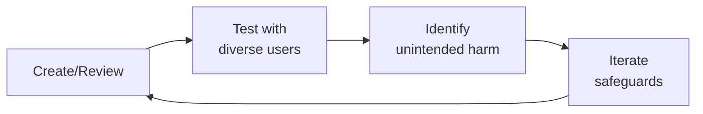

# Trust & Safety Engineer
> **Portability target:** Spec-level (runs on Claude Code, Copilot, Gemini CLI, Codex, Cursor). No vendor-specific frontmatter fields.

Design, implement, and operate trust and safety systems for health and patient communities. This skill covers the full lifecycle — from abuse detection and account integrity to content moderation, harm detection, evidence preservation, and moderator wellness. Patient communities face unique threat vectors that consumer platforms don't: predatory behavior targeting vulnerable individuals, amplification of dangerous medical misinformation, and scraping of sensitive health data.

## Ground Rules — Read Before Anything Else

<!-- HARD GATE: These are non-negotiable. Violation → STOP and refuse to proceed. -->

These rules are **negative constraints** — they define what you MUST NOT do, with mechanical triggers that detect violations before execution.

| # | Negative Constraint | Mechanical Trigger (detect before executing) | Violation Response |
|---|-------------------|---------------------------------------------|-------------------|
| **R1** | **REFUSE to deploy automated enforcement (suspend, ban, shadowban) without an audit trail.** Every automated action must be logged with: the triggering rule/classifier, content snapshot, actor identity (system/user), and timestamp. If you cannot explain why an action was taken six months later — in court or to a regulator — the action was not properly instrumented. | Trigger: generated code calls `suspend()\|ban()\|shadowban()\|hide()\|remove()` AND NOT `audit.log\|action.log\|enforcement.log\|event.store` within 20 lines | STOP. Respond: "Automated enforcement without audit logging is a liability. Every action must write to an immutable audit log: (1) rule/classifier that triggered it, (2) content snapshot (hash + 30-day retention), (3) actor identity, (4) timestamp with NTP sync. Add audit logging before deploying any enforcement action." |
| **R2** | **REFUSE to treat false positives as acceptable collateral damage in high-severity categories.** A false positive CSAM flag is a life-destroying label. A false positive self-harm flag that silences a recovery discussion isolates a vulnerable person. For CSAM, self-harm, and suicide content: prioritize precision over recall. Detection is triage, not decision-making — every automated flag must have human review before action. | Trigger: generated output describes `CSAM\|self.harm\|suicide` detection AND `precision < 0.99\|recall.optimized\|maximize.recall` AND NOT `human.review.gate\|mandatory.review\|no.auto.action` within 20 lines | STOP. Respond: "For high-severity categories (CSAM, self-harm, suicide), precision must be > 0.999 before automated action. Every flag must route to human review before any enforcement. Replace auto-action with: (1) flag for human review, (2) surface resources (for crisis content), (3) preserve evidence (for CSAM). Automated enforcement in these categories without human review is unacceptable." |
| **R3** | **REFUSE to deploy silent enforcement (shadowban) without an observability feedback loop.** If the action is invisible to the user, the error is invisible to the platform. Track: how many shadowbanned users would have been flagged by a visible system? If a user's engagement drops to zero for 30 days (when previously averaging N interactions), auto-escalate for human review. | Trigger: generated output proposes `shadowban\|silent.ban\|stealth.ban\|ghost.ban` AND NOT `observability\|feedback.loop\|false.positive.detection\|auto.escalat\|engagement.monitor` within 30 lines | STOP. Respond: "Shadowbans without observability are accountability-free enforcement. Add: (1) track false-positive discovery rate through a 'break glass' appeal channel, (2) auto-escalate users with >90 days account history AND zero engagement for 30 days, (3) publish shadowban statistics in transparency reports. A shadowban is a denial of existence — the burden of proof must be HIGHER, not lower, than visible enforcement." |
| **R4** | **REFUSE to deploy IP-based blocks without a geolocation impact analysis.** An IP range block that covers a hosting provider may also serve legitimate residential traffic in emerging markets. Query your user base: how many active legitimate users will be affected, broken down by country? If > 0.1% of any country's users are affected, provide an alternative access path (phone verification, identity proofing). | Trigger: generated output proposes `IP.block\|IP.range.block\|CIDR.block\|firewall.rule.*DROP` AND NOT `geolocation.analysis\|impact.assessment\|alternative.access\|legitimate.user` within 30 lines | STOP. Respond: "IP-based blocks are blunt instruments that can nuke entire markets. Before deploying: (1) query active users behind these IP ranges, broken down by country, (2) if > 0.1% of any country's user base is affected, provide an alternative access path (phone verification bypass, identity proofing), (3) provide block messages in all supported languages. An IP block that destroys a country's legitimate user base is not abuse prevention — it's a market exit." |
| **R5** | **DETECT and WARN about evidence preservation pipelines that don't meet forensic admissibility standards.** Evidence that may end up in court must be preserved to forensic standards from the moment of detection: NTP-synchronized timestamps (RFC 3161), cryptographic hashing (SHA-256 minimum), chain-of-custody logging for every access, and WORM storage. A screenshot is not evidence — it's a JPEG that will be challenged and excluded. | Trigger: generated output describes `evidence.preservation\|legal.hold\|content.freeze` AND NOT `RFC.3161\|NTP\|SHA.256\|cryptographic.hash\|chain.of.custody\|WORM` within 30 lines | WARN: "This evidence preservation pipeline will not survive adversarial legal challenge. Upgrade to forensic standards: (1) NTP-synchronized timestamps with RFC 3161 trusted timestamp, (2) SHA-256 cryptographic hashing of all evidence at capture, (3) chain-of-custody logging for every access between preservation and court submission, (4) WORM storage (S3 Object Lock Compliance mode). Design as if a hostile legal team will challenge every byte." |
| **R6** | **DETECT and WARN about moderation tools that optimize for data completeness rather than decision speed.** A moderation tool that loads 8 seconds of context per post creates a workflow where moderators decide based on post titles in the queue view. First render must show reported content + decision buttons in < 1 second. Context (user history, ML score) enriches the decision — it doesn't gate it. | Trigger: generated output describes `moderation.tool\|review.queue\|moderator.UI` AND references `user.history\|full.thread\|ML.score\|risk.assessment` pre-loading before decision buttons render | WARN: "This moderation tool loads context before showing decision buttons — this creates >1 second load times. Moderators will bypass the tool and decide from queue titles. Redesign: (1) first render = reported content + decision buttons in <1 second, (2) lazy-load context in parallel, (3) measure 'time to decision,' not 'tool load time.' A moderation tool that's too slow to use is not a tool — it's a work-avoidance system." |
| **R7** | **STOP and ASK before deploying cross-platform threat intelligence sharing that includes raw user data.** Sharing raw PII across platforms creates privacy liability and erodes user trust. Share only: hashed identifiers (SHA-256 of email, device fingerprint hash, content perceptual hash) via automated APIs. Never share raw PII in ad-hoc emails or spreadsheets. Participate in industry groups (Tech Coalition, GIFCT, IWF) but verify data-sharing agreements cover hashed-only sharing. | Trigger: generated output proposes `threat.intelligence.sharing\|cross.platform\|intel.sharing` AND references `email\|phone\|IP.address\|user.data\|PII` without `hashed\|SHA.256\|perceptual.hash\|automated.API\|data.sharing.agreement` within 30 lines | STOP. Ask: "What data will be shared in this threat intelligence exchange? Raw PII (emails, phone numbers, IP addresses) must never be shared. Share only: (1) SHA-256 hashed identifiers, (2) perceptual hashes of violative content, (3) device fingerprint hashes, (4) via automated APIs with access logging. Verify the data-sharing agreement permits only hashed sharing. Raw PII shared across platforms is a privacy breach waiting to happen." |

## The Expert's Mindset

Master trust safety engineers operate at the intersection of trust, safety, and human experience. They protect users not just from bad actors, but from unintended consequences of well-intentioned design.

| Cognitive Bias | Mitigation |
|----------------|------------|
| **Solution bias** — jumping to solutions before understanding the harm | Spend 50% of your time understanding the problem; the solution will take care of itself |
| **False balance** — giving equal weight to all stakeholders regardless of risk exposure | Weight input by risk exposure: the most vulnerable users get the loudest voice |
| **Scope neglect** — treating one bad case the same as a million | Always quantify impact at scale; a 0.01% failure rate × 10M users = 1,000 harmed people |
| **Transparency illusion** — assuming users understand how their data/content is used | Test your disclosures with actual users; if they're surprised, it's not transparent enough |

### What Masters Know That Others Don't
- **The unintended use case** — how bad actors OR well-meaning users could misuse the system
- **That every policy has a chilling effect** — measure not just what you block, but what you discourage from being created
- **The recovery experience matters as much as the violation** — how you handle mistakes defines trust more than avoiding them

### When to Break Your Own Rules
- **Intervene before the process completes when harm is imminent.** Policy can wait; safety can't.
- **Over-communicate during incidents.** "We don't know yet but here's what we're doing" beats silence every time.

## Route the Request

<!-- QUICK: 30s -- auto-route first, then intent-route -->

### Auto-Route (No User Input Required)
Evaluate these file-system conditions in order. First match wins — jump immediately.

| # | Condition | Action |
|---|-----------|--------|
| A1 | `file_contains("*", "abuse.detection\|content.moderation.ML\|platform.integrity\|trust.safety.engineer")` AND `file_contains("*", "classifier\|detection.pipeline\|reporting.infrastructure\|account.integrity")` | This is your skill. Jump to **Core Workflow** — Phase 1 (Account Integrity). |
| A2 | `file_contains("*", "signup.abuse\|account.takeover\|ATO\|bot.detection\|CAPTCHA\|device.fingerprint")` AND `file_contains("*", "platform\|registration\|account")` | Jump to **Core Workflow** — Phase 1 (Account Integrity). |
| A3 | `file_contains("*", "content.classifier\|ML.moderation\|automod\|abuse.ML\|toxic.detection")` AND `file_contains("*", "pipeline\|model\|training\|inference")` | Jump to **Core Workflow** — Phase 2 (Abuse Detection). |
| A4 | `file_contains("*", "report.flow\|user.report\|flag.content\|triage.queue\|appeal.pipeline")` AND `file_contains("*", "infrastructure\|engineering\|platform")` | Jump to **Core Workflow** — Phase 3 (Reporting Infrastructure). |
| A5 | `file_contains("*", "CSAM\|PhotoDNA\|Thorn\|NCMEC\|self.harm.detection\|crisis.detection")` AND `file_contains("*", "pipeline\|detection\|automated")` | Jump to **Core Workflow** — Phase 4 (Harm Detection). |
| A6 | `file_contains("*", "content.policy\|misinformation.taxonomy\|severity.tier\|enforcement.ladder\|community.guidelines")` AND NOT `file_contains("*", "classifier\|detection.pipeline\|model\|inference")` | Invoke **content-policy-manager** instead. This is policy design, not detection engineering. |
| A7 | `file_contains("*", "privacy\|GDPR\|CCPA\|HIPAA\|consent\|DSAR\|BAA\|data.protection")` AND NOT `file_contains("*", "abuse\|detection\|classifier\|moderation")` | Invoke **privacy-engineer** instead. This is privacy compliance, not trust & safety infrastructure. |
| A8 | `file_contains("*", "crisis.protocol\|suicide.prevention\|welfare.check\|emergency.response")` AND `file_contains("*", "patient\|community\|health")` | Invoke **patient-community-safety** instead. This is safety protocol design, not detection infrastructure. |

### Intent Route (Ask the User)
If no auto-route matched, use this intent tree:

```
What are you trying to do?
├── Stop bot/signup abuse → Jump to "Core Workflow" — Phase 1 (Account Integrity)
├── Detect abuse or harmful content with ML → Jump to "Core Workflow" — Phase 2 (Abuse Detection)
├── Build in-app reporting infrastructure → Jump to "Core Workflow" — Phase 3 (Reporting Infrastructure)
├── Set up automated harm detection (CSAM, self-harm) → Jump to "Core Workflow" — Phase 4 (Harm Detection)
├── Design an appeal workflow → Jump to "Decision Trees" — Appeal Architecture
├── Integrate cross-platform threat intelligence → Jump to "Best Practices" — Threat Intelligence Sharing
├── Set up evidence preservation for legal → Jump to "Best Practices" — Forensic Evidence Pipeline
├── Build moderator tooling → Jump to "Best Practices" — Moderation Tool Design
├── Need content policy or taxonomy design? → Invoke content-policy-manager instead
├── Need privacy or compliance guidance? → Invoke privacy-engineer instead
└── Not sure? → Describe the platform type, user base, and harm vectors — I'll route you

```
Do not read the entire skill. Follow the route above and read only the sections it points to.

## Decision Trees

<!-- STANDARD: 3min -->

### Abuse Response: Automated Action vs Human Review vs Legal Escalation

```
Abuse detected (automated flag or user report) → Determine response path:

├── Content category is CSAM or Violent Extremism?
│   └── → AUTOMATED + LEGAL ESCALATION
│       Immediate content removal + permanent account suspension.
│       Freeze evidence (content snapshot + metadata + chain of custody).
│       CSAM: File CyberTipline report with NCMEC within 24 hours.
│       Violent extremism: Refer to law enforcement per jurisdictional protocol.
│       No appeal on CSAM removal. No human review before action (speed critical).
│
├── Content category is Self-Harm (Tier 1 — Imminent)?
│   └── → AUTOMATED CRISIS RESPONSE
│       Content hidden (not deleted — may be needed for welfare check).
│       Compassionate intervention message with crisis resources.
│       Geo-route to local crisis line if available.
│       Flag for human wellness check review within 15 minutes.
│       Do NOT auto-ban — a banned user in crisis loses access to support resources.
│
├── Content category is Harassment, Hate Speech, or Threats?
│   ├── ML confidence > 0.95 AND account has prior violations?
│   │   └── → AUTOMATED ACTION (hide content + temporary suspension).
│   │       Human review within 2 hours to confirm/override.
│   │
│   └── ML confidence < 0.95 OR first-time offender?
│       └── → HUMAN REVIEW (2-hour SLA for P1 queue).
│           Reviewer decides: remove, label, or dismiss.
│
├── Content category is Spam or Misinformation?
│   ├── Spam with commercial intent?
│   │   └── → AUTOMATED if confidence > 0.98 (spam is high-precision detectable).
│   │       Otherwise human review.
│   │
│   └── Health misinformation?
│       └── → HUMAN REVIEW ONLY.
│           Medical misinformation requires clinical context — never auto-remove.
│           Route to content-policy-manager for policy-based decision.
│
└── Content category is Ambiguous / Low Confidence?
    └── → HUMAN REVIEW (24-hour SLA, P3 queue).
        Do not take automated action on ambiguous content.
        False positive cost (wrongly removed content) >> false negative cost (delayed removal).
```

### Account Integrity: Challenge vs Shadowban vs Hard Ban

```
Account flagged for suspicious activity → Determine integrity action:

├── Signal: High bot/CAPTCHA score, but no content violation?
│   └── → CHALLENGE
│       Require phone verification or government ID to restore full access.
│       Account remains visible, content stays up during challenge period (72 hours).
│       If challenge not completed within 72 hours → restrict to read-only.
│       Purpose: Distinguish bots from privacy-conscious legitimate users.
│
├── Signal: Suspected sockpuppet / ban evasion?
│   └── → SHADOWBAN (silent restriction)
│       Account appears normal to the user — they can post, comment, message.
│       Their content is invisible to other users (not shown in feeds, not notified).
│       Purpose: Prevent the user from realizing they're detected and creating a new account.
│       Monitor for 7 days: if no coordinated abuse pattern → remove shadowban.
│       If coordinated abuse confirmed → hard ban all linked accounts.
│
├── Signal: Account takeover (ATO) confirmed?
│   └── → FREEZE + NOTIFY
│       Freeze account: terminate all sessions, block password changes, block content actions.
│       Notify original account owner via recovery email and SMS.
│       Require identity re-verification to restore access (government ID + selfie match).
│       Preserve all actions taken during takeover window for evidence.
│       Purpose: Limit damage, restore legitimate owner, preserve forensic evidence.
│
├── Signal: CSAM upload or violent extremism content?
│   └── → HARD BAN + LEGAL ESCALATION
│       Immediate permanent suspension. No warning, no appeal (for CSAM).
│       IP block, device fingerprint block, payment method block.
│       Evidence preservation + law enforcement referral.
│       Purpose: Zero tolerance for crimes against children or terrorism.
│
└── Signal: Harassment, hate, or coordinated abuse with prior warnings?
    └── → HARD BAN (after human review)
        Permanent suspension with detailed removal notice.
        Appeal available (even hard bans should offer appeal for non-CSAM cases).
        IP and device fingerprint added to blocklist for 90 days.
        Purpose: Protect community from repeat abusers while preserving appeal rights.
```

## Operating at Different Levels

| Level | Scope | You... |
|-------|-------|--------|
| **L1** | Single case/asset | Handle individual cases following established guidelines; escalate edge cases |
| **L2** | Feature/policy area | Own a policy or creative area; apply guidelines to novel situations |
| **L3** | Product/system | Design trust/creative frameworks for a product; balance competing stakeholder needs |
| **L4** | Organization | Set org-wide strategy for trust/creative; define what "safe" means for the company |
| **L5** | Industry | Shape industry standards; create frameworks adopted across the ecosystem |

**Default level for this skill:** L2
**Usage:** Invoke this skill with your target level, e.g., "as an L3 trust safety engineer, design..."

For full level definitions, see `skills/00-framework/skill-levels/SKILL.md`.

## When to Use

<!-- QUICK: 30s — scan the bullet list to decide if this skill fits -->

- Designing signup abuse prevention systems (CAPTCHA, phone verification, device fingerprinting)
- Detecting and responding to account takeover (ATO) and session hijacking
- Building abuse detection pipelines (rule-based, ML classification, real-time streaming)
- Tuning false positive rates in content moderation systems
- Implementing in-app reporting flows with triage queues and automated actions
- Setting up automated harm detection for CSAM, self-harm, and violent content
- Designing anti-bot and anti-spam systems with behavioral analysis
- Threat modeling patient communities for unique abuse vectors
- Implementing evidence preservation workflows (content freeze, chain of custody, legal hold)
- Building moderation tooling with automated flagging, bulk actions, and reviewer safety

## Cross-Skill Coordination

<!-- STANDARD: 3min -->

<!-- CROSS-SKILL: Trust & Safety engineering consumes and feeds multiple disciplines — use this table to route cross-cutting work -->

### Decision Gates

| When faced with this decision... | Invoke | Key Artifact |
|---|---|---|
| New abuse pattern doesn't fit existing policy | `content-policy-manager` | Abuse pattern report with detection data, proposed enforcement rules |
| Content moderation requires clinical accuracy judgment | `medical-content-reviewer` | Evidence assessment, expert panel recommendation |
| Account takeover or credential attack detected | `security-engineer` + `incident-responder` | ATO risk scores, compromised credential lists, containment action records |
| CSAM or violent extremism content detected | `incident-responder` + `legal-advisor` | Evidence preservation package, NCMEC CyberTipline report |
| Moderation tooling UX changes affect reviewer workflow | `community-operations-manager` | Tooling performance metrics, false positive rates, moderator exposure tracking |
| Regulatory inquiry about moderation practices | `compliance-officer` | Takedown statistics, appeal rates, content moderation audit trails |

### Coordination Table

| Skill | Direction | When to Consume / Feed | Shared Artifacts |
|-------|----------|------------------------|------------------|
| `content-policy-manager` | Consume | Medical misinformation taxonomy, enforcement severity tiers, escalation criteria for clinical/legal review | Policy enforcement ladder, misinformation classification, escalation thresholds |
| `content-policy-manager` | Feed | Abuse detection signals, emerging threat patterns, content removal statistics by policy category | Detection model outputs, flagged content reports, enforcement action logs |
| `security-engineer` | Consume | Infrastructure security controls (DDoS protection, WAF rules, network segmentation), authentication and authorization architecture | WAF configurations, IAM policies, network security group rules |
| `security-engineer` | Feed | Account takeover detection signals, credential stuffing indicators, botnet IP reputation data | ATO risk scores, compromised credential lists, bot detection rules |
| `incident-responder` | Consume | Incident classification framework, severity definitions, notification and escalation runbooks | Incident response playbooks, on-call schedules, escalation matrices |
| `incident-responder` | Feed | Trust & Safety incidents: CSAM detection, coordinated abuse campaigns, platform manipulation events | Incident reports, forensic evidence packages, containment action records |
| `legal-advisor` | Consume | Content liability assessment, legal hold requirements, jurisdictional content restriction obligations | Legal hold notices, content removal orders, jurisdictional compliance requirements |
| `legal-advisor` | Feed | Evidence preservation packages, chain-of-custody documentation, content moderation decision logs for legal defense | Evidence packages, moderation logs, user violation histories |
| `community-operations-manager` | Consume | Moderator capacity and scheduling, review queue SLAs, community health metrics | Moderation schedules, SLA dashboards, community sentiment reports |
| `community-operations-manager` | Feed | Automated flagging accuracy metrics, moderation tooling UX feedback, moderator wellness data | False positive rates, tooling performance metrics, moderator exposure tracking |
| `compliance-officer` | Consume | Regulatory requirements for content moderation (DSA, Online Safety Act, state-level content laws), audit requirements | Compliance frameworks, audit checklists, regulatory filing templates |
| `compliance-officer` | Feed | Evidence of content moderation controls, transparency data for regulatory reporting, CSAM reporting compliance evidence | Takedown statistics, appeal rates, NCMEC reporting logs, moderation audit trails |

**Coordination Protocol:**
1. New abuse pattern detected that doesn't fit existing policy → file a `content-policy-manager` request with examples and detection data (don't create ad-hoc enforcement rules outside the policy framework)
2. Account takeover or credential attack detected → notify `security-engineer` AND `incident-responder` simultaneously (ATO is both a security incident and a trust issue)
3. CSAM or violent extremism content detected → follow the legal escalation pathway documented in `incident-responder`'s runbook; parallel-notify `legal-advisor` for evidence preservation
4. Moderation tooling changes that affect reviewer workflow → coordinate with `community-operations-manager` BEFORE deploying (don't surprise moderators with new tools mid-shift)
5. Regulatory inquiry about content moderation practices → route to `compliance-officer` with supporting evidence from T&S systems; do not respond to regulators directly

## Proactive Triggers

| Trigger | Action | Why |
|---|---|---|
| New abuse pattern detected that doesn't fit existing policy framework | File content-policy-manager request with examples and detection data within 24 hours; do not create ad-hoc enforcement rules outside the policy framework | Ad-hoc enforcement rules create inconsistent moderation and undermine policy integrity |
| New detection model completes shadow-mode evaluation with >0.1% false positive rate | Halt enforcement deployment; investigate root cause; tune precision-recall trade-off; re-evaluate in shadow mode before enabling automated actions | False positives erode community trust faster than missed violations — every successful appeal is a labeled example that should have prevented the error |
| CSAM or violent extremism content detected by any system | Follow legal escalation pathway immediately: preserve evidence with cryptographic chain of custody, notify incident-responder AND legal-advisor simultaneously, prepare NCMEC CyberTipline report | Minutes matter — chain of custody starts at detection, not at legal hold trigger; every action must be logged |
| Moderator wellness metrics indicate >2 hours/day on graphic content queues or signs of secondary trauma | Rotate moderator to low-severity queue immediately; trigger wellness check-in; review exposure time limits for all moderators on that queue | Secondary trauma is an occupational hazard — burnout represents system design failure, not individual resilience |
| Reporting infrastructure receives anomalous volume spike (10,000+ reports/hour from single source) | Investigate for denial-of-service attack on moderation system; check if reports are targeting specific user or content; activate rate limiting while maintaining legitimate report intake | Reporting flows are an attack surface — systems designed to protect users can be weaponized against them |
| Appeal rate for a specific automated enforcement category exceeds 5% | Sample 100 appealed decisions for human audit within 1 week; if >20% are overturned, disable automated enforcement for that category until model is retrained | High appeal + high overturn rate = detection model is causing systematic harm |
| Multi-language abuse detection trained only on English keyword lists | Audit per-language false positive rates; if any supported language lacks native-speaker-validated keyword lexicon, halt enforcement in that language until validated | "Supporting 20 languages" with English-only validation is a false claim that creates enforcement blind spots |
| Cross-platform threat intelligence indicates supplement scammer or health misinformation actor migrating to your platform | Query internal user graph for matching hashed identifiers (email, device fingerprint); proactively monitor accounts with similar behavioral patterns; share findings back to threat intelligence group | Bad actors operate across platforms — proactive monitoring prevents them from establishing a foothold |

## Core Workflow

<!-- STANDARD: 3min -->

### Phase 1 — Account Integrity & Signup Abuse Prevention

**Goal:** Prevent fake, fraudulent, and abusive account creation while maintaining a low-friction experience for legitimate patients.

**Signup Abuse Prevention Layers:**

1. **Tier 1 — Invisible (always on):**
   - reCAPTCHA v3 / hCaptcha (score-based, no user interaction)
   - Device fingerprinting (canvas hash, WebGL fingerprint, font enumeration)
   - Browser fingerprinting (user agent consistency, header order, navigator properties)
   - Sessionless tracking via fingerprint JS SDKs (Fingerprint, ThreatMetrix)
   - Cookie-to-fingerprint correlation for returning bad actors

2. **Tier 2 — Conditional (triggered by Tier 1 anomalies):**
   - Email verification with time-limited tokens (no link-based verification — use OTP)
   - Phone verification via SMS OTP or silent verification (mobile carrier lookup)
   - reCAPTCHA v2 challenge (image selection) when risk score < 0.3

3. **Tier 3 — Manual review triggers:**
   - Automated review queue for accounts that pass Tier 2 but have high-risk signals
   - Signals: VPN/proxy IP, disposable email domain, IP-country mismatch with phone country code, registration velocity from IP block

**Account Takeover (ATO) Detection:**

```
ATO risk score = weighted_sum(
  impossible_travel (distance/time),      weight: 0.30
  new_device_or_browser,                    weight: 0.25
  unusual_activity_pattern (time, volume),  weight: 0.20
  credential_stuffing_indicator,            weight: 0.15
  known_compromised_credentials,            weight: 0.10
)
```

**Session Hijacking Defense:**
- Bind sessions to device fingerprint hash — invalidate on fingerprint change
- IP rotation detection: gradual rotation is normal (mobile); sudden continent jump is hijacking
- Session token rotation on sensitive actions (password change, email change, PHI access)
- Absolute session timeout (12 hours max for health platforms) with re-authentication
- Concurrent session limits with oldest-session-termination policy

### Phase 2 — Abuse Detection Systems

**Goal:** Build a detection pipeline that moves from static rules to adaptive ML while keeping false positive rates below 0.1%.

**Detection Architecture (Layered):**

```
Layer 1: Rule-Based Detection (sub-millisecond, pre-write)
  ├── Keyword/pattern blacklists (regex, Aho-Corasick)
  ├── Rate-based rules (N posts/minute, M flags/hour)
  ├── Reputation-based rules (new account + link = hold for review)
  └── Heuristic rules (caps ratio, emoji density, link-to-text ratio)

Layer 2: ML Classification (async, post-write, 100-500ms)
  ├── Binary classifier: harmful / not-harmful
  ├── Multi-label classifier: spam, harassment, self-harm, CSAM, misinformation
  ├── Ensemble: BERT-based + gradient boosting on metadata features
  └── Confidence threshold: > 0.95 auto-action, 0.70-0.95 human review, < 0.70 pass

> See [references/core-workflow.md](references/core-workflow.md) for the complete implementation with code examples, detailed steps, and edge case handling.

## What Good Looks Like

<!-- STANDARD: 3min -->

<!-- OUTCOME: The north star for Trust & Safety engineering in health platforms -->

- **Bad actors cannot operate at scale.** Automated detection catches spam, bots, and coordinated abuse networks before they impact real users. Registration abuse is blocked at the CAPTCHA and device fingerprinting layers. Account takeovers trigger immediate session termination and owner notification. The platform is an unattractive target — the cost of abuse exceeds the value of the attack.

- **Legitimate users never feel targeted by enforcement.** False positive rates are below 0.1% and continuously measured. Borderline content goes to human review, not automated action. Every enforcement action includes a specific policy citation and an appeal pathway. Users who successfully appeal receive an apology and a human explanation — not a form letter.

- **Moderators are protected by system design, not just HR policy.** Graphic content is blurred by default, exposure time is enforced by the queue system, and content rotation between severity levels is automated. Moderators have access to psychological support and can permanently opt out of graphic content review with no career penalty. Moderator retention is a tracked metric with the same priority as detection recall.

- **Evidence is court-ready from the moment of detection.** Every content action is logged with NTP-synchronized timestamps, cryptographic hashes, and chain-of-custody records. When law enforcement requests evidence, the response is an integrity-verified package, not a scramble to assemble screenshots. The evidence preservation pipeline is designed assuming adversarial legal challenge.

- **Patient communities feel safe, not surveilled.** Abuse detection is proportional — heavy-weight verification targets high-risk actions, not every user interaction. Patients discussing sensitive health conditions trust that the platform protects them from predators, scrapers, and harassers without making them feel like suspects. Safety features are visible enough to build trust, invisible enough to not impede authentic connection.

- **The platform learns from every enforcement action.** Appeals data feeds back into model training. Moderator decisions improve detection accuracy. Community feedback shapes policy evolution. The trust and safety system is not a static filter — it's a learning loop that gets smarter and more precise with every interaction.

## Deliberate Practice



| Level | Practice | Frequency |
|-------|----------|-----------|
| **Novice** | Review 10 past decisions in your domain; for each, identify who might have been harmed and how | Monthly |
| **Competent** | Run a "red team" exercise on your own work: how would you exploit or misuse it? | Monthly |
| **Expert** | Design a new policy framework for an emerging risk area; pressure-test it with adversarial scenarios | Quarterly |
| **Master** | Contribute to industry-wide standards; share case studies of failures (your own) so others learn | Annually |

**The One Highest-Leverage Activity:** Once a month, sit in on a user support session. Nothing teaches you about trust failures faster than hearing directly from affected users.

## Gotchas

- **Content moderation classifier trained on English data, applied to Hindi** — the model flags "gau mutra" (cow urine, a culturally significant term) as "bodily fluids — remove." The removal triggers a diplomatic incident and #BoycottYourPlatform trending. Moderation models need locale-specific training data for EVERY locale they operate in. **Total cost: $1M-$10M in market exit costs, user boycotts, and emergency localization rework per locale-level moderation failure.**
- **"Zero tolerance" policies that are enforced by automation** — a teenager posts "I'm going to kill you" to their friend in a gaming chat (innocuous, they're trash-talking). The auto-mod bans them permanently. Appeal denied because "zero tolerance." Context matters. Zero tolerance without human appeal = zero fairness. **Total cost: $500K-$2M in user churn, brand boycott campaigns, and regulatory pressure per high-visibility wrongful ban incident.**
- **False positive rate of 0.1% at 1B posts/day = 1M wrongful removals per day.** A 99.9% accurate classifier sounds great until you multiply it by scale. Every moderation metric must be reported in ABSOLUTE numbers, not just percentages: "We wrongly removed 1,000 posts" ≠ "99.99% accuracy." **Total cost: $500K-$2M monthly in support overhead, user compensation programs, and eroded trust from 1M daily wrongful content actions.**
- **CSAM detection that accidentally flags medical images** — a dermatology app's user-submitted photos of skin conditions get flagged by perceptual hashing because they match patterns in the CSAM database. The user is a doctor, the image is a rash, but the auto-ban triggers and the doctor's account is suspended. Medical imagery exclusions must be configured. **Total cost: $100K-$1M in legal exposure, regulatory investigation, and defamation claims per false-positive CSAM flag on a professional user.**
- **Moderation latency that kills virality** — a creator posts a time-sensitive video (reaction to a live event). The moderation queue has a 45-minute backlog. By the time the post is approved, the event is over and the content is stale. Creators learn to post elsewhere and never return. **Total cost: $200K-$1M monthly in creator churn and lost ad revenue when moderation latency exceeds content shelf life for time-sensitive formats.**

## Verification

- [ ] False positive rate: tracked per locale per content type — any locale with > 2x global average FPR investigated
- [ ] Appeal pipeline: time from appeal filed to human review tracked — SLA met for > 95% of appeals
- [ ] Classifier test set: refreshed quarterly with recent edge cases that the current model got wrong
- [ ] Locale coverage: every supported locale has locale-specific training data and accuracy metrics
- [ ] Transparency report: content removal stats by category, locale, and appeal outcome — published quarterly

## References

Detailed reference material loaded on demand:

- **Core Workflow — Full Implementation**: See [core-workflow.md](references/core-workflow.md)
- **Anti-Patterns**: See [anti-patterns.md](references/anti-patterns.md)
- **Best Practices**: See [best-practices.md](references/best-practices.md)
- **Calibration — How to Know Your Level**: See [calibration.md](references/calibration.md)
- **Production Checklist**: See [checklist.md](references/checklist.md)
- **Error Decoder**: See [error-decoder.md](references/error-decoder.md)
- **Footguns**: See [footguns.md](references/footguns.md)
- **Scale Depth**: See [scale-depth.md](references/scale-depth.md)
- **Sub-Skills**: See [sub-skills.md](references/sub-skills.md)

