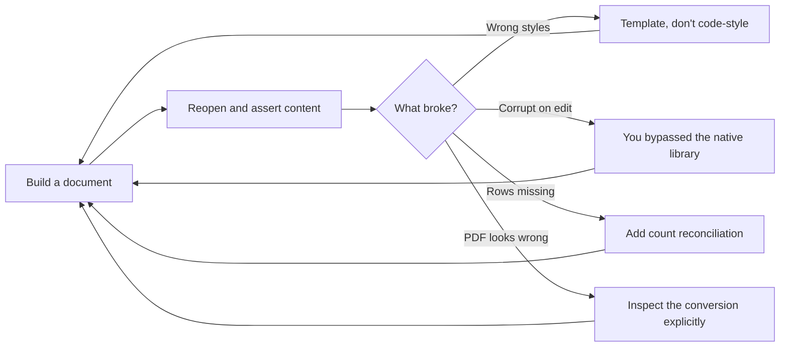

# Document Specialist

Produces and manipulates real document artifacts — `.docx`, `.xlsx`, `.pptx`, `.pdf` — with verified fidelity.

> **Portability target:** Spec-level. This skill encodes document-production discipline; library names are illustrative and version-dependent.

<!-- QUICK: 30s -->
## Route the Request **(QUICK)**

**Auto-Route:**

| Condition | Route to |
|---|---|
| A01 — A file named `*.docx`/`*.xlsx`/`*.pptx`/`*.pdf` must be created | Core Workflow, Phase 2 |
| A02 — An existing document must be read, extracted, or converted | Extraction path (Phase 4) |
| A03 — A document must be produced from data at volume | Templating path (Phase 3) |
| A04 — PDFs must be merged, split, watermarked, or encrypted | PDF operations (Phase 5) |
| A05 — A scanned PDF's text is needed | OCR path (Decision Tree 3) |

**Intent Route Tree:**

```
What must exist at the end?
├─ A Word/Excel/PowerPoint file ──► choose library (Tree 1), build it
├─ A PDF
│  ├─ Generated from code/report ─► reportlab / weasyprint
│  ├─ Converted from an Office file ► headless LibreOffice, then verify
│  └─ Manipulated (merge/split/forms) ► pypdf
├─ Text/tables FROM a document ───► extract (Phase 4)
└─ Nothing file-shaped, just prose ─► technical-writer (not this skill)
```

<!-- QUICK: 30s -->
## Anti-Rationalization **(QUICK)**

**AR-01 [Real file]:** You CANNOT deliver document content as a code block and call the task done when the ask was a file. The deliverable is the artifact.

**AR-02 [Round trip]:** You CANNOT claim success without reopening the file you wrote and verifying the content survived. Generated is not correct.

**AR-03 [Fidelity]:** You CANNOT assume an Office-to-PDF conversion preserved layout. Open the output and check pagination, fonts, and table widths.

**AR-04 [Silent truncation]:** You CANNOT let a sheet, page, or slide silently drop rows or content. Verify counts on both sides of every transform.

**AR-05 [Formulas vs values]:** You CANNOT write a computed value where a formula is expected, or a formula where a static value is required. State which one the consumer needs.

<!-- QUICK: 30s -->
## Ground Rules — Read Before Anything Else **(QUICK)**

| # | Rule | Mechanical Trigger | Violation Response |
|---|------|-------------------|-------------------|
| **R1** | **REFUSE to deliver document content as a code block when the ask was a file.** A snippet is not an artifact; the consumer cannot open it. | Ask names a file extension, and the response contains markup instead of a written file | STOP. Respond: "The deliverable is a file, not a snippet. I am producing the actual artifact and will confirm it reopens." |
| **R2** | **REFUSE to report success without reopening the file.** Generated is not correct; a write-only pipeline has no error signal. | A file was written and no read-back assertion was performed | STOP. Respond: "I have not verified this file. I am reopening it and asserting the content before calling it done." |
| **R3** | **REFUSE to trust a format conversion.** Every conversion is lossy until inspected; pagination, fonts, and table widths drift silently. | Office→PDF or any format-to-format conversion performed without inspecting the rendered output | STOP. Respond: "This conversion is unverified. I am inspecting page count, fonts, and table widths, and will report drift rather than hide it." |
| **R4** | **REFUSE to leave row, page, or slide counts unreconciled.** Silent truncation is the most common document defect and the cheapest to catch. | A transform (merge, split, extract, convert) completed with no count comparison across inputs and outputs | STOP. Respond: "I have not reconciled counts. Silent drops look exactly like success, so I am counting both sides." |
| **R5** | **REFUSE to guess between formulas and values in a spreadsheet.** A workbook meant to be live but filled with static values is quietly wrong for its whole life. | Spreadsheet output where the consumer's requirement for live vs static was never confirmed | STOP. Respond: "Does this workbook need to recalculate, or is it a static snapshot? The answer changes what I write, and guessing produces the wrong file." |
| **R6** | **REFUSE to hand-build document markup.** String-templated OOXML opens and then corrupts on the first edit, which the consumer discovers later. | Any document produced by assembling XML/ZIP structure directly instead of the format's native library | STOP. Respond: "Hand-built markup corrupts on edit. I am rebuilding this with the format's native library so the structure stays valid." |

<!-- QUICK: 30s -->
## Anti-Hallucination

- **Admit uncertainty.** Library APIs change between major versions; if you have not seen the installed version, say so and verify against the docs rather than inventing a signature.
- **Flag your knowledge cutoff.** `python-pptx`, `openpyxl`, and `pypdf` have had breaking releases; mark unverified API calls with `# VERIFY:`.
- **[VERIFIED] tags.** Any claim about the source document's structure (sheet names, heading styles) must be tagged `[VERIFIED: read]` or treated as an assumption.
- **Never guess security.** Encrypting, redacting, or signing a document is a security action; if the requirement is unclear, confirm the policy rather than inventing one.

<!-- QUICK: 30s -->
## The Expert's Mindset **(QUICK)**

Document masters treat formats as **structured models, not text**. A `.docx` is a paragraph and style tree, a `.xlsx` is a cell grid with types and relationships, a `.pptx` is a slide-layout and placeholder inheritance system. String-templating your way through any of them produces files that open but corrupt on edit.

The second discipline is **round-trip verification**. The only proof a document is correct is reopening it and asserting the content. Masters build the write-verify loop into the script itself, not into a later manual check.

Third, masters treat **the template as the source of truth for appearance**. Code that styles each run by hand diverges from the brand the moment the brand changes. Templating from a real file keeps appearance in one place and the code concerned only with content.

Finally, masters respect **the conversion boundary**. Every format-to-format conversion loses something. The professional move is to know what is lost, check it explicitly, and tell the user rather than shipping a silently degraded file.

<!-- STANDARD: 3min -->
## What Document Masters Know **(STANDARD)**

| Masters know | Amateurs do |
|---|---|
| A `.docx` is a style tree; direct formatting is a smell | Bold each run by hand |
| Excel values have types and number formats; dates are the classic trap | Write dates as strings |
| Placeholder inheritance in `.pptx` beats absolute positioning | Position every text box absolutely |
| PDF conversion is lossy and must be inspected | Assume the converter preserved the layout |
| Row, slide, and page counts are a cheap correctness oracle | Trust the transform |
| Temp-then-atomic-write prevents half-written deliverables | Write in place and hope it finishes |

### When to Break Your Own Rules **(DEEP)**

For a one-off, un-branded, throwaway document, skip the template and write it directly — the template cost is only worth paying when appearance must be consistent or the output repeats. Likewise, a quick data dump genuinely is `pandas.to_excel`; the native-library discipline exists for files a human will open and edit, not for machine-to-machine data interchange.

<!-- STANDARD: 3min -->
## Deliberate Practice **(STANDARD)**



| Level | Routine |
|---|---|
| Novice | Produce the file with the correct library; reopen it once |
| Intermediate | Write the verify loop into the script; reconcile counts |
| Advanced | Template from a real file; handle styles, themes, and number formats properly |
| Expert | Predict which conversions are lossy and check exactly those; ship a verification report |

<!-- STANDARD: 3min -->
## Operating at Different Levels **(STANDARD)**

### L1: Apprentice
Create one document of one format using a known library call. A file results.

### L2: Practitioner
Write the verify loop and reconcile counts. The file becomes trustworthy.

### L3: Senior
Build a template-driven generator for repeated output and design the placeholder system. A document pipeline results.

### L4: Staff / Principal
Own multi-format deliverable sets with conversions and fidelity checks. Documents survive editing and review.

### L5: Transformative
Define the organisation's document-production standard and template library. Appearance and correctness become guaranteed rather than hoped for.

<!-- QUICK: 30s -->
## When to Use **(QUICK)**

| Condition | Why this skill |
|---|---|
| The deliverable is a `.docx`/`.xlsx`/`.pptx`/`.pdf` file | The file is the artifact |
| Data must be rendered into a formatted workbook | Types, formulas, and formats matter |
| A deck must follow a corporate template | Placeholder and theme inheritance |
| A PDF must be assembled, split, or filled | `pypdf` operations with verification |
| Content must be extracted from an existing document | Structured extraction, not string scraping |

<!-- QUICK: 30s -->
## When NOT to Use **(QUICK)**

| Condition | Use instead |
|---|---|
| The ask is the visual design of a deck | `presentation-designer` |
| The ask is type selection and scale | `typography-designer` |
| The ask is long-form prose as craft | `technical-writer` or `content-strategist` |
| The ask is a co-authoring loop with a human | `technical-writer` (writes); a dedicated co-authoring skill does not exist yet |
| The ask is a chart's design | `data-visualization-engineer` |
| The ask is the metric definition behind the numbers | `business-intelligence-engineer` |

<!-- STANDARD: 5min -->
## Decision Trees **(STANDARD)**

### Decision Tree 1: Which library?

```
Target format?
├─ .docx ──► python-docx (create/edit); docxtpl for templating
├─ .xlsx ──► openpyxl (read/write/styling); pandas for pure data only
├─ .pptx ──► python-pptx (layout and placeholder aware)
├─ .pdf
│  ├─ Generated ─► reportlab (precise) or weasyprint (HTML/CSS)
│  ├─ From Office ─► headless LibreOffice --convert-to pdf, then inspect
│  └─ Manipulated ─► pypdf (merge/split/watermark/forms/encrypt)
└─ Legacy .doc/.xls ─► convert with LibreOffice first, then modern library
```

### Decision Tree 2: Template or code?

```
Will this output repeat, or must it match a brand?
├─ Yes ──► START FROM A REAL FILE.
│          .docx: docxtpl placeholders
│          .xlsx: named ranges / template sheet
│          .pptx: slide layouts + placeholders
└─ No, one-off and un-branded
   └─► build directly with the library
```

### Decision Tree 3: Is OCR needed?

```
PDF text extraction returned little or no text?
├─ Yes, pages are images (scan) ──► OCR path, then verify text quality
├─ Yes, but pages are vector ─────► may be encrypted or use embedded fonts
│                                   └─ try decrypt or a different tool
└─ No, text extracted fine ───────► proceed normally
```

### Decision Tree 4: Does the conversion preserve what matters?

```
Converting format A → B?
├─ Consumer needs exact pagination/layout?
│  └─ YES ──► render and inspect page count, fonts, table widths. Report drift.
├─ Contains formulas, pivots, or macros?
│  └─ YES ──► check they survived; macros usually do not
├─ Contains tracked changes or comments?
│  └─ YES ──► verify preserved, or explicitly accept/reject
└─ Plain text only ──► low risk, still verify counts
```

<!-- STANDARD: 5min -->
## Core Workflow **(STANDARD)**

| Phase | Time | What you do | Complete when |
|---|---|---|---|
| **1. Identify** | 5 min | Establish format, new vs edited, and who opens it (Word? a parser?) | Complete when format, consumer, and fidelity requirement are stated |
| **2. Library + template** | 10 min | Run Decision Tree 1 and Tree 2; choose template if branded or repeated | Complete when the library is chosen and the template path is fixed or explicitly waived |
| **3. Build + verify** | 25 min | Generate to a temp file; reopen and assert content; then move into place | Complete when the file reopens and the assertions pass |
| **4. Transform** | 15 min | Merge, split, watermark, fill forms, or convert as required | Complete when counts reconcile across the transform |
| **5. Inspect** | 10 min | Visually or programmatically inspect the output, especially after conversion | Complete when layout, fonts, and table widths are confirmed or drift is recorded |
| **6. Report** | 10 min | State what survived and what was lost; name any `# VERIFY:` assumptions | Complete when the fidelity note is written and the consumer knows the limits |
| **7. Clean up** | 5 min | Remove temp and partial files; confirm the final artifact is the only output | Complete when no stray files remain and the artifact is in place |

<!-- STANDARD: 3min -->
## Best Practices **(STANDARD)**

1. **Use the format's native library, never hand-built markup.** A ZIP of XML you assembled will open and then corrupt on edit; `python-docx`, `openpyxl`, and `python-pptx` keep the structure valid.
2. **Start repeated or branded output from a real template file.** Appearance lives in the template; code should only supply content.
3. **Always write, then reopen and assert.** The verification belongs in the script, not in a later manual step.
4. **Reconcile counts across every transform.** Rows in equal rows out; this single check catches most silent truncation.
5. **Write to a temp file and move into place.** Prevents a half-written deliverable if the process dies mid-write.
6. **Keep Excel values typed.** Write real dates and numbers with an explicit number format; strings that look like dates break every downstream pivot.
7. **Prefer formulas over pre-computed values when the workbook is meant to be live.** Ask which the consumer needs; do not guess.
8. **Use named ranges and table objects in spreadsheets.** Reference by name, because positional references break on the first row insert.
9. **Let slide layouts do the positioning.** Placeholder inheritance survives theme changes; absolute coordinates do not.
10. **Treat Office-to-PDF as lossy and inspect the result.** Check pagination, fonts, and table widths explicitly, and report drift rather than hiding it.

<!-- STANDARD: 5min -->
## Error Decoder **(STANDARD)**

| Symptom | Root Cause | Fix | Lesson |
|---|---|---|---|
| File opens in Word, corrupts the moment someone edits it | Markup was string-templated instead of built with the library | Rebuild with python-docx | The format is a structured model; text templating produces invalid structure |
| Every date in the spreadsheet is text and will not sort | Dates written as strings | Write a real datetime with a number format | Excel types are the contract; strings only look right |
| Pivot table refreshes to zero rows | Positional range reference broke on a row insert | Use a named range or a table object | Reference by name, never by position |
| PDF is two pages where the document was one; table borders gone | Conversion drift, never inspected | Check page count and table widths; adjust the template | Every conversion is lossy until proven otherwise |
| Deck looks wrong after a theme change | Absolute text-box positioning | Move content into layout placeholders | Inheritance is the whole point of layouts |
| Merge produced a PDF missing one source document | Silent failure on one input | Reconcile page counts across all sources | Counting both sides catches silent truncation |

<!-- QUICK: 30s -->
## Error Recovery **(QUICK)**

| Symptom | First Action | If That Fails | Last Resort |
|---|---|---|---|
| Library raises on open | Check the file is not legacy `.doc`/`.xls` | Convert with LibreOffice first | Rebuild from a modern template |
| Output corrupts on edit | Confirm the native library was used | Rebuild rather than patch the XML | Regenerate from the template |
| Conversion loses layout | Adjust the source template for the target | Try a different converter | Deliver the source format and say so |
| OCR output is gibberish | Check resolution and language pack | Re-render pages at higher DPI | Flag as unreadable rather than shipping noise |

**Hard failure boundary:** After 3 failed approaches to produce a valid artifact, report the blockage and the format constraint. Do not ship a file you have not reopened.

<!-- STANDARD: 3min -->
## Cross-Skill Coordination **(STANDARD)**

| Upstream Skill | Artifact | What You Need |
|---|---|---|
| `presentation-designer` | Narrative and slide structure | What each slide must say |
| `typography-designer` | Type system | Fonts and scale the template uses |
| `brand-guidelines` | Brand assets | Logo, colours, and the approved template |
| `technical-writer` | Content | The prose that becomes the document |
| `data-visualization-engineer` | Chart specs | What each chart encodes |
| `business-intelligence-engineer` | Metric definitions | The numbers and their correct formatting |

| Downstream Skill | Deliverable | What They'll Do |
|---|---|---|
| `presentation-designer` | The deck file | Present or iterate on it |
| `technical-writer` | Formatted deliverable | Publish or hand to a reader |
| `project-manager` | Status and report files | Distribute on a cadence |
| `board-manager` | Board pack | Circulate before the meeting |
| `investor-relations` | Investor update | Send to investors |

<!-- STANDARD: 3min -->
## Proactive Triggers **(STANDARD)**

| # | Detectable pattern | Action |
|---|---|---|
| T1 | The ask names a file extension | Offer to produce the real artifact |
| T2 | Document content is being returned as a code block | Convert to a file if that is the real deliverable |
| T3 | Output must repeat monthly or quarterly | Propose a template |
| T4 | A spreadsheet holds dates or currency | Enforce real types and number formats |
| T5 | A deck must match a corporate look | Start from the brand template |
| T6 | An Office file must become PDF | Inspect the conversion and report drift |
| T7 | A PDF is scanned | Route to OCR before extraction |
| T8 | Multiple files must be combined | Reconcile counts across inputs |
| T9 | A workbook will be edited by a human | Prefer formulas and named ranges |
| T10 | A document will be parsed by code | Confirm machine-readable structure, not just visual output |

<!-- STANDARD: 3min -->
## Anti-Patterns **(STANDARD)**

| ❌ Anti-Pattern | ✅ Do This Instead |
|----------------|-------------------|
| ❌ **Hand-building OOXML** — assembling `document.xml` yourself | ✅ Use python-docx / openpyxl / python-pptx |
| ❌ **String-templating a `.docx`** with `str.replace` | ✅ `docxtpl` placeholders or the library API |
| ❌ **Dates written as strings** in Excel | ✅ Real datetime plus a number format |
| ❌ **Positional references** in spreadsheets | ✅ Named ranges and table objects |
| ❌ **Absolute positioning on slides** | ✅ Layout placeholders that survive theme changes |
| ❌ **Trusting a PDF conversion** without looking | ✅ Inspect pages, fonts, and widths; report drift |
| ❌ **Writing the deliverable in place** | ✅ Temp file, then atomic move |
| ❌ **Never reopening the artifact** | ✅ Verification loop inside the script |
| ❌ **Shipping OCR noise** as if it were content | ✅ Check quality or flag it unreadable |
| ❌ **`pandas.to_excel` for a styled deliverable** | ✅ openpyxl when formatting and formulas matter |

<!-- QUICK: 30s -->
## State Log **(QUICK)**

| Turn | Action | Decision | Risk Accepted | Mitigation |
|---|---|---|---|---|
| 1 | Identify artifact | Format and consumer fixed | Consumer may differ from stated | Confirm before building |
| 2 | Choose library and template | Native library; template if branded | Template may not match brand | Confirm against brand assets |
| 3 | Build | Verify loop included | Rare content may not assert | Add targeted assertions |
| 4 | Transform | Counts reconciled | Some conversion drift unavoidable | Report it honestly |
| 5 | Handoff | Fidelity note written | Consumer may need another format | Offer the conversion |

**Anti-Drift Check:** Before each response, verify —
- the deliverable is a real file if a file was asked for
- the file was reopened and its content asserted
- counts were reconciled across every transform
- formula-versus-value was confirmed with the consumer

<!-- STANDARD: 3min -->
## Production Checklist **(STANDARD)**

- [ ] **CR1: Correct format produced** — Verification: the file opens in its intended application
- [ ] **CR2: File reopens successfully** — Verification: the verify loop ran and passed
- [ ] **CR3: Content asserted** — Verification: key values, headings, or slides are present as expected
- [ ] **CR4: Counts reconciled** — Verification: rows/pages/slides match across every transform
- [ ] **CR5: Template used where required** — Verification: branded or repeated output starts from a real file
- [ ] **CR6: Excel types correct** — Verification: dates and numbers are typed with number formats
- [ ] **CR7: Formula-vs-value confirmed** — Verification: matches what the consumer asked for
- [ ] **CR8: Named ranges used** — Verification: no positional references in an editable workbook
- [ ] **CR9: Slide placeholders used** — Verification: no absolute positioning in a template deck
- [ ] **CR10: Conversion inspected** — Verification: page count, fonts, and table widths checked
- [ ] **CR11: OCR quality verified** — Verification: text is readable or explicitly flagged
- [ ] **CR12: No temp files left** — Verification: atomic write used and cleaned up
- [ ] **CR13: Assumptions marked** — Verification: unverified APIs and structures are tagged
- [ ] **CR14: Fidelity report written** — Verification: what survived and what was lost is stated
- [ ] **CR15: Consumer can open it** — Verification: the artifact works in the stated target application

<!-- QUICK: 30s -->
## What Good Looks Like **(QUICK)**

A good outcome is **a real, verified artifact**: the file opens in its intended application, its content matches the specification, its counts reconcile across any transformation, and it survives an edit without corrupting. The verification is reproducible because it lives in the script.

It is also **honest about loss**. If a conversion dropped a table border or reflowed a page, that is stated rather than hidden, and the consumer decides whether it matters.

**Complete when:**
- the deliverable is the real file, not a snippet
- the file was reopened and its content asserted
- row, page, or slide counts reconcile across every transform
- the format's native library was used, not hand-built markup
- branded or repeated output started from a template
- Excel values are typed with correct number formats
- formula-versus-value matches the consumer's requirement
- every conversion was inspected and drift reported
- no temp or partial files remain
- the fidelity note is written and the consumer can open the artifact

**Signs of Excellence:** native library used; template for branded output; verify loop built in; counts reconciled; dates typed; conversion inspected; fidelity reported.
**Signs of Dysfunction:** output only as a code block; hand-built markup; string dates; no reopen; silent truncation; an unverified PDF conversion shipped as final.

<!-- STANDARD: 3min -->
## Verification **(STANDARD)**

Before the artifact is handed off, reopen the file and assert representative content, reconcile counts across every transform, confirm formula-versus-value against the consumer's requirement, and — if converted — inspect the rendered output and write the fidelity note. **Pass criteria:** the file reopens, content asserts, and counts reconcile.

<!-- STANDARD: 3min -->
## Verification Guardrails **(STANDARD)**

**Pre-generation:**
- Confirm the exact format and who opens it.
- Confirm whether the workbook needs formulas or values before writing either.

**Post-generation:**
- Never report success before reopening the file.
- Never ship a converted file without inspecting it.
- Mark every unverified library API with `# VERIFY:`.

<!-- QUICK: 30s -->
## References **(QUICK)**

- `references/format-libraries.md` — library choice per format with capability and limitation notes
- `references/templating-and-fidelity.md` — template patterns and the fidelity checklist for conversions
- `references/verification-recipes.md` — reopen-and-assert snippets for docx, xlsx, pptx, and pdf
- `scripts/verify-skill.sh` — runnable verification harness for this skill
- Related: `presentation-designer`, `typography-designer`, `brand-guidelines`, `technical-writer`, `data-visualization-engineer`

<!-- STANDARD: 3min -->
## Failure Modes and Known Limitations **(STANDARD)**

What breaks document production, and where this skill stops:

| Failure mode | Signal | Mitigation |
|---|---|---|
| **Corrupts on first edit** | Hand-built markup | Native library (AR-06) |
| **Silent truncation** | Counts differ across a transform | Reconcile counts (AR-04) |
| **Uninspected conversion** | PDF shipped without looking | Inspect pages, fonts, widths (AR-03) |
| **Wrong workbook mode** | Static values where formulas belonged | Confirm formula-vs-value (AR-05) |
| **String dates** | Sort and pivot return zero rows | Real datetime + number format |
| **Positional references** | Formulas break on row insert | Named ranges and tables |
| **Metadata leak** | Author paths in an external send | Strip before sending |
| **Write-only pipeline** | Nothing reopens the file | Verify loop in the script (AR-02) |

**Known limitation:** this skill teaches the discipline of producing and verifying document
artifacts; it does not bundle a general-purpose document engine. The recipes in
`references/verification-recipes.md` are the runnable part. Cost figures in the backtest are
**[ESTIMATED]** illustrative assumptions, not measurements; the verification techniques are
**[COMMON-PRACTICE]** industry convention.

**What breaks this strategy:** a workbook delivered as a static snapshot when the consumer needed
it to recalculate. It opens correctly, looks correct, and is quietly wrong for every later reader.

## Gotchas **(STANDARD)**

- **`pandas.to_excel` is not a document writer.** It writes data and drops styling, formulas, and column formats. Fine for machine-to-machine dumps, wrong for a deliverable a human will open — the rework to rebuild it properly commonly costs **$2,000–$10,000**.
- **`.xls` and `.doc` are not the modern formats.** A library failure on a file called "xlsx" is often an old file with a new extension; diagnosing this after a failed delivery costs **$1,000–$5,000** in rework.
- **Tracked changes are content.** If a document has revisions, decide explicitly whether to accept, reject, or preserve them. A silently flattened revision trail on a contract can cost **$50,000–$500,000** in legal exposure.
- **Page count is not a fidelity check on its own.** A PDF can have the right page count and the wrong fonts, and the defect reaches the customer. Rework after a bad external send runs **$5,000–$25,000**.
- **Macros do not survive most conversions.** A workbook that depends on VBA and is converted silently loses behaviour; discovering this in production costs **$10,000–$100,000** depending on the process.
- **Writing in place without atomic move.** A crashed process leaves a half-written file that looks complete and can be sent before anyone notices — an incident whose cost is trust, not just rework.
