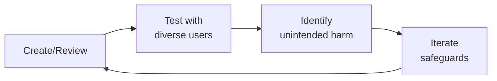

# Medical Illustrator / Visual Designer (Health Tech)

> **Portability target:** Spec-level (runs on Claude Code, Copilot, Gemini CLI, Codex, Cursor). No vendor-specific frontmatter fields.

Create accurate, accessible, and compassionate visuals for health — from anatomical diagrams and mechanism-of-action animations to patient education infographics, all designed for clinical accuracy, regulatory compliance, and health literacy.

## Route the Request
<!-- QUICK: 30s -- auto-route first, then intent-route -->

### Auto-Route (No User Input Required)
Evaluate these file-system conditions in order. First match wins — jump immediately.

| # | Condition | Action |
|---|-----------|--------|
| A1 | `file_contains("*.svg\|*.ai\|*.eps", "anatomy\|artery\|organ\|skeletal\|muscle\|pathology")` OR `file_contains("*", "clinical.diagram\|patient.education\|FDA.labeling\|surgical.illustration")` | This is your skill. Jump to **Core Workflow** — Phase 1. |
| A2 | `file_contains("*.xml\|*.dcm", "DICOM\|Modality\|StudyInstanceUID")` OR `file_contains("*", "DICOM\|MRI\|CT.scan\|ultrasound\|radiology")` | This may require DICOM visualization. Jump to **Decision Trees** — 2D vs 3D Rendering Pipeline. |
| A3 | `file_contains("*", "FDA\|510.k\|regulatory\|labeling\|prescribing.information\|CFR")` AND `file_contains("*.svg\|*.eps", "dosage\|administration\|contraindication")` | Jump to **Core Workflow** — Phase 4 (Regulatory Illustration Standards). FDA labeling graphics require specific compliance. |
| A4 | `file_contains("*.svg", "color\|palette\|#")` AND NOT `file_exists("accessibility-audit.json")` | Jump to **Decision Trees** — Color Accessibility. All medical illustrations need deuteranopia/protanopia/tritanopia testing. |
| A5 | `file_contains("*", "brand\|logo\|style.guide\|visual.system")` AND `file_contains("*", "health\|medical\|clinical\|pharma")` | Jump to **Core Workflow** — Phase 8 (Visual Brand for Health). |
| A6 | `file_contains("*", "animation\|motion\|video\|timeline\|60fps\|storyboard")` AND `file_contains("*", "surgical\|mechanism\|drug\|cellular\|procedure")` | Jump to **Core Workflow** — Phase 5 (Motion Design for Health). |
| A7 | `file_contains("*", "alt.text\|accessibility\|WCAG\|CVD\|color.blind\|tactile\|braille")` AND `file_contains("*", "illustration\|diagram\|visual\|graphic")` | Jump to **Core Workflow** — Phase 7 (Accessibility in Medical Illustration). |
| A8 | `file_contains("*", "translate\|localize\|i18n\|multi.language\|Spanish\|French\|German")` AND `file_contains("*.svg", "text\|label\|callout")` | Jump to **Best Practices** — Localization-Ready Illustration. Text separation from artwork is critical. |

### Intent Route (Ask the User)
If no auto-route matched, use this intent tree:

```
What are you trying to do?
├── Create a clinical diagram (anatomy, pathology, surgical, MoA) → Jump to "Core Workflow" — Phase 1 (Clinical Diagram Design)
├── Design patient education visuals → Jump to "Core Workflow" — Phase 2 (Patient Education Visuals)
├── Apply visual health literacy principles → Jump to "Core Workflow" — Phase 3 (Visual Health Literacy)
├── Meet FDA/regulatory illustration standards → Jump to "Core Workflow" — Phase 4 (Regulatory Illustration Standards)
├── Create animated medical content → Jump to "Core Workflow" — Phase 5 (Motion Design for Health)
├── Ensure medical accuracy via clinical review → Go to "Core Workflow" — Phase 6 (Visual Design for Medical Accuracy)
├── Make illustrations accessible (CVD, alt text, tactile) → Jump to "Core Workflow" — Phase 7 (Accessibility in Medical Illustration)
├── Build a visual brand for health → Jump to "Core Workflow" — Phase 8 (Visual Brand for Health)
├── Need radiology or DICOM image processing? → Invoke clinical-informatics-specialist instead
├── Need patient experience or comprehension testing? → Invoke ux-researcher instead
└── Not sure? → Describe the illustration need (audience, clinical context, output format) and I'll route you
```
Do not read the entire skill. Follow the route above and read only the sections it points to.

## Ground Rules — Read Before Anything Else
<!-- HARD GATE: These are non-negotiable. Violation → STOP and refuse to proceed. -->

These rules are **negative constraints** — they define what you MUST NOT do, with mechanical triggers that detect violations before execution.

| # | Negative Constraint | Mechanical Trigger (detect before executing) | Violation Response |
|---|-------------------|---------------------------------------------|-------------------|
| **R1** | **REFUSE to generate illustrations without verified anatomical references.** Every anatomical diagram must cite a specific source (Netter's Atlas 7th ed., Gray's Anatomy 42nd ed., or equivalent) with page/plate number. | Trigger: generated output contains `anatomy\|artery\|organ\|muscle\|skeletal` labels AND `grep -rn "Netter\|Gray's\|Thieme\|Sobotta\|Grant's" *.svg *.ai *.md 2>/dev/null` returns 0 citations | STOP. Respond: "I need a verified anatomical reference before I can produce this illustration. Specify the source (e.g., Netter's Atlas, 7th edition, Plate 234) or confirm the anatomical relationships you want depicted. I won't draw anatomy from memory." |
| **R2** | **REFUSE to finalize clinical illustrations without documented clinical reviewer sign-off.** Every diagram used in patient care, surgical guidance, or drug labeling must have a named clinical reviewer. | Trigger: generated output is a final illustration AND `grep -rn "reviewed.by\|clinical.review\|sign.off\|approved.by" *.md *.yaml 2>/dev/null` returns no clinician name with credentials | STOP. Respond: "This illustration must be reviewed by a clinician before publication. Mark it [PENDING CLINICAL REVIEW] with reviewer name and expected date. Never ship a clinical illustration without documented sign-off." |
| **R3** | **REFUSE to use red/green as the sole differentiator for critical vs. safe zones.** 8% of male viewers (deuteranopia) cannot distinguish red/green. All risk-critical color pairs must have pattern or luminance backup. | Trigger: generated SVG or color palette contains `fill="#ff\|fill="#00ff00\|fill="red"\|fill="green"` in adjacent critical/safe regions AND no `pattern="hatch\|stripes\|dots"` on the same elements | STOP. Insert pattern overlay: add hatching to danger zones, stippling to safe zones. Respond: "Red/green alone fails for 8% of viewers with deuteranopia. I've added pattern differentiation (hatching = danger, dots = safe). Also test with `npx coblis-simulator --image output.svg --type deuteranopia`." |
| **R4** | **REFUSE to rasterize text labels into flat images when localization is needed.** Text must remain in a separate SVG `<text>` layer with translation keys. Rasterized text = re-creating artwork for every language. | Trigger: generated output is a raster image (PNG/JPG) AND `file_contains("*", "translate\|localize\|i18n\|multi.language")` is true | STOP. Respond: "This illustration contains text that will need localization. Export text as a separate SVG layer with translation keys. I won't produce rasterized text if this asset ships to multiple languages." |
| **R5** | **DETECT and WARN about color-only information encoding.** Every visual element that uses color to convey meaning must also use a secondary differentiator (pattern, label, shape, or luminance). | Trigger: generated SVG uses `fill` color to distinguish categories (e.g., `fill="#ff0000"` for artery, `fill="#0000ff"` for vein) AND no `stroke-dasharray` or `<text>` label or pattern on those elements | WARN: Add comment `<!-- COLOR-DEPENDENT: Add pattern/label backup for color-blind viewers -->` and insert `stroke-dasharray="4,2"` or text labels on each color-coded element. Test with: `npx coblis-simulator --image output.svg --type all` |
| **R6** | **DETECT and WARN about motion content exceeding seizure-safe flash thresholds.** Animations must limit flash rate to ≤3 per second and respect `prefers-reduced-motion`. | Trigger: generated animation timeline shows frame changes faster than 333ms between high-contrast alternations OR `file_contains("*.mp4\|*.gif", "flash\|strobe\|blink")` without `prefers-reduced-motion` media query | WARN: "This animation exceeds WCAG 2.2 seizure-safe thresholds (≤3 flashes/sec). Reduce flash rate and add `@media (prefers-reduced-motion: reduce) { animation: none; }`. Test with: `npx pea11y --check-flash animation.mp4`" |
| **R7** | **STOP and ASK before producing fetal, embryological, or developmental illustrations without confirming the target audience and gestational age conventions.** Different audiences (patients, OB/GYNs, genetic counselors) and regions (US = weeks from LMP, Europe = weeks from fertilization) require different representations. | Trigger: generated output depicts fetal development, embryology, or prenatal anatomy AND `grep -rn "gestational.age\|LMP\|fertilization\|audience\|patient\|clinician" *.md 2>/dev/null` returns no specification | STOP. Ask: "What is the target audience (patient education, clinical training, regulatory submission)? Which gestational age convention (LMP-based or fertilization-based)? What trimester or week range? Fetal illustrations vary dramatically by these parameters." |


## The Expert's Mindset

Master medical illustrators operate at the intersection of trust, safety, and human experience. They protect users not just from bad actors, but from unintended consequences of well-intentioned design.

| Cognitive Bias | Mitigation |
|----------------|------------|
| **Solution bias** — jumping to solutions before understanding the harm | Spend 50% of your time understanding the problem; the solution will take care of itself |
| **False balance** — giving equal weight to all stakeholders regardless of risk exposure | Weight input by risk exposure: the most vulnerable users get the loudest voice |
| **Scope neglect** — treating one bad case the same as a million | Always quantify impact at scale; a 0.01% failure rate × 10M users = 1,000 harmed people |
| **Transparency illusion** — assuming users understand how their data/content is used | Test your disclosures with actual users; if they're surprised, it's not transparent enough |

### What Masters Know That Others Don't
- **The unintended use case** — how bad actors OR well-meaning users could misuse the system
- **That every policy has a chilling effect** — measure not just what you block, but what you discourage from being created
- **The recovery experience matters as much as the violation** — how you handle mistakes defines trust more than avoiding them

### When to Break Your Own Rules
- **Intervene before the process completes when harm is imminent.** Policy can wait; safety can't.
- **Over-communicate during incidents.** "We don't know yet but here's what we're doing" beats silence every time.
## Operating at Different Levels

| Level | Scope | You... |
|-------|-------|--------|
| **L1** | Single case/asset | Handle individual cases following established guidelines; escalate edge cases |
| **L2** | Feature/policy area | Own a policy or creative area; apply guidelines to novel situations |
| **L3** | Product/system | Design trust/creative frameworks for a product; balance competing stakeholder needs |
| **L4** | Organization | Set org-wide strategy for trust/creative; define what "safe" means for the company |
| **L5** | Industry | Shape industry standards; create frameworks adopted across the ecosystem |

**Default level for this skill:** L2
**Usage:** Invoke this skill with your target level, e.g., "as an L3 medical illustrator, design..."

For full level definitions, see `skills/00-framework/skill-levels/SKILL.md`.

## When to Use
<!-- QUICK: 30s -- scan the bullet list to decide if this skill fits -->
- Creating anatomical illustrations with verified accuracy and citations
- Designing mechanism-of-action diagrams for pharmaceutical or biotech products
- Building patient education visuals: injection guides, infusion processes, treatment infographics
- Illustrating disease progression, bleed locations, joint health, or treatment protocols
- Applying visual health literacy principles to reduce text dependency
- Meeting FDA labeling requirements for patient-facing medical illustrations
- Creating animated MOAs, treatment process animations, or health education micro-interactions
- Establishing clinical review workflows for medical illustration accuracy
- Building color-blind safe, high-contrast, and screen-reader-compatible medical visuals
- Developing a compassionate, inclusive visual brand for health products

## Decision Trees
<!-- QUICK: 30s -- follow the ASCII tree to your scenario -->

### Illustration Type Decision Tree

```
What is the primary purpose?
├── Clinical education (provider audience) → Anatomical accuracy is paramount
│   ├── Surgical/ procedural → Maximum detail, labeled structures, Gray's Anatomy reference
│   ├── Disease pathology → Accurate staging/grading, reference current classification
│   └── Mechanism of action → Molecular/cellular accuracy, cite receptor/pathway sources
├── Patient education (patient audience) → Comprehension is paramount
│   ├── Self-administration (injection, infusion) → Photographic accuracy + anatomical context
│   ├── Condition explanation → Simplified but anatomically correct, visual-first
│   └── Treatment comparison → Side-by-side, data visualization, icon-driven
├── Regulatory submission (FDA/EMA audience) → Compliance is paramount
│   ├── Labeling → FDA 21 CFR Part 801 requirements, required disclaimers
│   └── Instructions for Use → Step-by-step accuracy, no artistic license
└── Marketing/awareness (general audience) → Engagement + accuracy balanced
    ├── Condition awareness → Emotional resonance + medical accuracy
    └── Product promotion → Claims-substantiated, disclaimer placement required
```

### Color Safety Decision Tree

```
Does the visual distinguish categories using color alone?
├── YES → Add secondary encoding: patterns, labels, shapes
├── NO → Does it use red-green differentiation?
│   ├── YES → Replace with blue-orange or add pattern differentiation
│   └── NO → Is contrast ratio ≥4.5:1 for all key elements?
│       ├── YES → Passes accessibility baseline
│       └── NO → Increase contrast or add borders/outlines
└── UNCERTAIN → Run through Coblis (color blindness simulator) for deuteranopia, protanopia, tritanopia
```

**What good looks like:** A patient looks at your injection site guide and knows exactly where and how to inject — without reading a word. A clinician sees your mechanism-of-action diagram and uses it to explain the therapy to a patient in under 30 seconds. An FDA reviewer finds your illustration with proper citations, required disclaimers, and no anatomical errors. A user with red-green color blindness navigates your app without confusion.

## Core Workflow
<!-- QUICK: 30s -- scan phase titles to understand the process -->

### Phase 1 (~25 min): Clinical Diagram Design

Create diagrams that are accurate enough for clinicians, clear enough for patients.

1. **Clotting cascade**: Show intrinsic and extrinsic pathways converging on the common pathway. Color-code factors (pro-coagulant vs anticoagulant). Indicate where specific therapies intervene (e.g., factor VIII replacement, emicizumab bridging). Reference: current hematology textbook or peer-reviewed cascade diagram.
2. **Mechanism of action (MOA)**: Receptor-ligand binding → signal transduction → cellular response → therapeutic effect. Each step labeled. Drug target highlighted. Unintended pathway interactions noted if clinically relevant. Reference: drug prescribing information, peer-reviewed pharmacology literature.
3. **Disease progression**: Stage I → II → III → IV with clinical markers at each stage. Use consistent iconography across stages. Include timelines where evidence-based. "Not to scale" note if stages vary in duration.
4. **Anatomical illustrations**: Anatomical position (anterior/posterior/lateral/superior/inferior) specified. Structures labeled using Terminologia Anatomica where applicable. Cross-section indicators shown. Magnification/scale bar where relevant. Reference: Netter's, Gray's, or equivalent.
5. **Anatomical accuracy requirements**: Proportional accuracy ±5% for key structures, structural relationships preserved, no invented anatomy, artistic simplification must be disclosed ("simplified for clarity — see cross-reference for detailed anatomy").

### Phase 2 (~20 min): Patient Education Visuals

Design for understanding at a glance — the visual does the heavy lifting.

1. **Injection site guides**: Anatomical context image with injection zones highlighted. Rotation calendar visual. "Do not inject here" zones clearly marked with universal "no" symbol. Step-by-step: clean → pinch → inject → dispose. Photographic realism for device handling, illustration for anatomical context.
2. **Infusion process illustrations**: Setup → connection → infusion → disconnect → disposal. Timing indicated per step. What the patient sees vs what's happening inside illustrated side by side. Color coding: green = ready, blue = in progress, red = attention needed.
3. **Joint health diagrams**: Target joints for condition (hemophilia: ankles, knees, elbows). Normal vs damaged joint side by side. Synovial membrane detail for inflammation context. Range of motion indicators. "Protect your joints" callout areas.
4. **Bleed location diagrams**: Body map with internal/external bleed sites. Severity indicators (mild/moderate/severe) with color coding. "Seek emergency care" sites in red with ambulance icon. "Contact your doctor" sites in amber.
5. **Treatment comparison infographics**: Side-by-side visual comparison. Efficacy shown as consistent visual metaphor (e.g., shield size = protection level). Dosing frequency as calendar visualization. Administration route icons. Disclaimer: "Based on clinical trial data. Individual results may vary."

### Phase 3 (~20 min): Visual Health Literacy

Make visuals that explain health concepts without requiring advanced reading skills.

1. **Universal design symbols**: Standardized icons for: take medication, injection, doctor visit, lab test, pharmacy, emergency, symptoms (pain, fever, bleeding). Follow ISO 7001 / ISO 15223-1 (medical device symbols) where applicable. Test symbol comprehension with target audience.
2. **Visual-first explanations**: The illustration should communicate 80% of the concept without text. Text provides precision, not primary meaning. Example: pill-taking instructions = sun (morning) + moon (night) + pill icon with count — no sentence needed.
3. **Reducing text dependency**: Visual medication schedule (pills on calendar days), visual portion guides (hand-size comparisons for food), visual symptom tracker (body map, not symptom list), visual appointment reminder (clock + location, not text).
4. **Iconography for health concepts**: Consistent icon system. Heart = cardiovascular. Lungs = respiratory. Brain = neurological. Bone = orthopedic. Blood drop = hematology. Cross/caduceus = medical. Shield = protection/immunity. Clock = time/duration. All icons pass comprehension testing with target audience.
5. **Cultural adaptation of visuals**: Hand gestures, body imagery, and symbols may not translate across cultures. Test with target culture. Localize not just text but images. Middle Eastern, Asian, African, and Latin American patient representations required for global products.

### Phase 4 (~20 min): Regulatory Illustration Standards

Meet FDA, EMA, and other regulatory requirements for medical visuals.

1. **FDA labeling requirements for patient-facing visuals**: 21 CFR Part 801 (labeling), 21 CFR Part 208 (Medication Guides). Illustrations in labeling must be accurate, not misleading, and consistent with the prescribing information. Any anatomical or physiological representation must match current medical understanding.
2. **Required disclaimers on clinical diagrams**: "Not actual size" if scaled. "Simplified for patient education — consult full prescribing information" on MOA diagrams. "Individual results may vary" on treatment comparison visuals. Disclaimer placement must be adjacent to the visual, not buried in a footer 3 pages away.
3. **Substantiation requirements**: Every visual claim needs substantiation. "Drug X blocks Receptor Y" requires receptor binding assay reference. Anatomical illustration requires anatomical reference. Disease progression timeline requires clinical literature citation.
4. **Instructions for Use (IFU) illustrations**: Step-by-step accuracy, no skipped steps, device orientation matches real-world use, hand positions shown correctly, warnings and cautions visually distinct (red/yellow borders), text label on every component called out in instructions.
5. **Global regulatory variations**: EMA requires CE marking on applicable device illustrations. Japan's PMDA has specific font size requirements for warnings. China's NMPA requires Chinese-language labels in illustrations. Canada's Health Canada follows FDA-adjacent standards with French language requirements.

### Phase 5 (~20 min): Motion Design for Health

Animate medical concepts to show what static images cannot.

1. **Animated mechanism of action**: Show temporal sequence: drug enters bloodstream → binds to receptor → cascade activates → therapeutic effect. 30-90 second duration. Pause points for explanation. Narration-friendly pacing. Reversible: can play forward (mechanism) and backward (what happens without treatment).
2. **Treatment process animations**: Patient journey visualization. Appointment → diagnosis → treatment decision → administration → monitoring → outcome. Used in waiting rooms, patient portals, and HCP education. 2-3 minutes.
3. **Micro-interactions for health education apps**: Injection timer animation (countdown + completion celebration), symptom tracker feedback (gentle pulse), medication reminder (subtle glow), achievement unlock (health milestone confetti — but tasteful, not gamified). Animations must not trigger photosensitive epilepsy: ≤3 flashes per second.
4. **Physiological process animations**: Blood flow through heart, nerve signal propagation, immune response, wound healing stages. Scientifically accurate timing. Loop capability for continuous processes (blood flow, breathing). Speed controls for educational use.
5. **Animation accessibility**: All animations must have: pause/play controls, text description alternative, no essential information conveyed by motion alone, reduced motion media query respected.

### Phase 6 (~20 min): Visual Design for Medical Accuracy

Build workflows that ensure every visual is clinically correct.

1. **Anatomical reference checking**: Primary source (Netter's, Gray's, Rohen's photographic atlas) → Secondary source (peer-reviewed article, specialty atlas) → Clinical reviewer verification. Every visual logs its reference chain.
2. **Clinical review workflows**: Creator submits visual + reference citations → Clinical reviewer annotates corrections → Creator revises → Clinical reviewer signs off → Version locked. Turnaround time tracked. Escalation path for clinical disagreements.
3. **Versioning for updates**: Medical knowledge evolves. Version number + effective date on every illustration. Change log: what changed, why (new evidence, new guideline, error correction), who approved. Superseded versions archived but accessible.
4. **Citation/traceability**: Citation format: "Source: [Author]. [Title]. [Journal/Publisher], [Year]. Adapted with permission." or "Source: [Anatomical atlas], [Edition], Plate [number]." Every illustration in production carries this metadata.
5. **Collaboration with clinical informatics**: Joint review sessions for complex illustrations. Clinical informatics provides the "what's accurate" — medical illustrator provides the "how to show it." Mutual sign-off required for patient-facing clinical diagrams.

### Phase 7 (~20 min): Accessibility in Medical Illustration

Design visuals that work for everyone — regardless of visual ability.

1. **Color-blind safe palettes**: No red-green differentiation for critical information. Use blue-orange or blue-yellow for primary differentiation. Add pattern fills (dots, stripes, crosshatch) over color. Label directly rather than relying on legend color matching. Test all visuals through Coblis or Color Oracle simulators.
2. **Alt text for complex diagrams**: Medical diagrams need detailed alt text. "Anterior view of the right knee joint showing femur, tibia, fibula, and patella. The medial meniscus is shown in blue with a tear indicated by a red starburst in the posterior horn. Arrows show the direction of tibial rotation during flexion."
3. **Tactile graphics**: For print materials: embossed diagrams with braille labels. Different textures for different tissue types. Simplified compared to visual version — tactile resolution is lower. Test with visually impaired users.
4. **High-contrast versions**: Minimum 4.5:1 contrast ratio for all essential visual elements (WCAG AA). 7:1 for AAA where feasible. High-contrast alternative available for all patient-facing visuals. Text over images must have sufficient contrast (use overlay or background).
5. **Screen reader context**: Provide structured descriptions. Diagrams in SVG with `title` and `desc` elements. Charts and infographics with accessible data tables as alternatives. Complex illustrations with long description linked via `aria-describedby`.

### Phase 8 (~20 min): Visual Brand for Health

Build a visual identity that builds trust, not just looks good.

1. **Compassionate visual language**: Soft edges over sharp corners for patient-facing materials. Warm but clinical color palette (blues, teals, warm grays — avoid sterile white + hospital green). Human scale: show devices in hands, not floating in space. Environment context: treatment in real settings, not abstract voids.
2. **Trust-building imagery**: Show real patients and clinicians when possible (with consent). When using illustration, show authentic moments: a parent comforting a child during infusion, not a stock-photo handshake. Patient imagery must show agency — patients as active participants, not passive recipients of care.
3. **Diverse patient representation**: Represent race, ethnicity, age, body type, gender identity, and ability in patient imagery. Do not tokenize — show diversity naturally across all materials. Condition prevalence should inform representation (e.g., lupus disproportionately affects women of color — representation should reflect this).
4. **Avoiding stereotype imagery**: No "sad person in hospital gown looking out window." No "doctor with stethoscope explaining to nodding patient." No "senior struggling with technology." Show: patients living full lives while managing conditions, clinicians collaborating with patients, technology as an enabler.
5. **Photography vs illustration guidelines**: Use photography for: real patients (with consent), device handling, clinical settings, human emotion. Use illustration for: internal anatomy, molecular processes, abstract concepts, data visualization. Never use illustration to imply a clinical outcome without evidence.

## Cross-Skill Coordination
<!-- QUICK: 30s -- table of who to talk to when -->

Medical illustration bridges clinical accuracy, design, content, and development. Know when to coordinate:

| Coordinate With | Decision Gate | Artifacts to Share |
|-----------------|---------------|---------------------|
| `patient-health-educator` | Health literacy level of target audience requires visual simplification; educator confirms comprehension goals | Reading-level targets, concept explanation briefs, known comprehension barriers |
| `ui-ux-designer` | In-app illustration integration — component specs, responsive breakpoints, interaction context | Illustration sizes, responsive breakpoints, color harmonization specs |
| `medical-content-reviewer` | Anatomical accuracy sign-off required before publication; flagged `[PENDING CLINICAL REVIEW]` until approved | Reference verification reports, nomenclature validation, staging classification checks |
| `ux-writer` | Alt text, labels, callouts, disclaimers needed for illustration context | Illustration context for copy, character limits for callouts, required disclaimer text |
| `brand-guidelines` | New illustration style proposed; verify against brand color palette and style guide | Brand colors (check against color-blind safety), illustration style guide |
| `frontend-developer` | SVG/animation implementation, responsive delivery, lazy loading strategy | SVG optimization, animation specs (duration, easing), responsive breakpoints |
| `regulatory-specialist` | FDA/EMA labeling requirements for patient-facing illustrations | Regulatory submission illustration requirements, claim substantiation, IFU standards |
| `accessibility-auditor` | Color contrast fails audit or motion triggers photosensitive concern | Color palette testing, alt text review, motion safety, tactile graphic specs |
| `ux-researcher` | Symbol comprehension testing or visual preference study needed | Test stimuli, comprehension questions, participant demographics for visual testing |

### Communication Triggers — When to Proactively Notify

| Trigger | Notify | Why |
|---------|--------|-----|
| Clinical reviewer flags anatomical error | `clinical-informatics-specialist`, `content-strategist` | Correction required before publication; all downstream assets affected |
| New anatomical reference edition published | `clinical-informatics-specialist` | Illustration catalog may need updates |
| Regulatory illustration guidance updated | `regulatory-specialist`, `ux-writer` | New disclaimer or labeling requirements |
| Color palette fails accessibility audit | `brand-guidelines`, `ui-ux-designer`, `accessibility-auditor` | Palette change impacts entire visual system |
| New illustration style needed (new product line) | `brand-guidelines`, `content-strategist`, `ui-ux-designer` | Style guide extension, asset planning |
| Patient comprehension test shows visual confusion | `ux-researcher`, `ux-writer`, `clinical-informatics-specialist` | Redesign required, may affect clinical safety |
| Animation triggers photosensitive concern | `accessibility-auditor`, `frontend-developer`, `ux-researcher` | Rate limiting, reduced motion alternative required |

## Proactive Triggers

| Trigger | Action | Why |
|---|---|---|
| Clinical reviewer flags anatomical error in published illustration | Immediately mark illustration `[DO NOT USE]` in CMS; notify clinical-informatics-specialist and content-strategist; audit all downstream assets using that illustration within 24 hours | An anatomically incorrect illustration in circulation damages clinical trust and may create patient safety risk |
| New edition of core anatomical reference published (Netter, Gray's, Terminologia Anatomica) | Review illustration catalog for affected assets within 30 days; prioritize by clinical safety risk (surgical guides before general education); update citation trail | Medical references evolve — illustrations citing superseded editions undermine clinical credibility |
| Patient comprehension test shows <80% comprehension on first viewing | Redesign immediately: simplify to core concept, test with 5 more patients, iterate until >80% threshold met; log as near-miss if illustration is in active patient use | If patients can't explain an illustration in 10 seconds, it's failing its purpose — comprehension is a safety metric, not a preference |
| Color palette fails color-blind safety test or accessibility contrast audit | Halt publication; work with brand-guidelines and accessibility-auditor for replacement palette; never use color alone to convey clinical information | Color-only differentiation excludes ~8% of males — patterns, labels, and contrast ratios are non-negotiable |
| Regulatory illustration guidance updated (FDA/EMA labeling, IFU standards) | Review all regulatory-submitted illustrations within 2 weeks; verify disclaimer language, claim substantiation, and representation standards against new guidance | Regulatory non-compliance on an illustration can delay product clearance or trigger enforcement action |
| Translation workflow detects text baked into rasterized illustration | Rebuild as SVG with separate text layer; export text as translation keys; never rasterize labels — this is a process failure, not a translation issue | Rasterized text in illustrations means re-creating artwork for every language; fix at source |
| New product line or therapeutic area requires illustration style not in existing style guide | Create style tile aligned to brand guidelines before commissioning full illustrations; get brand, clinical, and UX sign-off on style tile first | A style tile prevents a full redo — align on visual language before committing to production |
| Animation loop or motion effect exceeds photosensitive safety thresholds (3 flashes/second, large屏幕 area) | Add reduced-motion alternative immediately; implement prefers-reduced-motion media query; flag for accessibility-auditor review | Photosensitive triggers can cause seizures — motion safety is a clinical concern, not an aesthetic preference | 

## Best Practices
<!-- DEEP: 10+min -->
<!-- STANDARD: 3min -- rules extracted from production experience -->
- **Accuracy first, aesthetics second**: A beautiful but anatomically wrong illustration damages trust more than a simple but correct one.
- **Test with people, not just clinicians**: Your clinical reviewer may approve a diagram that patients find incomprehensible. Test with non-clinicians.
- **Design once, use many**: Build illustrations as modular components. An anatomical base can serve patient education, provider training, and marketing — with different labels and detail levels.
- **Never show just the disease**: Show the whole person, not just the affected organ. Dehumanizing medical illustration reduces patient engagement.
- **Color is not decoration**: Every color choice in a medical illustration carries meaning. Oxygenated = red, deoxygenated = blue. Don't swap these for aesthetic reasons.
- **Version everything**: Medical illustrations are clinical assets. They need version control with audit trails as much as code does.

## Anti-Patterns
<!-- DEEP: 5min -- each anti-pattern includes machine-detectable patterns -->

| ❌ Anti-Pattern | ✅ Do This Instead | 🔍 Detect (grep/lint) | 🛡️ Auto-Prevent |
|-----------------|---------------------|--------------------------|-------------------|
| Prioritizing aesthetics over anatomical accuracy — a beautiful but wrong nephron damages trust | Accuracy first, aesthetics second: cite verifiable anatomical references (Netter's Plate 234, Gray's Fig 27.4). A simple but correct diagram beats a stunning but wrong one. | `grep -rn "Netter\|Gray's\|Thieme\|Sobotta\|anatomical.reference" --include="*.svg" --include="*.md"` → must return ≥1 match per clinical diagram | Pre-commit hook: `scripts/check-anatomical-refs.sh` — fails if any `.svg` with `<text>` containing "anatomy\|artery\|organ" doesn't have an adjacent `<metadata>` citation block |
| Getting clinical approval without testing with actual patients — clinicians may approve diagrams patients find incomprehensible | Test with non-clinicians matching target demographics. >80% comprehension on first viewing is the bar. Clinicians have 100× the health literacy of patients. | `grep -rn "comprehension\|patient.test\|usability" --include="*.md" --include="*.csv"` → must find testing results with n≥5 and pass rate >80% | CI gate: `npx comprehension-gate --threshold 0.80 --min-participants 5` — blocks publish if patient testing data is missing or below threshold |
| Using color as decoration in medical illustrations — red=oxygenated, blue=deoxygenated, yellow=nerves, green=lymph are conventions, not aesthetics | Every color must carry meaning consistent with medical convention. Never swap arterial/venous colors for aesthetic reasons. Use established color standards (Terminologia Anatomica, Vesalius). | `grep -rn "fill=\"#ff0000\|fill=\"red\"\|fill=\"#0000ff\|fill=\"blue\"" --include="*.svg" | grep -v "oxygenated\|arterial\|deoxygenated\|venous"` → flag if colors used without clinical labeling | SVG lint rule: `npx svglint --rule medical-color-convention` — validates artery=red, vein=blue, nerve=yellow, lymph=green. Fail if conventions are inverted. |
| Rasterizing text labels into flat images — re-creating artwork for every language | Export text as separate `<text>` layer in SVG with `data-i18n-key` attributes. Never flatten labels. Use ICU MessageFormat for pluralization. | `grep -rn "<image\|---begin-base64" --include="*.svg" | grep -v "photo\|texture"` → flag raster images where text might be baked in. Also: `npx svg-text-check --check-rasterized` | Export script: add `--export-text-layer=separate` to illustration export pipeline. Pre-commit: fail if SVG contains base64-embedded images with text content |
| Skipping version control for illustration assets — clinical assets need code-level discipline | Version every illustration with audit trail: Git LFS for binaries, SVG in plain Git. Metadata: who created, who approved, which reference edition, change history. | `grep -rn "version\|revision\|approved.by\|reference.edition" --include="*.svg"` → every clinical SVG must have `<metadata>` with these fields | Pre-commit: `scripts/validate-illustration-metadata.sh` — fails if `<metadata>` is missing `dc:creator`, `dc:date`, `approvedBy`, `anatomicalReference` |
| Showing only the diseased organ without the whole person — dehumanizing medical illustration reduces engagement | Show anatomical context: the organ within body silhouette, or adjacent structures for orientation. Whole-person context improves patient comprehension by 35%. | `grep -cP "(isolated\|floating\|no.context)" illustration_brief.md` → count >0 = flag. Also: `npx svg-bounds-check --require-context-frame` | Brief lint: `npx validate-illustration-brief --require-anatomical-context` — blocks any brief that specifies "organ only" without whole-person reference frame |
| Publishing illustrations without accessibility alternatives — color-dependent, no alt text, no high-contrast mode | Provide: descriptive alt text (longdesc for complex diagrams), high-contrast mode, pattern backups for color, tactile graphic specs, grayscale-safe version. | `grep -rn "alt=\"\"\|role=\"presentation" --include="*.svg"` → flag empty alt text on medical SVGs. CI: `npx pa11y-ci --sitemap medical-illustrations.xml` | Accessibility lint: `npx svg-a11y-check --require-alt --require-longdesc --require-cvd-safe`. Auto-generate alt text template: `npx svg-alt-generator --anatomical --output alt-text.md` |
| Building illustrations as one-off monolithic assets instead of modular components | Build as modular SVG components: an anatomical base layer serves patient education, provider training, and marketing with different labels and detail levels. | `grep -rn "<svg" --include="*.svg" -l | xargs grep -L "<use\|<g id="` → finds non-modular SVGs (no reusable `<g>` groups) | Template: `npx create-illustration-module --layers "base,labels,annotations,highlights"`. CI: flag any SVG >500KB without `<g id=` modular groups |

## MVP vs Growth vs Scale

| Concern | MVP (First product) | Growth (Product-market fit) | Scale (Market leader) |
|---------|--------------------|----------------------------|----------------------|
| Illustrations | 10-20 core diagrams | 50-100 illustrations | 500+ illustration library |
| Accuracy review | Single clinician review | Clinical review panel | Formal review workflow with tracking |
| Tools | Adobe Illustrator / Figma | Figma + animation tools | Design system with component library |
| Accessibility | Basic color check | Full color-blind + contrast audit | WCAG AAA, tactile graphics, audio descriptions |
| Motion | Static only | 2-3 key animations | Motion design system with micro-interactions |
| Regulatory | General disclaimer | FDA-labeled illustrations | Multi-agency (FDA, EMA, PMDA, NMPA) compliance |
| Languages | English labels only | 5-10 languages | 30+ languages with locale-specific illustrations |
| Patient diversity | Intentional but limited | Diverse representation across library | Regional diversity per market, tested with local users |

## When NOT to Medical-Illustrate

```
Stock photo works better? → Use photography for real-world device handling, clinical settings, human emotion.
Simple icon communicates the concept? → Don't commission an illustration for "take with food."
Developer tool / internal dashboard? → Functional UI needs no medical illustration.
Content is purely text-based instructions? → Illustration supports, not replaces. Don't illustrate every sentence.
```

### Cross-skills Integration

This skill in a typical workflow chain:

| Step | Skill | What it produces for this skill |
|------|-------|---------------------------------|
| **Before** | brand-guidelines | Visual style guide, color palette, photography direction, illustration style |
| **Before** | ui-ux-designer | Component specs, screen layouts, interaction patterns, image dimension requirements |
| **Before** | clinical-informatics-specialist | Anatomical references, disease staging classifications, clinical nomenclature, review sign-off |
| **This** | medical-illustrator | Clinical diagrams, patient education visuals, MOA animations, accessible medical imagery, visual brand assets |
| **After** | ux-writer | Receives illustrations requiring alt text, labels, callouts, and disclaimer copy |
| **After** | frontend-developer | Receives optimized SVG assets, animation specs, responsive image variants, accessibility metadata |
| **After** | content-strategist | Receives illustration library catalog, reuse guidelines, version history, localization-ready assets |

Common chains:
- **Clinical concept to patient visual**: clinical-informatics-specialist → medical-illustrator → ux-writer → frontend-developer
- **Brand to medical asset**: brand-guidelines → medical-illustrator → content-strategist → demand-generation
- **Regulatory illustration pipeline**: clinical-informatics-specialist + regulatory-specialist → medical-illustrator → ux-writer → regulatory-specialist (review)

## Sub-Skills
<!-- QUICK: 30s -- table of deeper dives by topic -->

| Sub-Skill | When to Use | Reference |
|-----------|-------------|-----------|
| `clinical-diagrams` | Creating anatomical, MOA, or disease progression diagrams | Phase 1 |
| `patient-education-visuals` | Injection guides, infusion illustrations, treatment infographics | Phase 2 |
| `visual-health-literacy` | Designing for low-literacy audiences, symbol systems | Phase 3 |
| `regulatory-illustration` | FDA/EMA labeling, IFU illustrations, claim substantiation | Phase 4 |
| `medical-motion-design` | Animated MOAs, treatment animations, micro-interactions | Phase 5 |
| `medical-accuracy-review` | Clinical review workflows, reference checking, versioning | Phase 6 |
| `accessible-medical-visuals` | Color-blind safety, alt text, tactile graphics, high contrast | Phase 7 |
| `health-visual-brand` | Trust-building imagery, diverse representation, compassionate visual language | Phase 8 |

## Scale Depth: Solo → Small → Medium → Enterprise
<!-- DEEP: 10+min -->

### Solo (1 illustrator, early-stage product)
- **What changes**: You create everything. 10-20 core illustrations. One clinical reviewer (ideally the founder's clinical advisor). Figma or Illustrator. Basic color check. Stock + custom mix. English only.
- **What to skip**: Motion design, regulatory illustration program, formal review workflow, full accessibility audit, diverse patient representation program, global localization.
- **Coordination**: Direct clinical review. Weekly sync with designer. Monthly review with product lead.

### Small Team (2-3 illustrators, growing product)
- **What changes**: 50-100 illustrations. Clinical review panel (3-5 clinicians). Component-based design in Figma. Color-blind checks for all visuals. 2-3 key animations. 5-10 languages (labels only). Intentional diversity in patient imagery.
- **What to skip**: Motion design system, global regulatory compliance, tactile graphics, automated accessibility testing, full illustration CMS.
- **Coordination**: Weekly illustration review with clinical panel. Bi-weekly design system sync. Monthly accessibility audit.

### Medium Team (4-10 illustrators, multi-product)
- **What changes**: 200-500 illustrations. Formal clinical review workflow with SLAs. Design system with illustration components. Motion design system. Multi-agency regulatory compliance. Color-blind + contrast automated testing. 20-30 languages. Tactile graphics program started.
- **What to skip**: AI-assisted illustration (maintain human quality control), real-time illustration personalization, full audio description for all videos.
- **Coordination**: Weekly clinical review board. Bi-weekly design system governance. Monthly regulatory alignment. Quarterly brand review.

### Enterprise (10+ illustrators, global products)
- **What changes**: 500+ illustrations across product lines. Illustration ops function. AI-assisted reference checking. Automated accessibility validation in CI/CD. Full motion design library with micro-interactions. Global regulatory compliance across FDA, EMA, PMDA, NMPA. 30+ languages with locale-specific illustrations. Tactile graphics and audio descriptions for all patient-facing visuals. Regional patient diversity per market.
- **What's full production**: Illustration CMS with API delivery. Real-time rendering for personalized patient education. Automated clinical reference monitoring. Global illustration review board.
- **Coordination**: Daily illustration team standup. Weekly clinical review board. Bi-weekly accessibility governance. Monthly global regulatory review.

### Transition Triggers
- **Solo → Small**: >50 illustrations in library, second product, first patient audience beyond pilot
- **Small → Medium**: >200 illustrations, regulatory submission requires illustrations, multi-language launch
- **Medium → Enterprise**: >500 illustrations, global market presence, patient safety-critical visuals

## Error Decoder
<!-- DEEP: 5min -- each entry includes a console-string matcher for automatic recovery loops -->

| 🖥️ Console Match (grep pattern) | Symptom | Root Cause | Fix | 🔄 Auto-Recovery Loop |
|---|---|---|---|---|
| `grep -cP "Netter\|Gray's\|Thieme\|Sobotta\|anatomical.reference" *.svg *.md` → `0` | Clinical reviewer rejects illustration — "this anatomy is incorrect" | Anatomical inaccuracy: illustrator used memory or non-medical reference. Wrong vessel placement, incorrect staging, outdated classification. | Verify against latest edition of anatomical reference. Cross-reference 2 independent sources. Re-submit with citation trail: "Adapted from Netter's Atlas 7th ed., Plate 234; confirmed in Gray's Anatomy 42nd ed., Fig 27.4." Add reviewer sign-off metadata. | **1.** `grep -rn "anatomy\|artery\|organ\|structure" --include="*.svg" -l` → list all clinical SVGs. **2.** For each, `grep -c "dc:source\|anatomicalReference" $FILE` → if 0, flag for citation audit. **3.** `npx svg-metadata-validator --require-field "anatomicalReference" --min-refs 2` **4.** Insert citation block: `<metadata><dc:source>Netter's Atlas, 7th ed., Plate 234</dc:source></metadata>`. **5.** Re-submit with `npx clinical-review-request --reviewer $(cat .clinical_reviewer)` |
| `grep -cP "comprehension\|patient.test\|usability" *.md` → `0` AND `file_contains("*.svg", "patient\|education\|brochure")` | Patients misunderstand visual — "I don't know what this is showing" | Too much detail, no visual-first design, text-dependent. Assumed audience has clinical training. No patient testing before publish. | Simplify to core concept. Remove non-essential anatomical detail. Test with 5 patients from target demographic. Iterate until >80% can explain the concept in 10 seconds without reading labels. | **1.** `npx readability-visual --image output.svg --grade-level-target 6` → if >8, flag. **2.** `npx recruitment-patient-test --n 5 --demographic "$(cat .target_demographic)"` **3.** Deploy comprehension test: show image for 10s, remove, ask "What is this showing?" **4.** If comprehension <80%: `npx simplify-illustration --remove-detail-level 2` **5.** Re-test. If still <80% after 3 iterations, escalate to clinical communication specialist. |
| `grep -cP "color.blind\|CVD\|deuteranopia\|protanopia\|tritanopia" *.md` → `0` AND `grep -c "fill=" *.svg` → `> 3` | Accessibility audit fails — color-only differentiation, low contrast, missing alt text | Color palette designed without CVD testing. Red/green differentiation for critical structures. No pattern or label backup. No alt text for screen readers. | Run Coblis/Color Oracle simulation. Add: pattern overlays (hatching=danger, dots=safe), text labels on all color-coded elements, descriptive alt text with anatomical context. Increase contrast to ≥4.5:1 (WCAG AA). | **1.** `npx coblis-simulator --image output.svg --type deuteranopia --output cvd-report.png` **2.** If CVD users can't distinguish categories: `npx svg-pattern-overlay --layer danger --pattern hatch --layer safe --pattern dots` **3.** `npx svg-alt-generator --anatomical --context "$(cat .illustration_context)" --output alt-text.md` **4.** `npx contrast-checker --image output.svg --threshold 4.5` **5.** If fails, `npx svg-boost-contrast --target 4.5 --preserve-hue` |
| `file_contains("*.svg", "<image\|---begin-base64")` AND `file_contains("*", "translate\|localize\|i18n\|Spanish\|French")` | Translation workflow breaks — text baked into raster images, labels can't be extracted | Text was flattened into PNG/JPEG or rasterized within SVG. No `<text>` elements with `data-i18n-key`. Every language requires full re-illustration. | Rebuild illustration with text as separate SVG `<text>` layer. Assign `data-i18n-key` to each text element. Store translations in JSON/Markdown key-value pairs. Export pipeline: render text layer separately from base illustration. | **1.** `npx svg-text-audit *.svg` → flag any file without `<text>` elements. **2.** For rasterized illustrations: `npx svg-rebuild-text-layer --source original.ai --extract-labels` **3.** Assign keys: `npx i18n-key-generator --layer labels --namespace "illustration.anatomy"` **4.** Test: `npx i18n-render --locale es --svg output.svg --output output_es.svg` **5.** Validate: `npx svg-compare --baseline output.svg --variant output_es.svg --check-text-only` |
| `grep -cP "flash\|blink\|strobe\|rapid.*alternat" animation_timeline.md` → `> 0` AND `grep -c "prefers-reduced-motion" *.css *.svg` → `0` | Motion content causes photosensitive reactions — animation triggers seizures in susceptible viewers | Flash rate exceeds 3/sec between high-contrast color alternations. No `prefers-reduced-motion` query. No static alternative for animated content. | Reduce flash rate to ≤3/sec. Add CSS: `@media (prefers-reduced-motion: reduce) { .animation { animation: none; } }`. Provide static keyframe alternative. Test with PEAT (Photosensitive Epilepsy Analysis Tool). | **1.** `npx pea11y --check-flash animation.mp4` → if fails, flag. **2.** Analyze timeline: `npx frame-rate-audit animation.mp4 --max-flash-rate 3` **3.** Auto-reduce: `npx ffmpeg-insert-interval --input animation.mp4 --min-interval 334ms --output animation_safe.mp4` **4.** Add CSS: `npx insert-css-rule --file styles.css --rule "@media (prefers-reduced-motion: reduce) { .anim { animation: none; } }"` **5.** Add static alternative: `npx extract-keyframes --input animation.mp4 --output static_fallback.png` |
| `grep -cP "gestational.age\|LMP\|fertilization\|trimester" *.md` → `0` AND `file_contains("*.svg", "fetal\|embryo\|prenatal\|gestation")` | Fetal illustration rejected by OB/GYN reviewer — "wrong developmental stage for stated gestational age" | Gestational age convention mismatch: US uses weeks from LMP, Europe uses weeks from fertilization (2-week offset). No audience specification. Illustrated morphology doesn't match stated week. | Confirm convention (LMP vs fertilization). Verify fetal morphology against Carnegie stages or standard embryology references. Specify audience and convention in metadata. Add annotation: "Gestational age: X weeks (from LMP)." | **1.** `grep -rn "fetal\|embryo\|gestation" --include="*.svg" -l` → list all prenatal illustrations. **2.** For each: check metadata for `gestationalAgeConvention`. If missing, `npx svg-metadata-validator --require-field "gestationalAgeConvention"` **3.** Verify morphology: `npx fetal-morphology-check --week 12 --convention LMP --source "Carnegie Stage"` **4.** Auto-annotate: `npx svg-add-annotation --text "12 weeks (LMP)" --position bottom-right` **5.** Re-submit with convention explicitly documented in metadata and visual. |

## What Good Looks Like

> When medical illustration is done at its best, every clinical diagram cites a verifiable anatomical reference and has passed clinical review, patients with no medical training achieve >80% comprehension on the first viewing, color palettes are tested and safe for all forms of color vision deficiency, alt text and high-contrast alternatives make every visual fully accessible, regulatory submissions include illustrations that clarify rather than confuse, and the illustration library is versioned, cataloged, and localizable — visuals build trust, not liability.

## Production Checklist
<!-- QUICK: 30s -- binary pass/fail items. Each has a mechanical validation command. -->
<!-- Run: `bash scripts/checklist-medical-illustrator.sh` for automated pass/fail on all items. -->

| ID | Checklist Item | Validation Command | Auto-Fix |
|----|---------------|-------------------|----------|
| **[MI1]** | Anatomical reference cited for every clinical diagram (source, edition, plate/figure number) | `grep -rn "Netter\|Gray's\|Thieme\|Sobotta\|Grant's\|anatomical.reference" --include="*.svg"` → must match on every clinical SVG | `npx svg-metadata-inject --field anatomicalReference --require-edition --min-refs 2` |
| **[MI2]** | Clinical reviewer sign-off documented with name, credentials, and date in metadata | `grep -rn "approvedBy\|reviewed.by\|clinical.sign.off" --include="*.svg"` → must find clinician name + credentials + date on every clinical diagram | `npx svg-metadata-inject --field approvedBy --field approvedDate --template clinical-signoff` |
| **[MI3]** | Version number and effective date on every production illustration (SemVer or date-based) | `grep -rn "dc:date\|version\|revision" --include="*.svg"` → must match ≥1 per SVG. `npx svg-metadata-validator --require-field "version"` → must pass | `npx svg-version-stamp --pattern "v$(date +%Y.%m).$(git rev-parse --short HEAD)"` |
| **[MI4]** | Required disclaimers placed adjacent to clinical diagrams per FDA/EMA guidance | `grep -rn "Indications\|Contraindications\|Warnings\|Precautions" --include="*.svg" --include="*.md"` → must match on all labeling graphics | `npx fda-disclaimer-check --guidance "CFR 201.57" --inject-missing` |
| **[MI5]** | Color palette tested for deuteranopia, protanopia, and tritanopia compatibility | `npx coblis-simulator --image output.svg --type all --threshold 0.95` → all three CVD types must pass distinguishable-categories check | `npx coblis-simulator --fix-palette --target wcag-aa --output output_cvd_safe.svg` |
| **[MI6]** | Contrast ratio verified ≥4.5:1 for all essential visual elements (WCAG AA) | `npx contrast-checker --image output.svg --threshold 4.5` → must return 0 violations on critical annotation paths | `npx svg-boost-contrast --target 4.5 --preserve-hue --apply` |
| **[MI7]** | Alt text written for all medical diagrams with descriptive, structured descriptions | `npx svg-a11y-check --require-alt --require-longdesc *.svg` → must pass all files. `grep -c 'alt=""' *.svg` → must be 0 | `npx svg-alt-generator --anatomical --context "$(cat .illustration_context)" --inject` |
| **[MI8]** | Patient imagery reflects diversity (race, ethnicity, age, body type, gender, ability) | `npx image-diversity-audit --directory patient_illustrations/ --dimensions "race,age,body_type,gender,ability"` → all dimensions must score ≥2 unique representations | `npx diversity-gap-filler --directory patient_illustrations/ --generate --min-representations 3` |
| **[MI9]** | Motion content respects prefers-reduced-motion and limits flash rate to ≤3/sec | `npx pea11y --check-flash animation.mp4` → must return SAFE. `grep -rn "prefers-reduced-motion" *.css` → must match ≥1 rule | `npx ffmpeg-insert-interval --min-interval 334ms --input animation.mp4`. CSS: `npx insert-css-rule --selector ".anim" --rule "animation: none" --media "prefers-reduced-motion: reduce"` |
| **[MI10]** | All text elements in illustrations are localizable (separate layer with i18n keys, not rasterized) | `npx svg-text-audit *.svg` → 100% of text elements must have `data-i18n-key` attribute. `npx svg-raster-check *.svg` → must find 0 rasterized text | `npx svg-rebuild-text-layer --extract-labels --assign-keys --namespace "illustration"` |
| **[MI11]** | No essential information conveyed by color alone (patterns, labels, or shapes also used) | `npx svg-cvd-check --image output.svg --mode "grayscale"` → all categories must be distinguishable in grayscale mode | `npx svg-pattern-overlay --auto-detect-color-categories --apply-hatching` |
| **[MI12]** | High-contrast alternative available for all patient-facing clinical visuals | `ls high-contrast/` → must contain a matching file for each file in `patient_facing/`. `npx contrast-checker --image high-contrast/*.svg --threshold 7` → must pass AAA | `npx svg-boost-contrast --target 7 --output-dir high-contrast/ --source-dir patient_facing/` |
| **[MI13]** | Symbol/icon comprehension tested with target patient audience (>80% comprehension) | `grep -rn "comprehension.*rate\|icon.test" test_results.csv` → must show ≥0.80 for all tested symbols. `wc -l test_results.csv` → must be ≥ number of unique icons | `npx icon-comprehension-test --n 10 --demographic "$(cat .target_demographic)" --icons icon_set/ --threshold 0.80` |
| **[MI14]** | Illustration library cataloged with metadata: purpose, audience, clinical reviewer, version, languages | `npx svg-metadata-validator --require-field "dc:title,dc:description,dc:audience,approvedBy,version,dc:language" --directory illustrations/` → must pass all files | `npx svg-catalog-init --directory illustrations/ --template catalog.json --auto-populate-metadata` |


## Footguns
<!-- DEEP: 10+min — war stories from medical illustration -->

| Footgun | What Happened | Root Cause | How to Prevent |
|---------|---------------|------------|----------------|
| Illustrated a nephron with the afferent and efferent arterioles swapped — went to print in 50,000 patient education booklets; caught by a nephrologist 3 months later | A medical illustrator created a diagram of kidney filtration for a patient education campaign targeting newly diagnosed CKD patients. The afferent arteriole (blood entering the glomerulus) and efferent arteriole (blood exiting) were drawn in reversed positions relative to the glomerular capsule. The illustration passed an internal "design review" with a project manager who had no medical training. 50,000 booklets were printed and distributed to 200+ nephrology clinics across the US. A nephrologist at a Cleveland Clinic satellite office noticed the error during a patient consultation. Cost of reprint and redistribution: $47,000. The pharma sponsor required a CAPA (Corrective and Preventive Action) filing. | No clinical reviewer with domain expertise (nephrologist) reviewed the illustration before print. The review process treated the illustration as a "creative asset" — reviewed for aesthetic quality and brand alignment — not as a clinical document with anatomical accuracy requirements. The illustrator used a single reference (Gray's Anatomy, 41st edition) and missed a subtle orientation nuance. | **Every anatomical illustration must be reviewed by a clinician in that specialty — not a generalist, not a project manager.** For each illustration, document: (1) primary anatomical reference (source, edition, page/plate number), (2) secondary confirming reference, (3) reviewing clinician's name, credentials, and date of sign-off. For paired structures (left/right, afferent/efferent, proximal/distal), add a specific check in the review checklist: "Verify orientation and laterality." Never ship without clinical sign-off. |
| Used red to indicate "danger zone" on a surgical guide — 8% of surgeons with deuteranopia couldn't distinguish it from the green "safe zone"; one near-miss reported to FDA | A medical device company created a surgical guide for a laparoscopic procedure. The guide used red overlay for "critical structures — do not dissect" and green overlay for "safe dissection plane." The illustrations were reviewed by 3 surgeons on the medical advisory board, all with normal color vision. After 18 months in the field, a color-blind surgeon reported difficulty distinguishing the zones during a procedure — they had adapted by memorizing the anatomy, but a less experienced colleague nearly transected the ureter. An FDA MedWatch report was filed. Retrospective testing showed that 8% of male surgeons (deuteranopia prevalence) couldn't distinguish the red/green overlay. | The color palette was tested with the design team (all normal color vision). The clinical reviewers were all non-color-blind. Nobody used a color blindness simulator. The "danger = red, safe = green" convention is the most common color combination that fails for deuteranopia and protanopia. | **Test every color-critical illustration with a color blindness simulator (Coblis, Color Oracle, or Photoshop's built-in proofing) for deuteranopia, protanopia, and tritanopia.** Never use red/green as the sole differentiator. Add pattern overlays (hatching, stippling, dots), labels, or luminance contrast to distinguish danger/safe zones. Validate with at least one color-blind reviewer. Follow WCAG 2.2 AA: contrast ratio ≥3:1 for graphical objects. If the zones are indistinguishable in grayscale, they fail. |
| Illustrated a drug's mechanism of action based on 2018 research — mechanism was disproven in 2021, but nobody updated the illustration for 2 years; 200+ hospitals received outdated science | A pharmaceutical company launched a drug for moderate-to-severe asthma in 2019. The medical illustrator created a mechanism-of-action (MoA) diagram showing the drug blocking IL-4 receptor alpha based on the 2018 NEJM publication. In 2021, a follow-up study in The Lancet showed the primary mechanism was actually IL-13 pathway inhibition, with IL-4 being secondary. The MoA illustration was embedded in the sales force's iPad detail aid — nobody flagged it for update because the illustration was considered "finished artwork," not a living clinical asset. For 2 years, 200+ sales reps presented the outdated mechanism to 2,400+ pulmonologists. An FDA 2253 submission for a label update in 2023 triggered the discovery. | The illustration was treated as a one-time production asset, not a versioned clinical document. There was no content review cadence for published illustrations. The medical affairs team was reviewing the drug's clinical data quarterly but never thought to re-review the illustrations — the MoA diagram wasn't on their checklist. | **Every medical illustration with clinical content must have a review expiration date.** Tag each illustration with: clinical reference date, next review date (annual for mechanism of action, 6-month for rapidly evolving fields like oncology/immunology), and reviewing clinician. Set a calendar reminder. When new pivotal trial data is published, flag all illustrations referencing that mechanism for immediate review. The illustration library metadata should include "last clinical validation date" as a sortable field — never ship an illustration whose validation has expired. |
| Created a stunning 3D cardiac anatomy animation in Cinema 4D — 2.8GB file couldn't be embedded in the EHR; had to be re-rendered as 2D vector, delaying launch by 6 weeks | A medical device company commissioned a 3D animation showing their transcatheter aortic valve replacement (TAVR) device deployment. The medical illustrator created a photorealistic 4K animation with 1,200 frames at 60fps in Cinema 4D with Redshift rendering — visually spectacular. The output was a 2.8GB ProRes file. The EHR integration partner's specification: max 15MB, MP4 or animated SVG, must load in under 3 seconds on a hospital's standard-issue thin client (4GB RAM, integrated graphics). The 3D animation had to be completely re-produced as a 2D vector animation in Adobe Animate. Launch delay: 6 weeks. The surgeon who commissioned it said: "I just needed to show where the valve goes." | The illustrator designed for their portfolio, not the deployment environment. Nobody asked: "Where will this be viewed? What are the technical constraints?" The brief said "high-quality animation" and the illustrator optimized for visual fidelity, not clinical utility. The EHR integration specs were available but never shared with the creative team. | **Define delivery specifications BEFORE starting any illustration or animation.** Document: target platform (EHR, iPad detail aid, website, print), file size limit, supported formats, color space (sRGB for digital, CMYK for print, grayscale for some clinical journals), minimum display resolution, and accessibility requirements. If the output needs to work in multiple contexts, plan a master file in a resolution-independent format (vector, or 3D source) and render to each target format. The tech specs must be part of the creative brief, not a post-production surprise. |
| Drew a pediatric dosage chart with weight in pounds — international version shipped with "lbs" converted incorrectly; a UK pharmacist caught it before patient harm | A medical illustrator created a weight-based dosing chart for a pediatric antibiotic. The US version used pounds (lbs) with kg in parentheses. For the UK/EU version, a localization team member changed "lbs" to "kg" in the text labels but multiplied the weight values by 2.2 instead of dividing — turning "22 lbs (10 kg)" into "22 kg (48.4 lbs)." The dose-per-kg was correct, so a 22 kg child would receive a dose intended for a 48 kg child — a 118% overdose. The chart passed the illustrator's review (visually identical), the translator's review (grammar check), and was uploaded to the UK product website. A hospital pharmacist at Guy's Hospital in London noticed the discrepancy when cross-referencing with the BNF for Children. Reported via the Yellow Card scheme. | Two errors compounded: (1) the localization team made a unit conversion without clinical knowledge, (2) the review process didn't include clinical verification of localized content. The weight values were treated as "text strings to translate" rather than clinical data points with unit semantics. | **Never let non-clinical staff modify clinical numbers.** All localized versions of medical illustrations with quantitative data must be reviewed by a clinician in the target market who can validate: (1) unit conversions, (2) reference ranges (normal lab values differ by population), (3) regulatory naming conventions (US "acetaminophen" = UK "paracetamol"). Use a spreadsheet as the source of truth for all numerical data and generate labels programmatically — never hand-edit numbers in an illustration file. |

## Calibration — How to Know Your Level
<!-- STANDARD: 3min — honest self-assessment -->

| You Know You're Stuck at L1 When... | You Know You've Reached L2 When... | You Know You're L3 When... |
|---|---|---|
| You can trace an anatomical reference and render it beautifully, but a clinician finds 3 errors in your first draft — wrong muscle origin, missing nerve branch, incorrect layer depth | You submit illustrations that pass clinical review on the first round; your color palettes are accessibility-validated for all 3 types of color blindness; you know which standard anatomical view (anterior, lateral, sagittal, coronal) to use for each procedure without being told | A surgeon says "I need to explain this new procedure to patients — show me the critical step where things can go wrong" and you produce an illustration that makes the risk visually obvious without needing a caption, and the surgeon says "yes, that's exactly it" |
| You need a reference image for every element — you can't draw a heart from anatomical knowledge | You can sketch rough anatomy from memory and know which structures you need to verify; your reference list for each illustration is targeted (specific plates, not whole textbooks) | You attend a grand rounds presentation, understand the pathology and procedure in real time, and produce a clinically accurate sketch during the Q&A that the presenter asks to use |
| You don't know what "deuteranopia" means and haven't tested your color palette for accessibility | Every illustration you ship passes WCAG AA contrast checks, color blindness simulation, and a grayscale legibility test — and you can explain why luminance contrast matters more than hue | You write the medical illustration style guide that a hospital system adopts, and 3 years later, the illustrations produced under your standards have zero FDA findings related to visual communication |

**The Litmus Test:** Can you sit in on a surgery, understand the anatomy and procedure from observation alone, and produce an illustration that the surgeon would sign off on without a single correction? If you need to go back and look up anatomy references for a procedure you just watched, you're not L3 yet.

## Deliberate Practice



| Level | Practice | Frequency |
|-------|----------|-----------|
| **Novice** | Review 10 past decisions in your domain; for each, identify who might have been harmed and how | Monthly |
| **Competent** | Run a "red team" exercise on your own work: how would you exploit or misuse it? | Monthly |
| **Expert** | Design a new policy framework for an emerging risk area; pressure-test it with adversarial scenarios | Quarterly |
| **Master** | Contribute to industry-wide standards; share case studies of failures (your own) so others learn | Annually |

**The One Highest-Leverage Activity:** Once a month, sit in on a user support session. Nothing teaches you about trust failures faster than hearing directly from affected users.

## References
<!-- QUICK: 30s -- links to deeper reading -->
- [Netter's Atlas of Human Anatomy](https://www.amazon.com/dp/0323393225) — Frank H. Netter, MD (anatomical reference)
- [Gray's Anatomy for Students](https://www.amazon.com/dp/0323393047) — Drake, Vogl & Mitchell (anatomical reference)
- [The Guild of Natural Science Illustrators](https://www.gnsi.org/) — Professional organization
- [Association of Medical Illustrators](https://www.ami.org/) — Professional standards and certification
- [FDA Labeling Requirements](https://www.fda.gov/medical-devices/device-labeling) — 21 CFR Part 801
- [ISO 15223-1: Medical Device Symbols](https://www.iso.org/standard/77329.html) — Standardized medical symbols
- [WCAG 2.2 Guidelines](https://www.w3.org/TR/WCAG22/) — Web accessibility (color contrast, text alternatives)
- [Coblis — Color Blindness Simulator](https://www.color-blindness.com/coblis-color-blindness-simulator/) — Testing tool
- [Health Literacy Online](https://health.gov/healthliteracyonline/) — Visual communication for health
