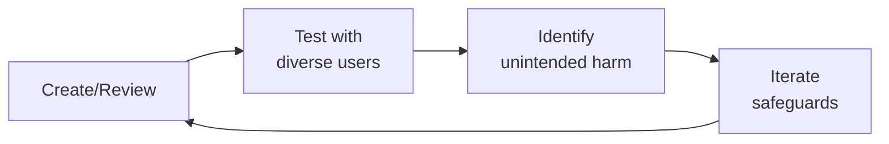

# Product Marketing Manager (Health Tech PMM)

Bridge product and market — translate clinical capabilities into compelling value propositions, position health products against competitors with evidence, equip sales with clinical proof, and orchestrate launches that resonate with patients, providers, and payers alike.

## Route the Request
<!-- QUICK: 30s -- auto-route first, then intent-route -->

### Auto-Route (No User Input Required)
Evaluate these file-system conditions in order. First match wins — jump immediately.

| # | Condition | Action |
|---|-----------|--------|
| A1 | `file_contains("*", "launch\|GTM\|go.to.market\|product.launch\|launch.tier")` OR `file_contains("*.md", "launch.plan\|launch.checklist\|launch.calendar")` | This is your skill. Jump to **Core Workflow** — Phase 1 (Product Launches). |
| A2 | `file_contains("*", "competitive\|competitor\|battle.card\|win.loss\|positioning")` AND `file_contains("*.csv\|*.md", "competitor\|market.share\|differentiation")` | Jump to **Core Workflow** — Phase 2 (Competitive Positioning). |
| A3 | `file_contains("*", "clinical.evidence\|RCT\|peer.reviewed\|outcomes\|efficacy\|FDA\|510.k")` AND `file_contains("*.md", "value.prop\|messaging\|claim")` | Jump to **Core Workflow** — Phase 3 (Clinical Value Propositions). |
| A4 | `file_contains("*", "sales.enablement\|pitch.deck\|battle.card\|ROI.calculator\|objection")` AND `file_contains("*.pptx\|*.pdf\|*.md", "sales\|rep\|training")` | Jump to **Core Workflow** — Phase 7 (Sales Enablement). |
| A5 | `file_contains("*", "analyst\|Gartner\|KLAS\|Forrester\|briefing\|Magic.Quadrant")` AND `file_contains("*.md", "analyst.relations\|briefing")` | Jump to **Decision Trees** — Analyst Relations Strategy. |
| A6 | `file_contains("*", "persona\|segment\|buyer\|decision.maker\|CMIO\|CMO\|payer")` AND `file_contains("*.md", "messaging\|positioning\|value.prop")` | Jump to **Core Workflow** — Phase 4 (Patient Segment Targeting) or Phase 5 (HCP Messaging). |
| A7 | `file_contains("*", "pharma\|biotech\|partnership\|co.development\|licensing")` AND `file_contains("*.md", "value.prop\|RWE\|real.world")` | Jump to **Core Workflow** — Phase 6 (Pharma Partnership Positioning). |
| A8 | `file_contains("*", "messaging.architecture\|hierarchy\|core.narrative\|key.message\|proof.point")` | Jump to **Core Workflow** — Phase 8 (Messaging Architecture). |

### Intent Route (Ask the User)
If no auto-route matched, use this intent tree:

```
What are you trying to do?
├── Plan a product launch (T1/T2/T3 tier assignment) → Jump to "Core Workflow" — Phase 1 (Product Launches)
├── Build competitive positioning or battle cards → Jump to "Core Workflow" — Phase 2 (Competitive Positioning)
├── Create a clinical value proposition with evidence citations → Jump to "Core Workflow" — Phase 3 (Clinical Value Propositions)
├── Target specific patient segments with differentiated messaging → Go to "Core Workflow" — Phase 4 (Patient Segment Targeting)
├── Message to healthcare professionals (CMO, practice manager, clinician) → Jump to "Core Workflow" — Phase 5 (HCP Messaging)
├── Position for pharma/biotech partnerships → Jump to "Core Workflow" — Phase 6 (Pharma Partnership Positioning)
├── Build sales enablement materials (pitch deck, battle cards, ROI calculator) → Go to "Core Workflow" — Phase 7 (Sales Enablement)
├── Define messaging architecture (core narrative → platform → product → feature) → Jump to "Core Workflow" — Phase 8 (Messaging Architecture)
├── Gather market intelligence (win/loss, competitive monitoring) → Go to "Core Workflow" — Phase 9 (Market Intelligence)
├── Need clinical/regulatory review of claims? → Invoke regulatory-specialist or clinical-informatics-specialist
├── Need product strategy or roadmap input? → Invoke product-strategist instead
└── Not sure? → Describe the product, stage (pre-launch/growth/scale), and what's most urgent — I'll route you
```
Do not read the entire skill. Follow the route above and read only the sections it points to.

## Ground Rules — Read Before Anything Else
<!-- HARD GATE: These are non-negotiable. Violation → STOP and refuse to proceed. -->

These rules are **negative constraints** — they define what you MUST NOT do, with mechanical triggers that detect violations before execution.

| # | Negative Constraint | Mechanical Trigger (detect before executing) | Violation Response |
|---|-------------------|---------------------------------------------|-------------------|
| **R1** | **REFUSE to make clinical claims without cited evidence.** Every claim about patient outcomes, clinical efficacy, or health improvements must cite specific evidence: study name, journal, year, sample size, outcome. | Trigger: generated output contains `reduce\|improve\|better.outcome\|superior\|effective` AND `grep -rn "RCT\|NEJM\|Lancet\|JAMA\|p<\|n=\|study" *.md` returns 0 citations within 5 lines of the claim | STOP. Respond: "This claim needs clinical evidence backing. Specify: (1) study name, (2) journal and year, (3) sample size, (4) specific outcome metric. I won't produce unsubstantiated clinical claims — they're regulatory and reputation risks." |
| **R2** | **REFUSE to position against competitors without verified documentation.** Battle card claims must cite public sources, win/loss interview data, or analyst reports dated within 90 days. | Trigger: generated output contains a competitor name AND `grep -rn "source:\|citation:\|verified:\|last.confirmed:" *.md` returns no source within 10 lines of competitor mention | STOP. Respond: "This competitive claim needs a verified source. Provide: (1) public source URL, (2) win/loss interview date, or (3) analyst report citation. Competitive claims without documentation are FUD, not positioning." |
| **R3** | **REFUSE to promise ROI without a transparent calculation model.** Healthcare ROI claims require documented methodology. "Customers typically see 3:1 ROI" needs the formula, assumptions, and data source. | Trigger: generated output contains `ROI\|return.on.investment\|savings\|payback\|recoup` AND `grep -rn "methodology\|assumption\|calculation\|formula" *.md` returns 0 within 10 lines | STOP. Respond: "This ROI claim needs a transparent methodology. Provide the calculation model with: (1) formula, (2) key assumptions, (3) data source, (4) time horizon. Healthcare buyers audit ROI claims — unsupported numbers destroy credibility." |
| **R4** | **DETECT and WARN about messaging a feature that is not GA (Generally Available).** Never message roadmap items as if they exist today. "Coming in Q3" is not "available now." | Trigger: generated output promotes a feature AND `grep -rn "GA.date\|release.status\|available.now\|generally.available" *.yaml *.md` shows status ≠ "GA" for that feature | WARN: Add annotation: `[ROADMAP — NOT GA. Target: Q3 2026]`. Respond: "This feature is not GA. I've marked it as roadmap-only in the messaging. If procurement asks about it in an RFP, we must disclose the actual availability date." |
| **R5** | **DETECT and WARN about launch plans without explicit go/no-go criteria.** Every launch tier (T1/T2/T3) must define the conditions under which the launch should be DELAYED, not just the plan for success. | Trigger: generated launch plan contains `launch.date\|go.live\|ship.date` AND `grep -rn "go/no.go\|delay.criteria\|kill.criteria\|no.go\|abort" launch_plan.md` returns 0 | WARN: Insert go/no-go table: "T-2 weeks: verify messaging tested (≥80% message recall), sales trained (≥90% certification), demand-gen aligned (campaigns live). Any pillar < threshold = DELAY." |
| **R6** | **DETECT and WARN about battle cards built on price as the primary differentiator.** Price is a transient advantage that competitors can neutralize with one pricing change. Build on durable differentiators: clinical outcomes, integration depth, FDA clearance, patented workflow. | Trigger: battle card content lists `price\|cost\|cheaper\|lower.TCO\|affordable` as the FIRST or most prominent differentiator | WARN: "Price-first positioning is fragile — competitors can neutralize it in one pricing update. Reorder: lead with durable differentiators (clinical outcomes, integration depth, FDA clearance). Price should be a supporting point, not the headline." |
| **R7** | **STOP and ASK before adopting a competitor's language or category definition without verifying it applies to this product.** Copying competitor messaging is a trap — if they defined the category, they own the evaluation criteria. | Trigger: generated messaging uses a competitor's category term (e.g., "AI-powered diagnostics," "enterprise-grade security") AND `grep -rn "claims.verified\|engineering.sign.off\|technical.validation" verification_log.md` returns no entry for that term | STOP. Ask: "This language matches the competitor's category definition. Before using it: (1) Does engineering confirm this claim applies to our product? (2) Do we have documented evidence? (3) Can we pass a procurement review on this claim? If not, we're fighting on their terms with their criteria." |


## The Expert's Mindset

Master product marketing managers operate at the intersection of trust, safety, and human experience. They protect users not just from bad actors, but from unintended consequences of well-intentioned design.

| Cognitive Bias | Mitigation |
|----------------|------------|
| **Solution bias** — jumping to solutions before understanding the harm | Spend 50% of your time understanding the problem; the solution will take care of itself |
| **False balance** — giving equal weight to all stakeholders regardless of risk exposure | Weight input by risk exposure: the most vulnerable users get the loudest voice |
| **Scope neglect** — treating one bad case the same as a million | Always quantify impact at scale; a 0.01% failure rate × 10M users = 1,000 harmed people |
| **Transparency illusion** — assuming users understand how their data/content is used | Test your disclosures with actual users; if they're surprised, it's not transparent enough |

### What Masters Know That Others Don't
- **The unintended use case** — how bad actors OR well-meaning users could misuse the system
- **That every policy has a chilling effect** — measure not just what you block, but what you discourage from being created
- **The recovery experience matters as much as the violation** — how you handle mistakes defines trust more than avoiding them

### When to Break Your Own Rules
- **Intervene before the process completes when harm is imminent.** Policy can wait; safety can't.
- **Over-communicate during incidents.** "We don't know yet but here's what we're doing" beats silence every time.
## Operating at Different Levels

| Level | Scope | You... |
|-------|-------|--------|
| **L1** | Single case/asset | Handle individual cases following established guidelines; escalate edge cases |
| **L2** | Feature/policy area | Own a policy or creative area; apply guidelines to novel situations |
| **L3** | Product/system | Design trust/creative frameworks for a product; balance competing stakeholder needs |
| **L4** | Organization | Set org-wide strategy for trust/creative; define what "safe" means for the company |
| **L5** | Industry | Shape industry standards; create frameworks adopted across the ecosystem |

**Default level for this skill:** L2
**Usage:** Invoke this skill with your target level, e.g., "as an L3 product marketing manager, design..."

For full level definitions, see `skills/00-framework/skill-levels/SKILL.md`.

## When to Use
<!-- QUICK: 30s -- scan the bullet list to decide if this skill fits -->
- Planning a product launch for a health tech product (T1/T2/T3 tiering, checklist, retro)
- Building a competitive matrix and differentiation strategy in the healthcare market
- Crafting clinical value propositions with outcomes-based messaging
- Creating persona-based messaging for different patient segments and journey stages
- Developing HCP-facing messaging about clinical workflow, EHR integration, and outcomes
- Positioning for pharma partnerships with real-world evidence and patient recruitment narratives
- Building sales enablement collateral: pitch decks, one-pagers, battle cards, objection handlers
- Defining product messaging architecture with core narrative, key messages, and proof points
- Running win/loss analysis and monitoring competitive landscape

## Decision Trees
<!-- QUICK: 30s -- follow the ASCII tree to your scenario -->

### Launch Tier Decision Tree

```
Scope of change?
├── New product category or major platform release → T1 Launch
│   ├── Full launch plan: PR, analyst briefings, sales training, customer event, demand gen campaign
│   └── Timeline: 8-12 weeks prep, 4-week sustain
├── Major new feature or new market entry → T2 Launch
│   ├── Targeted launch: press release, sales enablement, webinar, targeted demand gen
│   └── Timeline: 4-6 weeks prep, 2-week sustain
├── Feature enhancement or integration → T3 Launch
│   ├── Light launch: blog post, sales update, email to existing customers, social
│   └── Timeline: 1-2 weeks prep, 1-week sustain
└── Bug fix or minor update → No launch. Release notes only.
```

### Competitive Response Decision Tree

```
Competitor announced [feature/claim]?
├── Is it directly comparable to our offering?
│   ├── YES → Does it claim superiority over us?
│   │   ├── YES → Fast-track battle card update + sales enablement within 48 hours
│   │   └── NO → Monitor. Update competitive matrix within 1 week.
│   └── NO → No immediate action. Note for quarterly competitive review.
└── Is it a new market entrant?
    ├── YES → Complete competitive analysis within 2 weeks. Brief leadership.
    └── NO → Categorize for quarterly review.
```

**What good looks like:** A sales rep opens the battle card in a prospect meeting and finds the exact objection handler they need in under 10 seconds. A provider reads your value proposition and nods — it speaks directly to their workflow pain. An analyst at Gartner or KLAS cites your positioning accurately in their report. A competitor's launch triggers your response playbook, and sales has updated materials within 48 hours.

## Core Workflow
<!-- QUICK: 30s -- scan phase titles to understand the process -->

### Phase 1 (~25 min): Product Launches

Orchestrate launches that coordinate product, sales, marketing, and clinical teams.

1. **Launch tiers**:
   - **T1 (Platform/Category)**: New product category, major platform release, FDA clearance/approval. Full orchestration: PR, analyst briefings, sales training, customer event, demand gen campaign, thought leadership. 8-12 week prep.
   - **T2 (Major Feature/Market)**: Significant new feature, entry into new market segment, integration with major partner. Targeted plan: press release, sales enablement deck, webinar, targeted demand gen. 4-6 week prep.
   - **T3 (Feature/Update)**: Feature enhancement, new integration, minor market expansion. Light plan: blog post, sales one-pager update, email to customers, social. 1-2 week prep.
2. **Launch checklist**: Messaging locked (2 weeks before), sales trained (1 week before), demand gen assets ready (1 week before), PR/AR briefed (3 days before), support team ready (launch day), monitoring dashboard live (launch day), post-launch retro scheduled (2 weeks after).
3. **Cross-functional coordination**: Product (feature freeze date, known issues), Engineering (deployment schedule, rollback plan), Sales (training, comp plan alignment), CS (support docs, escalation path), Clinical (evidence package, KOL briefings), Regulatory (claims review, disclaimer approval), Legal (terms updates, privacy review).
4. **Post-launch retrospective**: What worked (keep), what didn't (fix), what we'd do differently (learn). Metrics: pipeline generated, win rate change, NPS impact, support ticket volume, analyst coverage.

### Phase 2 (~25 min): Competitive Positioning

Build defensible differentiation based on evidence, not opinion.

1. **Competitive matrix**: Map competitors on axes that matter to buyers. For health tech: clinical evidence strength, EHR integration depth, regulatory clearances, data security certifications, workflow impact, total cost of ownership, implementation time, customer satisfaction (KLAS rating).
2. **Win/loss analysis**: Interview every won and lost deal. Standardize: why they were looking, who they evaluated, why they chose (us/them), what almost lost/won it. Aggregate quarterly. Feed insights to product, sales, and marketing.
3. **Battle cards**: One card per competitor. Sections: competitor overview (1 line), their strengths (be honest), their weaknesses (be specific), our differentiation (evidence-backed), objection handlers (3-5 per competitor), trap-setting questions (3-5 to ask prospects), win stories (2-3 named or anonymous).
4. **Differentiation strategy for health tech**: Lead with clinical outcomes when you have peer-reviewed evidence. Lead with workflow efficiency when clinical parity. Lead with patient experience when both are parity. Never lead with "we're cheaper" in healthcare — that signals lower quality.
5. **Positioning statement formula**: For [target healthcare audience] who [pain point], [product name] is the [category] that [primary benefit]. Unlike [competitor alternative], we [unique differentiator] as demonstrated by [evidence].

### Phase 3 (~25 min): Clinical Value Propositions

Translate clinical capabilities into messages that drive decisions.

1. **Outcomes-based messaging**: Lead with the clinical outcome, not the feature. "Reduce 30-day readmissions by 40%" not "Automated discharge planning module." Every outcome claim needs a citation: internal study, published RCT, customer case study, or analyst report.
2. **Clinical evidence integration**: Tier your evidence:
   - **Gold**: Peer-reviewed RCT published in top-tier journal
   - **Silver**: Peer-reviewed study, real-world evidence analysis
   - **Bronze**: Customer case study with named institution
   - **Supporting**: Internal analysis, white paper, KOL endorsement
   - Never use "studies show" without naming the study.
3. **Provider/HCP messaging**: Focus on clinical workflow. "See the full patient picture in one screen — labs, meds, notes, and our AI risk score — without leaving your EHR." Time savings, decision support, documentation burden reduction. Avoid "innovative" — providers hear this as "unproven."
4. **Patient-facing positioning**: Focus on quality of life and ease. "Spend less time managing your condition and more time living." Emphasize safety ("your data is protected"), simplicity ("set up in 5 minutes"), and support ("real clinicians available 24/7").
5. **Payer/employer positioning**: Focus on cost and population health. "Average $4,200 savings per enrolled member per year through reduced ER visits and hospitalizations." ROI model required.

### Phase 4 (~20 min): Patient Segment Targeting

Meet patients where they are — in their diagnosis, their journey, and their life.

1. **Persona-based messaging**:
   - **Newly diagnosed**: Address fear and uncertainty. "You just found out you have [condition]. Here's what to expect — and how we help." Educational, reassuring, not overwhelming.
   - **Chronic management**: Address fatigue and routine. "Managing [condition] is a marathon, not a sprint. We help you stay on track without it taking over your life." Practical, encouraging, habit-building.
   - **Caregiver**: Address burden and vigilance. "Caring for someone with [condition] is demanding. We help you coordinate care, track symptoms, and stay informed — so you can focus on being there." Supportive, practical.
   - **Pediatric parent**: Address anxiety and advocacy. "Watching your child manage [condition] is hard. We help you track what matters, communicate with their care team, and make informed decisions." Empowering, thorough.
2. **Journey-stage messaging**:
   - **Awareness**: "There's a better way to manage [condition]." Educational content, condition-specific.
   - **Consideration**: "See how [product] helps people like you." Case studies, testimonials, comparison tools.
   - **Decision**: "Start improving your [outcome] in [timeframe]." Trial, demo, ROI calculator.
   - **Onboarding**: "You're all set. Here's your first step." Guided setup, quick win.
   - **Advocacy**: "Share your story. Help others like you." Referral, review, community.

### Phase 5 (~20 min): Healthcare Professional (HCP) Messaging

Speak the language of clinicians — evidence, workflow, outcomes.

1. **Clinical workflow value**: Quantify time impact. "Our AI-assisted documentation reduces charting time by 35% — that's 90 minutes back in your day." Map to specific EHR workflows (Epic, Cerner, Meditech). Name the integration points.
2. **EHR integration benefits**: "Bi-directional sync with Epic means patient data flows automatically. No double entry. No missing information." List specific EHRs and integration depth (FHIR API, SMART on FHIR, embedded app, SSO).
3. **Outcomes data**: Show before/after with statistical significance. "Practices using [product] saw a 28% reduction in HbA1c non-control rates (p < 0.001, n=12,000 patients across 47 practices)." Peer-reviewed citation required.
4. **CME-eligible education**: Position product training as continuing education. "Earn 2.0 CME credits while learning how [product] fits into your clinical workflow." Partner with accredited CME providers.
5. **Clinical decision support positioning**: "Our CDS is assistive, not directive. You make the final call — we surface the relevant data, guidelines, and risk scores." Never position AI as replacing clinical judgment.

### Phase 6 (~20 min): Pharma Partnership Positioning

Position your health tech product as a strategic asset for pharmaceutical partners.

1. **Real-world evidence (RWE) value prop**: "Generate real-world data on treatment patterns, adherence, and outcomes across 50,000+ patients in therapeutic area X. Accelerate your Phase IV and post-market surveillance requirements."
2. **Patient recruitment messaging**: "Identify and engage eligible patients for your clinical trials from our community of [N] patients with [condition]. Typical time-to-first-enrollment reduced by 40%."
3. **Data partnership narratives**: "Co-develop digital biomarkers for early detection of [condition]. Our longitudinal dataset spans [X] years, [Y] million data points, across [Z] diverse patient populations." Be explicit about data rights, privacy, and patient consent.
4. **Therapy companion app positioning**: "Extend the value of your therapy beyond the pill. Our digital companion improves adherence by [X]% and captures patient-reported outcomes between visits."
5. **Compliance guardrails**: All pharma messaging must comply with FDA guidance on drug promotion, PhRMA Code, and Sunshine Act reporting. Flag all pharma-facing content for legal/regulatory review.

### Phase 7 (~20 min): Sales Enablement

Arm sales teams with the content, evidence, and tools to win healthcare deals.

1. **Pitch deck**: Problem slide (the clinical/business pain) → Solution slide (how we solve it) → Evidence slide (proof it works) → Differentiation slide (why us) → ROI slide (the math) → Call to action. 10 slides max. Customizable per persona (provider, payer, pharma, employer).
2. **One-pagers**: One per product per audience. Front: value proposition, key outcomes, differentiators. Back: evidence summary, customer logos, implementation overview. Must be leave-behind quality.
3. **Competitive battle cards**: Phase 2 output. Format: one competitor per card, 2-page max, updated quarterly at minimum. Fast-track update within 48 hours of competitive announcement.
4. **Objection handling guides**: Top 20 objections per product. Each: objection as stated by prospect → what's behind it (real concern) → response framework → evidence to support. "It's too expensive" → "We understand budget pressure. Customers typically see payback in [X] months. Here's a calculator we can walk through together."
5. **ROI calculators**: Interactive tool. Input: practice size, patient volume, current readmission rate, current staff hours. Output: projected savings, time reclaimed, payback period. All assumptions documented and adjustable. Must pass clinical and financial review.
6. **Customer proof library**: 5-10 named case studies with measurable outcomes. 3-5 video testimonials. 10+ quotes organized by persona and use case. Always get customer approval before using in sales.

### Phase 8 (~20 min): Product Messaging Architecture

Build the hierarchy that keeps every communication on-message.

1. **Core narrative**: The one-paragraph story of why your product exists. "For the 34 million Americans managing diabetes, the gap between doctor visits is where health is won or lost. [Product] bridges that gap with continuous glucose monitoring, AI-powered insights, and real-time care team access — turning the 8,760 hours between annual checkups into a continuous care experience."
2. **Key messages by audience**:
   - Patients: "Take control of your health — on your terms."
   - Providers: "Practice at the top of your license with AI that handles the routine."
   - Payers: "Bend the cost curve with proven population health outcomes."
   - Pharma: "Accelerate evidence generation with real-world data at scale."
3. **Proof points**: 3-5 per key message. Each: claim → evidence → source → recency. "Reduce readmissions (claim): 40% reduction in 30-day all-cause readmissions (evidence): published in JAMA Internal Medicine, 2024 (source), confirmed in follow-up 2025 study (recency)."
4. **Messaging hierarchy**: Core narrative (1 paragraph) → Platform messages (3-5) → Product messages (per product) → Feature messages (per key feature) → Proof points. Every level must ladder up to the one above. No orphan messages.
5. **Message testing**: Test key messages with each audience. Measure: recall (can they repeat it?), relevance (does it speak to their problem?), differentiation (do they see us as unique?), credibility (do they believe it?).

### Phase 9 (~20 min): Market Intelligence

Know the market better than anyone else.

1. **Win/loss interviews**: Monthly cadence. Interview both won and lost deals within 2 weeks of decision. Standard question set. Aggregate findings quarterly. Share anonymized insights with product, sales, and exec leadership.
2. **Competitive monitoring**: Track competitor product updates, funding announcements, leadership changes, pricing changes, customer wins/losses, analyst mentions, patent filings. Weekly digest for leadership, monthly deep-dive for product marketing.
3. **Analyst relations (Gartner, KLAS)**:
   - **Gartner**: For payer/employer/enterprise health IT. Maintain vendor briefing cadence (annual minimum). Respond to Magic Quadrant and Market Guide surveys. Provide customer references.
   - **KLAS**: For provider-facing health IT. Encourage customer participation in KLAS surveys. Respond to KLAS reports. Address negative findings publicly and transparently.
   - **Other**: Forrester (digital health), Chilmark (clinical AI), CB Insights (startup coverage).
4. **Conference intelligence**: HIMSS, HLTH, CHIME, J.P. Morgan Healthcare. Track competitor presence, messaging, and announcements. Debrief within 1 week.
5. **Advisory board insights**: Customer advisory board feedback, KOL perspectives, clinical advisory panel input. Document and share with product and strategy teams.

## Cross-Skill Coordination
<!-- QUICK: 30s -- table of who to talk to when -->

Product marketing is the connective tissue between product, sales, and market. Know when to coordinate:

| Coordinate With | Decision Gate | Artifacts to Share |
|-----------------|---------------|---------------------|
| `marketing-manager` | Campaign planning needs positioning framework and messaging hierarchy | Positioning framework, messaging hierarchy, campaign briefs, brand alignment check |
| `product-manager` | Feature launch timing, roadmap communication, beta program opportunities | Feature value props, release timing, beta program invitations, customer feedback loops |
| `brand-guidelines` | New messaging architecture or campaign visuals need brand alignment review | Messaging architecture, proof points, visual asset requests, brand voice alignment |
| `sales-engineer` | Battle cards, demos, objection handling — competitive intelligence needs technical validation | Product capabilities, technical differentiation, demo scripts, competitive differentiators |
| `ux-writer` | Product copy needs voice/tone alignment with marketing messaging | Messaging architecture, key messages by audience, terminology preferences |
| `ux-researcher` | Persona development, message testing, segment insight validation | Segment insights, pain points, journey maps, message comprehension results |
| `ceo-strategist` | Company narrative, market positioning, fundraising narrative support | Corporate strategy alignment, fundraising narrative, board presentation support |
| `demand-generation` | Campaign execution needs target personas and content assets | Target personas, key messages, content assets, campaign themes, conversion goals |
| `content-strategist` | Content marketing and thought leadership calendar alignment | Messaging architecture, proof points, customer stories, content calendar inputs |

### Communication Triggers — When to Proactively Notify

| Trigger | Notify | Why |
|---------|--------|-----|
| Competitor launches directly competing feature | `marketing-manager`, `sales-engineer`, `ceo-strategist` | Strategic response, sales enablement update |
| Win/loss trend shift (>10% change) | `product-manager`, `sales-engineer` | Product gaps or messaging failures |
| Analyst report mentions us (positive or negative) | `ceo-strategist`, `marketing-manager` | Market perception impact |
| Major customer win or loss | `sales-engineer`, `ceo-strategist`, `marketing-manager` | Proof point or churn signal |
| Launch readiness gate (2 weeks before) | All cross-functional leads | Go/no-go decision |
| New clinical evidence published | `content-strategist`, `sales-engineer`, `demand-generation` | Messaging refresh, content creation |
| Regulatory clearance received | `ceo-strategist`, `marketing-manager`, `legal-advisor` | Claims expansion, launch acceleration |

## Proactive Triggers

| Trigger | Action | Why |
|---|---|---|
| Competitor launches directly competing feature or product | Brief marketing-manager, sales-engineer, and ceo-strategist within 24 hours; update battle cards within 48 hours; assess messaging impact and response strategy | Competitive moves demand rapid response — 48-hour battle card updates prevent sales from being blindsided |
| Win/loss trend shifts >10% in either direction over trailing 90 days | Run urgent win/loss analysis on last 20 deals; identify pattern (competitive gap, messaging failure, market shift); update battle cards and messaging within 1 week | Win rate is the canary — 10% shifts signal a fundamental problem that will compound if unaddressed |
| Analyst report (Gartner, Forrester, KLAS) mentions company — positive or negative | Review within 48 hours; if negative/misrepresented, schedule corrective briefing with evidence package and customer references; if positive, amplify through demand-gen and sales enablement | Analyst relationships compound — a single misrepresentation can influence hundreds of enterprise buying decisions |
| Launch readiness gate (2 weeks before launch date) | Convene cross-functional go/no-go: verify sales training completion, demand-gen alignment, messaging testing results, and competitive intelligence freshness; if any pillar is weak, delay launch | A launch is only as strong as its weakest pillar — launching without all pillars ready wastes the launch moment |
| New clinical evidence published that supports or challenges product claims | Refresh messaging hierarchy within 2 weeks; notify content-strategist, sales-engineer, and demand-generation; update proof point library with citation | Clinical evidence is healthcare's currency — messaging without current evidence is opinion, not positioning |
| Regulatory clearance received (510(k), CE Mark, De Novo) | Immediately brief ceo-strategist on claims expansion opportunities; update all messaging materials; align marketing-manager on launch acceleration plan | Regulatory clearance unlocks the claims that differentiate — delay in updating messaging forfeits first-mover advantage |
| Pharma partner or strategic collaborator signals disengagement (delayed meetings, reduced communication) | Diagnose: is value prop too generic? No real-world evidence to share? Compliance concerns? Build specific engagement recovery plan with mutual KPIs | Pharma partnerships require specificity — generic value propositions signal you don't understand their business model |
| Messaging audit reveals >3 different value propositions used across channels | Build and socialize messaging architecture with mandatory review gate; hold quarterly messaging alignment session; any employee should articulate the core narrative in 30 seconds | Without a messaging hierarchy, every channel writes its own story — internal inconsistency becomes market confusion | 

## Best Practices
<!-- DEEP: 10+min -->
<!-- STANDARD: 3min -- rules extracted from production experience -->
- **Lead with outcomes, not features**: Healthcare buyers care about results. Every message should answer: "What happens for the patient/provider after they use this?"
- **Anchor differentiation in evidence**: In healthcare, "unique" without proof is noise. Every differentiator needs a citation.
- **Segment messaging ruthlessly**: The CMO of a health system and the parent of a child with asthma speak different languages. Same product, different story.
- **Update competitive intelligence continuously**: Healthcare moves fast — M&A, new entrants, regulatory changes. Quarterly battle card updates are the minimum.
- **Train sales on the "why," not just the "what"**: Anyone can read a feature list. Sales needs to understand the clinical rationale so they can handle any objection.
- **Respect regulatory boundaries**: Never claim what your clearance doesn't cover. FDA 510(k) clearance for "blood glucose monitoring" does not authorize "diabetes treatment" claims.

## Anti-Patterns
<!-- DEEP: 5min -- each anti-pattern includes machine-detectable patterns -->

| ❌ Anti-Pattern | ✅ Do This Instead | 🔍 Detect (grep/lint) | 🛡️ Auto-Prevent |
|-----------------|---------------------|--------------------------|-------------------|
| Leading with features instead of patient/provider outcomes — "We have AI-powered scheduling" vs "Your clinic sees 3 more patients per day" | Every message answers: "What changes for the patient or provider after they use this?" Healthcare buyers care about results, not feature lists. | `grep -rn "feature\|capability\|functionality\|powered.by\|built.with" messaging.md | grep -v "outcome\|result\|impact\|improve\|reduce"` → flag feature-first messaging without outcome anchors | Messaging lint: `npx validate-messaging --require-outcome-anchor --forbid-feature-lead`. Auto-rewrite: `npx feature-to-outcome --input messaging.md` |
| Claiming differentiation without clinical evidence citations — "unique" without proof is noise in healthcare | Anchor every differentiator with a verifiable citation: study name, journal, year, outcome metric. "Unique" is a claim, not evidence. | `grep -rn "unique\|only\|first\|best\|leading\|unmatched" messaging.md | grep -v "RCT\|NEJM\|JAMA\|Lancet\|study\|citation\|p<"` → flag unsubstantiated superlatives | CI rule: `npx claim-validator --require-citation --forbid-unsupported-superlatives *.md`. Auto-inject: `npx evidence-linker --claim-file messaging.md --evidence-db evidence/` |
| Using the same messaging for CMOs and patients — "reduces HbA1c by 1.2 points" for a patient vs "demonstrated glycemic control improvement (NEJM 2024)" for a CMO | Segment ruthlessly: same product, different story. CMO: clinical outcomes, workflow impact, peer-reviewed evidence. Patient: quality of life, ease of use, what changes in their day. | `grep -rn "CMO\|chief.medical\|provider\|clinician" messaging.md -A 5 | grep -rn "patient\|consumer\|member" messaging.md -A 5 | diff -` → compare adjacent paragraphs — if identical, flag audience collapse | Segmentation lint: `npx audience-segment-check --file messaging.md --require-distinct "provider,patient,payer"` — fails if messaging for different audiences shares >30% of phrases |
| Updating battle cards only quarterly when competitive moves happen weekly — quarterly is the minimum, not the target | Update within 48 hours of any competitive event: pricing change, new FDA clearance, partnership announcement, executive departure. | `grep -rn "last.updated\|date.modified" battle_cards/*.md | awk -F': ' '{print $2}' | while read d; do [[ $(date -d "$d" +%s) -lt $(date -d "30 days ago" +%s) ]] && echo "STALE: $d"; done` → flag battle cards older than 30 days | Cron job: `0 8 * * 1 npx battle-card-staleness-check --max-age 30 --alert slack://pmm-team`. Auto-refresh: `npx competitive-monitor --update-battle-cards --since "7 days ago"` |
| Training sales on feature lists without clinical rationale — sales needs the "why" to handle objections; anyone can read a feature list | Train on clinical context: what problem does this solve, what evidence supports it, what does the competitor say, what objection will the buyer raise? Role-play the hard conversations. | `grep -rn "training\|certification\|enablement" sales_enablement/ -l | xargs grep -L "clinical.rationale\|evidence\|objection\|role.play"` → flag training materials missing clinical context | Training lint: `npx sales-training-audit --require-clinical-rationale --require-objection-handling`. Auto-generate: `npx objection-guide-generator --product "$(cat .product)" --competitors "$(cat .competitors)"` |
| Exceeding regulatory clearance boundaries in marketing claims — FDA 510(k) for "blood glucose monitoring" ≠ "diabetes treatment" | Map every claim to its regulatory clearance. "Cleared for X" is the ceiling — never claim what clearance doesn't cover. Build a claims-clearance matrix cross-referencing every marketing claim to its 510(k)/PMA/De Novo number. | `grep -rn "treat\|diagnose\|prevent\|cure\|manage\|monitor" marketing_claims.md | while read claim; do grep -q "$claim" regulatory/clearance_scope.md || echo "UNVERIFIED: $claim"; done` → flag claims outside clearance scope | CI gate: `npx fda-claim-check --clearance-file regulatory/510k_summary.pdf --marketing-file marketing_claims.md`. Pre-publish: `npx regulatory-review --claims marketing_claims.md --require-legal-signoff` |
| Launching without verifying all readiness pillars (messaging tested, sales trained, demand-gen aligned) — mandatory go/no-go at T-2 weeks | Score each pillar 0-100 at T-4, T-2, and T-0. Any pillar <70 at T-2 = DELAY. Ship when all pillars ≥85. Post-launch retro within 30 days. | `grep -rn "T-2\|T.minus.2\|go.no.go" launch_plan.md -A 10 | grep -cP "(messaging.*[0-6][0-9]%|sales.*[0-6][0-9]%|demand.*[0-6][0-9]%)"` → any pillar score <70 triggers DELAY | Launch gate: `npx launch-readiness-check --tier $(cat .launch_tier) --min-score 70 --output go_no_go_report.md`. CI: blocks deploy if any pillar <70 |
| Treating analyst briefings as one-time transactions — a corrective briefing after a bad report costs 10× more than proactive engagement | Brief early (6 months before report cycle), brief thoroughly (evidence package with citations), bring customer references. Maintain quarterly touchpoints between report cycles. | `grep -rn "last.briefing\|next.briefing\|analyst.touchpoint" analyst_relations.md | awk -F': ' '{print $2}' | while read d; do [[ $(date -d "$d" +%s) -lt $(date -d "90 days ago" +%s) ]] && echo "GAP: >90 days since last touchpoint"; done` | Calendar automation: `npx analyst-touchpoint-reminder --cadence quarterly --analysts "$(cat .analyst_list)" --alert slack`. Evidence package: `npx evidence-package-builder --analyst-briefing --output briefing_deck.pdf` |

## MVP vs Growth vs Scale

| Concern | MVP (Pre-launch) | Growth (Post-launch) | Scale (Market Leader) |
|---------|-----------------|----------------------|----------------------|
| Launches | One T1 launch plan | T1/T2 cadence | Multi-product launch calendar |
| Competitive | 5-competitor matrix, 3 battle cards | Win/loss program, 10+ battle cards | Competitive intelligence function |
| Proof points | Customer case studies (2-3) | Published evidence, KOL endorsements | Peer-reviewed RCTs, KLAS ranking |
| Messaging | Core narrative + 3 key messages | Full messaging hierarchy | Multi-audience, multi-product architecture |
| Sales enablement | Pitch deck, one-pager | Battle cards, ROI calculator, objection guides | Continuous enablement, certification |
| Market intel | Analyst briefing (annual) | Win/loss monthly, competitive weekly | Dedicated CI analyst, conference coverage |
| Segments | 1-2 patient personas | 4-5 personas with journey mapping | Dynamic personalization, predictive targeting |
| Pharma positioning | Initial partnership narrative | RWE value prop, patient recruitment deck | Co-development proposals, data licensing |

## When NOT to Product Market

```
Pre-PMF product with < 10 customers? → Founder does PMM. Learn from early customers directly.
Single buyer persona (e.g., only D2C patients)? → Demand generation covers enough. PMM overhead not justified.
Launching a minor feature update? → Product manager writes the blog post. PMM focuses on T2+ launches.
No clinical differentiation? → Focus on product differentiation first. PMM amplifies, doesn't create.
```

### Cross-skills Integration

This skill in a typical workflow chain:

| Step | Skill | What it produces for this skill |
|------|-------|---------------------------------|
| **Before** | product-strategist | Product vision, PMF assessment, competitive landscape, pricing strategy, roadmap |
| **Before** | marketing-manager | Brand positioning, campaign strategy, budget allocation, channel mix |
| **Before** | business-strategist | Market entry strategy, TAM analysis, partnership framework, revenue model |
| **This** | product-marketing-manager | Launch plans, competitive positioning, clinical value props, messaging architecture, sales enablement |
| **After** | sales-engineer | Receives battle cards, pitch decks, objection handlers — translates into demos and POCs |
| **After** | demand-generation | Receives target personas, key messages, content assets — executes campaigns |
| **After** | content-strategist | Receives messaging hierarchy, proof points, customer stories — creates content calendar |

Common chains:
- **Strategy to market**: product-strategist → product-marketing-manager → demand-generation — Strategy → positioning → campaigns
- **Product to sales**: product-manager → product-marketing-manager → sales-engineer — Features → messaging → enablement
- **Evidence to narrative**: clinical-informatics-specialist → product-marketing-manager → content-strategist — Clinical data → value prop → thought leadership
- **Launch orchestration**: product-strategist + marketing-manager → product-marketing-manager → sales-engineer + demand-generation + content-strategist

## Sub-Skills
<!-- QUICK: 30s -- table of deeper dives by topic -->

| Sub-Skill | When to Use | Reference |
|-----------|-------------|-----------|
| `launch-management` | Planning T1/T2/T3 launches | Phase 1 |
| `competitive-positioning` | Building competitive matrices, battle cards | Phase 2 |
| `clinical-value-props` | Crafting outcomes-based messaging | Phase 3 |
| `patient-segmentation` | Persona-based messaging | Phase 4 |
| `hcp-messaging` | Provider-facing communication | Phase 5 |
| `pharma-partnerships` | Positioning for pharma collaborations | Phase 6 |
| `sales-enablement` | Building pitch decks, one-pagers, ROI tools | Phase 7 |
| `messaging-architecture` | Defining messaging hierarchy | Phase 8 |
| `market-intelligence` | Win/loss, competitive monitoring, analyst relations | Phase 9 |

## Scale Depth: Solo → Small → Medium → Enterprise
<!-- DEEP: 10+min -->

### Solo (1 PMM, pre-launch startup)
- **What changes**: You do everything. Core narrative + pitch deck + 3 battle cards. Launch = blog post + sales email. Win/loss = you do the calls. No analyst relations yet.
- **What to skip**: Launch tiers (everything is T1 when you're launching your first product), formal win/loss program, analyst relations, dedicated CI, ROI calculator (use a spreadsheet).
- **Coordination**: Weekly founder sync. Monthly customer interview debrief.

### Small Team (2-3 PMMs, 1-3 products)
- **What changes**: Launch tiers emerge. Competitive matrix for 5-10 competitors. Formal win/loss monthly. Analyst briefing annual. ROI calculator built. 2-3 persona segments. Sales enablement = pitch deck + one-pagers + battle cards.
- **What to skip**: Full messaging hierarchy (core narrative + key messages is enough), continuous CI monitoring (quarterly is fine), dedicated pharma positioning.
- **Coordination**: Weekly product marketing sync. Monthly competitive review. Quarterly analyst prep.

### Medium Team (4-10 PMMs, multi-product portfolio)
- **What changes**: Product marketing function with specialization (competitive, analyst, enablement, pharma). Full messaging hierarchy. Continuous CI. Formal win/loss program with external interviewer. Gartner + KLAS engagement. Multi-audience messaging architecture. ROI calculator per product. Sales certification program.
- **What to skip**: AI-assisted CI (manual at this scale), real-time messaging personalization.
- **Coordination**: Weekly product marketing team meeting. Bi-weekly sales enablement review. Monthly competitive deep-dive. Quarterly analyst roadshow.

### Enterprise (10+ PMMs, global product lines)
- **What changes**: Dedicated PMM per product line. CI team with AI monitoring. Analyst relations function. Global launch coordination across regions. Sales enablement platform with certification. Dynamic messaging personalization. Pharma partnership team. Conference intelligence function.
- **What's full production**: PMM ops. Messaging automation. Continuous message testing. Board-level competitive reports. Global launch calendar management.
- **Coordination**: Daily CI briefing. Weekly global launch sync. Bi-weekly sales enablement council. Monthly executive competitive briefing. Quarterly board market update.

### Transition Triggers
- **Solo → Small**: Second product launch, >$2M ARR, first competitor targets you directly
- **Small → Medium**: >5 products, >$10M ARR, enterprise sales motion, first analyst coverage
- **Medium → Enterprise**: Global markets, >$50M ARR, public company analyst scrutiny, pharma partnership deals

## Error Decoder
<!-- DEEP: 5min -- each entry includes a console-string matcher for automatic recovery loops -->

| 🖥️ Console Match (grep pattern) | Symptom | Root Cause | Fix | 🔄 Auto-Recovery Loop |
|---|---|---|---|---|
| `grep -cP "RCT\|NEJM\|JAMA\|Lancet\|study\|p<\|n=\|citation" messaging.md` → `0` AND `file_contains("messaging.md", "improve\|reduce\|better\|superior\|effective")` | Launch messaging rejected by Legal/Regulatory — "unsubstantiated clinical claims" | Claims made without evidence citations. "Improves outcomes" without specifying which study, what outcome, what population, what magnitude. | Add specific citations for every clinical claim: "[Claim] (SOURCE: [Study Name], [Journal], [Year]; N=[sample size]; p=[value]; effect size=[magnitude])." Create claims-evidence matrix. | **1.** `npx claim-extractor --file messaging.md --output claims_inventory.csv` **2.** For each claim: `npx evidence-matcher --claim "$CLAIM" --evidence-db evidence/ --min-citations 1` **3.** If unmatched: `npx literature-search --query "$CLAIM" --source pubmed` **4.** Inject citation: `npx evidence-injector --file messaging.md --claim "$CLAIM" --citation "$CITATION"` **5.** Re-submit: `npx regulatory-review --claims messaging.md --require-evidence` |
| `grep -cP "last.updated\|date.modified" battle_cards/*.md | awk -F': ' '{print $2}' | while read d; do [[ $(date -d "$d" +%s) -lt $(date -d "90 days ago" +%s) ]] && echo "STALE"` → contains "STALE" | Sales team ignores battle cards — "they're outdated, I don't trust them" | Battle cards >90 days old. Competitive landscape changed (new pricing, FDA clearance, partnership) and cards weren't updated. Sales found an error and lost trust. | Cut to 2 pages max. Update within 48 hours of any competitive event. Co-create with top 3 reps — they know what prospects actually ask. Add "last verified" timestamp. | **1.** `npx battle-card-staleness-check --max-age 90 --output stale_cards.json` **2.** For each stale card: `npx competitive-intel-refresh --competitor "$COMPETITOR" --since "90 days ago"` **3.** `npx battle-card-updater --card "$CARD" --source competitive_intel/ --coauthor top_reps` **4.** Validate with sales: `npx battle-card-review --reviewers "$(cat .top_reps)" --approval-threshold 3` **5.** Publish with `npx battle-card-deploy --notify slack://sales-team` |
| `grep -cP "win.rate\|win.loss\|deal.outcome" pipeline_report.csv` → `trend: declining` over 2+ quarters AND `file_contains("messaging.md", "competitive\|positioning")` | Win rate declining — "we keep losing to Competitor X but nobody knows exactly why" | Competitive gap opened (feature, pricing, clinical evidence), messaging went stale, or market shifted. No win/loss analysis program running. | Run urgent win/loss analysis: interview last 20 deals (won + lost). Identify top 3 loss reasons. Update battle cards and messaging with counter-positioning. Refresh clinical evidence package. | **1.** `npx win-loss-analyzer --deals $(npx recent-deals --count 20 --status "won,lost")` **2.** Extract themes: `npx loss-theme-extractor --deals lost_deals.json --top-n 3` **3.** For each theme: `npx counter-positioning-builder --loss-reason "$THEME" --evidence-db evidence/` **4.** Update battle cards: `npx battle-card-updater --strategy counter-position --loss-themes loss_themes.json` **5.** Deploy retraining: `npx sales-training-deploy --module "Counter-Positioning Q3" --mandatory` |
| `grep -cP "GA\|generally.available\|released\|live" feature_status.yaml | grep -v "true"` → features marked GA=false appear in marketing materials | Enterprise prospect flags during procurement review: "You advertised SSO but it's not available" — deal stalls | PMM messaged a roadmap feature as if GA. Marketing claims exceeded product reality. Procurement legal review caught the gap. | Immediately update all materials: mark roadmap features as "[COMING Q3 2026]" not "available." Create claims-reality matrix: every marketing claim cross-referenced to GA status. PMM must attend 2 sales calls/month with target buyer segment. | **1.** `npx ga-claim-audit --marketing-dir marketing/ --feature-status feature_status.yaml` → list all non-GA features in marketing. **2.** Auto-annotate: `npx roadmap-annotator --file marketing/*.md --inject "[ROADMAP — target Q3 2026]"` **3.** Verify: `npx ga-claim-audit --strict --marketing-dir marketing/` → must return 0 non-GA claims. **4.** `npx sales-call-scheduler --pmm "$(whoami)" --frequency biweekly --segment enterprise` **5.** Post-fix: `npx customer-communication --affected-deals deals_with_false_claims.json --template correction_letter` |
| `grep -cP "T-2\|T.minus.2\|go.no.go" launch_plan.md -A 10 | grep -cP "(messaging.*[0-6][0-9]%|sales.*[0-6][0-9]%|demand.*[0-6][0-9]%)"` → `> 0` | Launch falls flat — low pipeline, no analyst coverage, sales unprepared | Messaging not tested with target audience, sales not trained, demand-gen not aligned to launch timing. Go decision made despite red flags. | Halt launch activities. Run messaging comprehension test (n≥10 target buyers, ≥80% recall). Mandate sales certification. Align campaigns to revised launch date. Schedule retro. | **1.** `npx launch-health-check --tier $(cat .launch_tier) --output readiness_report.json` **2.** If any pillar <70: `npx launch-pause --reason "readiness gap" --notify stakeholders` **3.** Fix messaging: `npx message-test --n 10 --audience "$(cat .target_buyer)" --threshold 0.80` **4.** Fix sales: `npx sales-certification-deploy --module "Launch Q3" --deadline "T-1 week" --mandatory` **5.** Fix demand-gen: `npx campaign-alignment-check --launch-date "$(cat .launch_date)" --campaigns demand_gen/` |
| `grep -cP "analyst\|Gartner\|KLAS\|Forrester" analyst_relations.md | grep -c "last.briefing"` → `0` | Analyst report misrepresents product — "competitor X is the leader, we're a niche player with limited capabilities" | Insufficient briefing: wrong analyst contacted, no evidence package provided, no customer references offered. Briefing was reactive, not proactive. | Schedule corrective briefing within 2 weeks. Prepare evidence package: clinical outcomes, customer case studies (3+), integration depth, KLAS scores if available. Offer 3 customer references. Build ongoing relationship. | **1.** `npx analyst-gap-report --analyst "$ANALYST" --report "$REPORT_NAME"` → identify misrepresentations. **2.** `npx evidence-package-builder --analyst-briefing --include "clinical_outcomes,case_studies,integrations,customer_refs" --output briefing_deck.pdf` **3.** Schedule: `npx analyst-outreach --analyst "$ANALYST" --type corrective_briefing --window "14 days"` **4.** Brief: present evidence package, offer 3 customer references, walk through competitive differentiation with citations. **5.** Follow-up: `npx analyst-touchpoint-reminder --cadence quarterly --analyst "$ANALYST"` |

## What Good Looks Like

> When product marketing is firing on all cylinders, every launch has a tiered plan with cross-functional sign-off and a retro within 30 days, battle cards are updated within 48 hours of a competitive move and sales teams trust them enough to use them, the core narrative is so clear that any employee can articulate it in 30 seconds, win/loss analysis runs continuously and its insights flow into product and messaging decisions, and analyst briefings result in accurate, favorable coverage — marketing is the bridge between product truth and market perception.

## Production Checklist
<!-- QUICK: 30s -- binary pass/fail items. Each has a mechanical validation command. -->
<!-- Run: `bash scripts/checklist-pmm.sh` for automated pass/fail on all items. -->

| ID | Checklist Item | Validation Command | Auto-Fix |
|----|---------------|-------------------|----------|
| **[PM1]** | Launch tier (T1/T2/T3) assigned with documented rationale (market impact, competitive urgency, revenue potential) | `grep -rn "T1\|T2\|T3\|launch.tier" launch_plan.md` → must match. `npx launch-tier-validator --tier $(grep -oP 'T[123]' launch_plan.md) --require-rationale` → must pass | `npx launch-tier-calculator --product "$(cat .product)" --output launch_tier.yaml` |
| **[PM2]** | Launch checklist completed with cross-functional sign-off from Product, Sales, CS, Clinical, Regulatory | `npx launch-signoff-check --signers "Product,Sales,CS,Clinical,Regulatory" --launch-id "$(cat .launch_id)"` → all 5 must return `approved` | `npx launch-signoff-request --signers "Product,Sales,CS,Clinical,Regulatory" --deadline "T-2 weeks"` |
| **[PM3]** | Post-launch retrospective scheduled within 30 days and metrics baseline captured (pipeline, win rate, MQLs, coverage) | `grep -rn "retro\|retrospective\|post.mortem" launch_plan.md -A 5 | grep -c "date\|scheduled"` → must match. `npx metrics-baseline-snapshot --launch-id "$(cat .launch_id)"` → must produce baseline.json | `npx launch-retro-scheduler --launch-date "$(cat .launch_date)" --window-days 30 --invitees "pmm,sales,product,cs"` |
| **[PM4]** | Competitive matrix built for top 5+ competitors with evidence citations dated within 90 days | `npx competitive-matrix-validator --min-competitors 5 --max-citation-age 90 --file competitive_matrix.yaml` → must pass | `npx competitive-matrix-builder --competitors "$(cat .competitors)" --evidence-db evidence/ --output competitive_matrix.yaml` |
| **[PM5]** | Battle cards updated within last 30 days with verified claims and source citations | `npx battle-card-staleness-check --max-age 30 *.md | wc -l` → must be 0 stale cards. `grep -rn "source:\|citation:\|verified:" battle_cards/*.md | wc -l` → must be ≥3 per card | `npx battle-card-refresh --all --source competitive_intel/ --auto-cite` |
| **[PM6]** | Clinical value proposition cites specific evidence: study name, journal, year, sample size, outcome metric | `grep -rn "RCT\|NEJM\|JAMA\|Lancet\|n=\|p<\|study" clinical_value_prop.md | wc -l` → must be ≥3 citations. `npx claim-validator --file clinical_value_prop.md --require-evidence` → must pass | `npx evidence-linker --file clinical_value_prop.md --evidence-db evidence/ --minimum-citations 3` |
| **[PM7]** | Core narrative + key messages defined for each target audience (patients, providers, payers, pharma) | `npx audience-messaging-check --file messaging_architecture.yaml --audiences "patients,providers,payers,pharma"` → all 4 must have distinct messaging | `npx messaging-segmenter --core-narrative "$(cat .core_narrative)" --audiences "patients,providers,payers,pharma" --output messaging_architecture.yaml` |
| **[PM8]** | Messaging hierarchy documented: core narrative → platform → product → feature → proof points | `npx messaging-hierarchy-validator --file messaging_architecture.yaml --levels "core,platform,product,feature,proof_point"` → all 5 levels must have content | `npx messaging-hierarchy-bootstrap --template messaging_hierarchy --output messaging_architecture.yaml` |
| **[PM9]** | Patient personas defined with journey-stage messaging for each (awareness, consideration, decision, retention) | `npx persona-audit --file personas/ --min-personas 3 --require-journey-stages "awareness,consideration,decision,retention"` → must pass | `npx persona-generator --research-dir user_research/ --journey-stages "awareness,consideration,decision,retention" --output personas/` |
| **[PM10]** | Sales enablement package complete: pitch deck, one-pagers, battle cards, objection guide, ROI calculator | `ls sales_enablement/ | grep -c "pitch_deck\|one_pager\|battle_card\|objection_guide\|roi_calculator"` → must be ≥5 files. `npx enablement-completeness-check --directory sales_enablement/ --required "pitch_deck,one_pager,battle_card,objection_guide,roi_calculator"` → must pass | `npx enablement-bootstrap --product "$(cat .product)" --output-dir sales_enablement/ --template all` |
| **[PM11]** | Win/loss program running with monthly interviews (≥5/month) and quarterly aggregate reporting | `grep -rn "win.loss\|win_loss" program_tracker.md -A 3 | grep -c "interview\|scheduled\|completed"` → must show ≥5/month. `ls reports/win_loss/ | grep -c "Q[1-4]"` → must see most recent quarter | `npx win-loss-scheduler --cadence monthly --min-interviews 5 --output-dir reports/win_loss/` |
| **[PM12]** | Competitive monitoring cadence established with weekly digest for leadership | `crontab -l | grep "competitive-monitor"` → must show weekly run. `npx digest-recipients-check --digest competitive_weekly --min-recipients 3` → must pass | `npx competitive-monitor-init --sources "rss,google_alerts,linkedin,press_releases" --competitors "$(cat .competitors)" --digest weekly` |
| **[PM13]** | Analyst relations maintained: annual Gartner/KLAS briefing, quarterly touchpoints, responsive to report inquiries | `grep -rn "last.briefing\|next.briefing\|analyst.touchpoint" analyst_relations.md | wc -l` → must be ≥3 touchpoints in trailing 12 months | `npx analyst-touchpoint-reminder --cadence quarterly --analysts "$(cat .analyst_list)" --auto-schedule` |
| **[PM14]** | All marketing claims reviewed by Legal and Regulatory; clinical claims validated by Clinical team with documented sign-off | `npx claim-review-audit --file marketing_claims.md --required-approvers "Legal,Regulatory,Clinical"` → all 3 must have signed off. `grep -rn "approved.by\|sign.off\|reviewed.by" marketing_claims.md | wc -l` → must be ≥3 | `npx claim-review-request --file marketing_claims.md --approvers "Legal,Regulatory,Clinical" --deadline "T-3 weeks"` |

## Footguns
<!-- DEEP: 10+min — war stories from product marketing -->

| Footgun | What Happened | Root Cause | How to Prevent |
|---------|---------------|------------|----------------|
| Launched with "AI-powered diagnostics" messaging — sales team promised FDA-cleared AI in the field; product was a rules engine; 3 enterprise deals worth $2.4M fell through during procurement legal review | A health tech startup built a clinical decision support tool using a deterministic rules engine (drools-based, 200+ clinical rules authored by physicians). The product marketing manager saw "AI" trending in competitor messaging and positioned it as "AI-Powered Diagnostic Intelligence." Sales reps, armed with this messaging, told hospital CIOs the product used "machine learning trained on millions of patient records." During the legal/security review for 3 enterprise deals, the hospital's CTO asked for the model card, training data provenance, and bias audit. The answer: "It's a rules engine, not ML." All 3 deals died in procurement. The company had to issue retraction letters to 40+ prospects. | The PMM copied competitor messaging without understanding the underlying technology. They assumed "AI" was a marketing term, not a regulated claim. In healthcare procurement, "AI" triggers a specific legal review process that rules engines don't pass. The engineering team wasn't consulted on the messaging. | **Every technical claim in marketing must be verified by the engineering or clinical team who built the feature.** Create a claims verification process: PMM writes proposed claims → engineering confirms or corrects technical accuracy → legal reviews regulatory risk. If a claim contains "AI," "machine learning," "algorithm," or "automated," it requires explicit engineering sign-off with documented evidence. Never adopt a competitor's language without verifying it applies to your product. |
| Built entire GTM around a "10× faster" claim from a single customer case study — competitive bake-off showed 1.2× difference; the customer had measured against paper records, not a competitor | A SaaS company's PMM team found a customer quote: "This tool is 10× faster than what we used before." They built the entire launch campaign around the "10× faster documentation" headline — website hero, billboard at HIMSS, sales deck, press release. During a competitive evaluation at Kaiser Permanente, the IT team benchmarked the product against Epic's native module. Result: 1.2× faster, not 10×. The customer's "10×" claim was comparing the product to PAPER CHARTS, not to the competitor they'd be replacing. Kaiser's procurement team flagged the claim as misleading. The company had to pull the billboard and update all materials. $340K in launch spend partially wasted. | The PMM took a single anecdote and turned it into a universal claim without understanding the benchmark methodology. No one asked the customer: "Faster than WHAT?" The claim wasn't tested against the products prospects would actually compare against. | **Every comparative performance claim needs a documented benchmark methodology.** Require: (1) what was compared (product and version, competitor and version), (2) measurement method (time-motion study, log analysis, user survey), (3) sample size, (4) statistical significance. If a customer quote contains a number, interview them about the methodology before using it. Create a library of benchmark datasets that prospects can replicate. If you can't reproduce the claim independently, label it "customer-reported" not "proven." |
| Positioned product as "enterprise-grade" — first 3 enterprise customers churned within 6 months because the product lacked SSO, audit logs, and an SLA; messaging attracted the wrong buyers | A Series B startup had a solid mid-market product (50-500 employee companies) with good PMF. The PMM decided to move upmarket with "Enterprise-Grade Security and Compliance" messaging. The website added "SOC 2," "SSO," and "99.9% SLA" badges. Three Fortune 500 companies signed — $180K ACV each. Then procurement kicked in: SSO was "coming in Q3" (SAML only, no SCIM), audit logs didn't exist, and the "99.9% SLA" was a marketing promise with no contractual backing. All 3 churned within 6 months. Worse: the G2 reviews from those procurement teams warned others. Pipeline from enterprise prospects dropped 60% for 9 months. | The PMM messaged features that were on the roadmap, not in the product. The "enterprise" label attracted buyers whose evaluation criteria included capabilities the product didn't have. The PMM didn't participate in a single sales call with enterprise prospects to hear what they actually required. | **Never message a feature that isn't GA (Generally Available).** If procurement will ask for it (SSO, RBAC, audit logs, SLA, SOC 2, HIPAA BAA, DPA), and you don't have it, don't call yourself "enterprise." Instead: "Trusted by mid-market teams. Enterprise capabilities roadmap: [link]." The PMM must join at least 2 sales calls per month with target-buyer-segment prospects to calibrate messaging against real buying criteria. If the product can't pass a procurement review, don't target procurement-reviewed buyers. |
| Ran a $150K HIMSS conference sponsorship — booth, keynote dinner, branded escalator wraps — generated 47 leads, 0 qualified; the audience was practitioners, not the economic buyers the sales team needed | A digital health company allocated $150K for HIMSS (the largest health IT conference, 30,000+ attendees). The PMM booked a 20×20 booth, sponsored a keynote dinner, and wrapped the escalators with branding. Three sales reps worked the booth for 4 days. Result: 47 badge scans, 0 qualified opportunities. Root cause: HIMSS attendees are primarily IT practitioners (sysadmins, analysts, informaticists) — they influence purchases but don't control the $100K+ budget decisions. The economic buyers (CMIO, VP of Clinical Informatics, CTO) attend the invitation-only CIO Forum, not the exhibit hall. The company had no presence at the CIO Forum. | The PMM selected the conference based on "it's the biggest" without analyzing attendee personas against the sales team's target buyer profile. The booth was designed for volume (badge scans) not quality (qualified conversations). The $60K keynote dinner was attended by existing customers and tire-kickers — no prospects. | **Qualify every event against your ideal buyer profile BEFORE signing the contract.** For each event, answer: (1) what percentage of attendees match our economic buyer persona? (2) can we get the attendee list 30 days in advance to pre-schedule meetings? (3) what's the cost per qualified opportunity, not per lead? A $150K event that generates 10 qualified opportunities ($15K/opp) may be fine if ACV is $100K+. A $150K event with 0 qualified opportunities is a process failure. Run a retrospective on every event within 30 days — kill anything with <3× ROMI. |
| Created a competitor battle card showing "we're cheaper" — competitor dropped price 40% 3 weeks after launch; the battle card had no differentiation beyond price, and now there was none | A PMM built a competitive battle card for sales reps positioning against the market leader. The primary differentiator: "40% lower TCO." The card listed price comparison tables, cost-per-seat breakdowns, and "switch and save" messaging. Three weeks after the battle card shipped to the field, the competitor announced a new pricing tier that undercut the startup by 10%. Sales reps in the field were caught mid-cycle with a "cheaper" competitor and no alternative narrative. Win rate against that competitor dropped from 35% to 12% in one quarter. | The battle card was built on a single, fragile differentiator that the competitor could neutralize with one pricing change. The PMM assumed the competitor wouldn't respond. There was no moat around the positioning — no clinical outcomes data, no integration depth, no workflow advantage documented. | **Build battle cards on durable differentiators, not transient advantages.** Durable: clinical outcomes data, integration depth with specific EHRs, FDA clearance for a specific indication, patented workflow, customer-reported outcomes. Transient: price, features the competitor can copy in 6 months, UI/UX (subjective). If your only differentiator is price, you don't have a differentiator — you have a temporary discount. Maintain a "competitor price change" scenario in the competitive monitoring program so sales gets updated positioning within 48 hours. |

## Calibration — How to Know Your Level
<!-- STANDARD: 3min — honest self-assessment -->

| You Know You're Stuck at L1 When... | You Know You've Reached L2 When... | You Know You're L3 When... |
|---|---|---|
| You can write a product datasheet but can't explain why a hospital CFO would buy your product instead of the incumbent they've used for 15 years | You've launched 3+ products where sales teams closed deals using your messaging, and you can name the specific economic buyer, their trigger event, and their alternatives for each product you market | A CEO hands you a product with zero traction and asks "why isn't this selling?" — within 2 weeks you identify the positioning failure, rewrite the narrative, and 6 months later the pipeline has 3×'d |
| Your messaging is built from competitor websites and "what sounds good" — no customer interviews, no win/loss analysis, no clinical validation | Your competitive intelligence is cited in quarterly business reviews; your win/loss program runs continuously with monthly interviews; your claims file has documented evidence for every statement | A competitor launches a product that makes your primary differentiator obsolete — you have a revised positioning and battle card in the field within 5 business days |
| You measure success by "launch completed" and "materials shipped" | You measure success by sales conversion rates, competitive win rates, and SAM expansion — and you can draw a line from a specific messaging change to a specific deal won | Your CEO presents your market analysis to the board as the definitive view of the competitive landscape — because you've proven it's more accurate than what the analysts publish |

**The Litmus Test:** Go look at a competitor's homepage right now. In 60 seconds, can you identify the single claim they're making that your product can disprove with evidence — and write the one sentence that would make an economic buyer reconsider? If you need a competitive matrix to answer that question, you're not L3 yet.

## Deliberate Practice



| Level | Practice | Frequency |
|-------|----------|-----------|
| **Novice** | Review 10 past decisions in your domain; for each, identify who might have been harmed and how | Monthly |
| **Competent** | Run a "red team" exercise on your own work: how would you exploit or misuse it? | Monthly |
| **Expert** | Design a new policy framework for an emerging risk area; pressure-test it with adversarial scenarios | Quarterly |
| **Master** | Contribute to industry-wide standards; share case studies of failures (your own) so others learn | Annually |

**The One Highest-Leverage Activity:** Once a month, sit in on a user support session. Nothing teaches you about trust failures faster than hearing directly from affected users.

## References
<!-- QUICK: 30s -- links to deeper reading -->
- [Obviously Awesome](https://www.amazon.com/dp/1999023005) — April Dunford (positioning)
- [Product Marketing Misunderstood](https://www.amazon.com/dp/0578768082) — Richard King
- [Crossing the Chasm](https://www.amazon.com/dp/0062292986) — Geoffrey Moore
- [Made to Stick](https://www.amazon.com/dp/1400064287) — Chip & Dan Heath (messaging)
- [Loved](https://www.amazon.com/dp/1119704598) — Martina Lauchengco (product marketing)
- [Gartner Digital Health Research](https://www.gartner.com/en/industries/healthcare) — Gartner
- [KLAS Research](https://klasresearch.com/) — KLAS (healthcare IT rankings)
- [Chilmark Research](https://www.chilmarkresearch.com/) — Healthcare AI and analytics
- [Product Marketing Alliance](https://www.productmarketingalliance.com/) — PMM resources and certification
