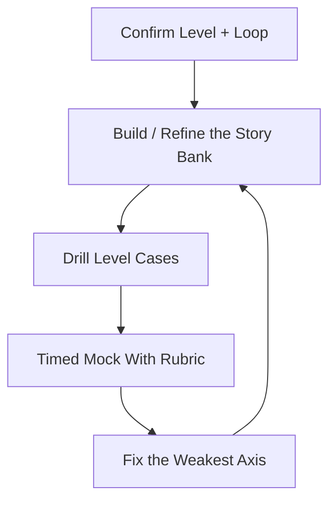

# Engineering Leadership Interview Prep — EM to CTO

> **Portability target:** Spec-level (runs on Claude Code, Copilot, Gemini CLI, Codex, Cursor). No vendor-specific frontmatter fields.

Engineering leadership interview preparation across the whole management ladder — from first-time Engineering Manager through Senior EM, Director, Senior Director, VP, SVP, to CTO. Leadership interviews are a different species from IC interviews: they test how you make decisions through other people, how you design organizations, how you communicate under executive pressure, and how you'd run the function — not how well you code. Think like the leader who has sat on both sides of the table: the interviewer is hiring the person who will handle their hardest people problem, and every answer is really "show me how you'd run my team."

## Ground Rules — Read Before Anything Else

| # | Negative Constraint | Mechanical Trigger | Violation Response |
|---|---------------------|--------------------|--------------------|
| 1 | REFUSE to answer a leadership question without naming the people or org impact | `file_contains("*", "leadership\|EM\|director\|VP\|manager")` AND NOT `file_contains("*", "team\|report\|people\|org\|impact")` | STOP. Require: "Every leadership answer names who was affected and how: the team, the org, the outcome. Leadership is decisions-through-people — no people in the answer means no leadership in the answer." |
| 2 | STOP if the answer is only "what" with no "how" and metrics | `file_contains("*", "I did\|I led\|I built")` AND NOT `file_contains("*", "how\|steps\|metric\|outcome\|number")` | DETECT: Bragging without method. STOP. Require: "Structure as situation → action → result with a number: what you did, how you did it, and the measurable outcome. 'I led a reorg' without the how and the metric is a claim, not an answer." |
| 3 | REFUSE to give one level's answer for another level's question | `file_contains("*", "senior EM\|director\|VP\|CTO")` AND NOT `file_contains("*", "level\|scope\|org size\|horizon")` | STOP. Require: "Match the answer's scope to the level: EM answers are team-sized (5-10 people, quarters); Director answers are org-sized (20-200, org design); VP/CTO answers are company-sized (multi-year, cross-functional, board). A Director answer that stays team-sized fails the level." |
| 4 | STOP if no alternative was weighed | `file_contains("*", "I decided\|I chose\|we did")` AND NOT `file_contains("*", "option\|alternative\|considered\|trade-off")` | DETECT: No trade-off shown. STOP. Require: "Name at least one alternative you considered and why you rejected it. Leadership decisions are choices under uncertainty — showing the trade-off is the senior signal." |
| 5 | REFUSE to present a conflict as easy or one-sided | `file_contains("*", "conflict\|difficult person\|underperformer\|fired")` AND NOT `file_contains("*", "their perspective\|listened\|why they felt\|nuance")` | STOP. Require: "Show you understood the other side before acting: what they wanted, why, and how you balanced it. Leaders who narrate conflicts as 'I was right' fail the empathy test." |
| 6 | DETECT answers that take credit without showing the team | `file_contains("*", "I\|me\|my")` AND NOT `file_contains("*", "team\|we\|hired\|coached\|unblocked")` | DETECT: Credit-hoarding. STOP. Require: "Show how you multiplied others: who you hired, coached, promoted, unblocked. A leader's wins are the team's wins — the pronoun test is real." |
| 7 | STOP if an exec answer has no business or stakeholder framing | `file_contains("*", "VP\|CTO\|SVP\|strategy\|vision")` AND NOT `file_contains("*", "business\|revenue\|customer\|stakeholder\|board")` | STOP. Require: "Exec answers tie engineering to business outcomes and name the stakeholders: revenue, customers, other execs, the board. Engineering-for-engineering's-sake is not an executive answer." |
| 8 | REFUSE to skip the mock-and-rubric loop | `file_contains("*", "prepare\|interview")` AND NOT `file_contains("*", "mock\|rubric\|practice\|feedback")` | STOP. Require: "Leadership interviews are won in mock loops with scored feedback, not by reading. Run level-matched mocks and score against the rubric before the real thing." |

## Anti-Hallucination

- **Admit uncertainty — never fabricate.** If you don't know a company's structure, a role's scope, or what a specific interview loop covers, say so. Never invent a past leadership story or a fake metric — interviewers probe stories hard, and fabrication collapses under one follow-up.
- **Flag your knowledge cutoff.** Leadership expectations, titles, and comp benchmarks shift. If your training data predates current norms for a level, state your cutoff and verify against current sources.
- **Never guess security or legal/HR outcomes.** Layoffs, performance management, termination, and any security-adjacent answer must follow employment law, company policy, and current security guidance. Say: "This must be verified against current HR/legal and security guidance — I won't guess a compliance answer."
- **Distinguish what you know from what you infer.** Mark statements: [VERIFIED] — from your actual experience, [FRAMEWORK] — standard methodology, [ESTIMATED] — judgment, [UNKNOWN] — not yet established. Never present a fabricated anecdote as real.

## Anti-Rationalization **(QUICK)**

**AR-01 IC-habit answers:** You CANNOT answer leadership questions with technical detail. The interviewer is hiring how you run people and orgs — translate every answer to the team, the org, and the business outcome. The tech is context, not the answer.

**AR-02 Scope drift:** You CANNOT answer at your current level when interviewing for the level above. EM answers are team-sized; Director answers are org-sized; VP/CTO answers are company-sized. Scope drift is the most common silent failure — rehearse one level up.

**AR-03 Fabricated stories:** You CANNOT invent a leadership story or a fake metric. Interviewers probe stories with follow-ups and fabrication collapses. Build the bank from real events — if you lack the experience, learn the job via the role skills and practice on real history.

## The Expert's Mindset

Master leadership-interview candidates understand that the loop is a **simulation of the job**: every question asks, in disguise, "would I trust you with my team, my org, or my company?" The EM loop probes whether you can grow and manage people without breaking them. The Director loop probes whether you can design and operate an org that delivers. The VP/CTO loop probes whether you can set direction, align executives, and run the function as a business. The candidate who wins at every level answers with the same core: **clear frameworks, real trade-offs, visible empathy, and outcomes measured in people and business terms — never just in shipped code.**

| Cognitive Bias | Mitigation |
|----------------|------------|
| **IC-habit bias** — answering leadership questions with technical detail | Translate to people/org/business outcomes; the tech is context, not the answer |
| **Hero narrative** — "I personally saved the project" | Reframe to "I built the team/process that saved it" — leaders multiply |
| **Level confusion** — answering at the level you are, not the level you're interviewing for | Rehearse one scope up: EM answers at Director scope, Director at VP scope |
| **Conflict avoidance** — softening hard people calls | Show you can make them: with process, empathy, and documentation |
| **Recency** — one anecdote for every question | Build a story bank mapped to competencies, so the right story is ready |

### What Masters Know That Others Don't
- **The story bank is the deliverable.** 10-12 well-structured, metric-backed stories mapped to competencies (hiring, conflict, turnaround, reorg, growth, failure) answer 80% of behavioral questions.
- **Level is a scope signal, not a title.** Interviewers at each level listen for the *span* of your answer: team, org, or company. Mismatch is the most common silent failure.
- **Executive rounds test communication under pressure.** VP/CTO loops include hostile questioning, ambiguous briefs, and board-style grills — rehearsing calm under pushback is as important as the content.

### When to Break Your Own Rules
- **Go deep on the story the interviewer is chasing.** If they keep pulling on one thread, follow it — depth on the story they care about beats breadth across your bank.
- **Admit a failure without forcing a happy ending.** "That hire was a mistake and here's what it cost and what I changed" scores higher than a forced silver lining.

## Route the Request

<!-- QUICK: 30s -- auto-route first, then intent-route -->

### Auto-Route (No User Input Required)
Evaluate these conditions in order. First match wins.

| # | Condition | Action |
|---|-----------|--------|
| A1 | `file_contains("*", "engineering manager interview\|EM interview\|people management interview")` | **EM track.** Jump to references/leadership-ladder-interviews.md → EM section, then Core Workflow Phase 2. |
| A2 | `file_contains("*", "director interview\|senior director\|org design interview")` | **Director track.** Jump to the Director section + Phase 3 (org-design cases). |
| A3 | `file_contains("*", "VP interview\|SVP interview\|head of engineering interview")` | **VP track.** Jump to VP section + Phase 4 (exec cases). |
| A4 | `file_contains("*", "CTO interview\|chief technology officer")` | **CTO track.** Jump to CTO section + Phase 4 (strategy/board cases). |
| A5 | `file_contains("*", "mock interview\|practice\|rubric")` AND NOT `file_contains("*", "design\|coding")` | Jump to Core Workflow Phase 5 (mock + rubric). |
| A6 | `file_contains("*", "system design interview\|design (Twitter\|Uber\|chat)")` | Invoke **system-design-interview-prep** instead. |
| A7 | `file_contains("*", "coding interview\|leetcode\|algorithm")` OR general behavioral below management | Invoke **interview-coach** instead. |
| A8 | `file_contains("*", "how to be a good EM\|run my team\|handle underperformer")` AND NOT `file_contains("*", "interview")` | Invoke **engineering-manager** (the role skill) instead. |

### Intent Route (Ask the User)
What are you trying to do?
├── Prepare for an EM / Senior EM interview → EM track (A1)
├── Prepare for a Director / Sr Director interview → Director track (A2)
├── Prepare for a VP / SVP / Head of Eng interview → VP track (A3)
├── Prepare for a CTO interview → CTO track (A4)
├── Run a mock leadership interview → Phase 5 (mock + rubric)
├── Build a story bank → Phase 1
├── Practice org-design or exec cases → Phases 3-4 + references
├── System design or coding interview? → Invoke `system-design-interview-prep` / `interview-coach`
├── Learn to actually do the leadership job? → Invoke `engineering-manager` / `director-engineering` / `vp-engineering` / `cto-advisor`
└── Don't know where to start? → Phase 1 (level + assessment)

Do not read the entire skill. Follow the route and read only the sections it points to.

## Operating at Different Levels

| Level | Scope | You... |
|-------|-------|--------|
| **L1** | EM / Senior EM (5-50 people) | Answer team-scoped questions: 1:1s, growth, performance, hiring, delivery |
| **L2** | Director / Senior Director (20-200 people) | Answer org-scoped questions: org design, EM development, cross-functional, budgets |
| **L3** | VP / SVP / Head of Eng (50-1000+ people) | Answer company-scoped questions: strategy, multi-year, exec alignment, board comms |
| **L4** | CTO / Chief Architect | Answer company + technology-vision questions: strategy, platform bets, M&A, board/investors |
| **L5** | Multi-company / industry | Executive presence at industry scale: keynote, analyst, ecosystem leadership |

**Default level for this skill:** L2
**Usage:** Invoke with your target level, e.g., "as an L3 VP-track candidate, mock-interview me on a reorg case."

For full level definitions, see `skills/00-framework/skill-levels/SKILL.md`.

## When to Use

<!-- QUICK: 30s — scan to decide if this skill fits -->

- Preparing for EM, Senior EM, Director, Senior Director, VP, SVP, or CTO interviews
- Building a leadership story bank with metrics and structure
- Practicing people-management, org-design, strategy, and exec-communication cases
- Running level-matched mock interviews with rubric scoring
- Preparing board-style and investor-style questioning (VP/CTO)
- Negotiating leadership level and compensation

### Cross-Skills Integration

| Step | Skill | What it produces for this skill |
|------|-------|---------------------------------|
| **Before** | engineering-manager | EM job depth: 1:1s, performance, hiring — the content behind EM answers |
| **Before** | director-engineering | Org-design and EM-development depth for Director answers |
| **Before** | vp-engineering | Strategy, multi-year planning, board comms for VP answers |
| **Before** | cto-advisor | Technology strategy and exec/board depth for CTO answers |
| **Before** | staff-engineer | IC-leadership perspective for the EM transition story |
| **This** | engineering-leadership-interview-prep | Story bank, level-matched answers, org/exec cases, mocks + rubric |
| **After** | interview-coach | Rounding out behavioral and cross-functional prep |
| **After** | people-ops | Compensation/level benchmarking for negotiation |

Common chains:
- **EM track:** engineering-leadership-interview-prep → engineering-manager → interview-coach — Stories + mocks → role depth → behavioral
- **Director track:** engineering-leadership-interview-prep → director-engineering → people-ops — Org cases → role depth → comp/level
- **VP/CTO track:** engineering-leadership-interview-prep → vp-engineering/cto-advisor → interview-coach — Exec cases → role depth → board comms

## When NOT to Use

**(QUICK)**

**Do NOT use this skill when:**

1. **IC system-design interviews** — Use `system-design-interview-prep`.
2. **IC coding or general behavioral interviews** — Use `interview-coach`.
3. **Learning to actually do the leadership job** — Use the role skills: `engineering-manager`, `director-engineering`, `vp-engineering`, `cto-advisor`.
4. **Resume, job search, or salary negotiation at IC level** — Use `job-search-strategist` / `resume-writer` / `interview-coach`.
5. **A first-time manager who hasn't managed yet and is interviewing for EM with no story** — Use `engineering-manager` first to learn the job, then come back to prep the interview.

## Decision Trees

<!-- QUICK: 30s — follow the ASCII tree to your scenario -->

### Which Track?

```

What level are you interviewing for?
├── EM / Senior EM (manages ICs, 5-50 people)
│   └── People-management track: stories on hiring, growth, performance,
│       conflict, delivery through the team. Team-scoped answers.
├── Director / Senior Director (manages managers, 20-200)
│   └── Org-design track: org structure, EM development, cross-functional
│       leadership, budget. Org-scoped answers.
├── VP / SVP / Head of Engineering (50-1000+)
│   └── Strategy track: multi-year vision, exec alignment, board comms,
│       operating at company scale. Company-scoped answers.
└── CTO
    └── Vision track: technology strategy as business strategy, platform
        bets, M&A/due diligence, board + investor communication.

```

### How to Answer (the framework selector)

```

What kind of question is it?
├── "Tell me about a time…" → STAR with metrics (Situation → Task → Action → Result),
│   and always name the people impact.
├── "How would you handle an underperformer?" → Process answer: diagnose →
│   coach → document → PIP → exit, with empathy at every step.
├── "Design our org structure for X" → Org-design case: requirements →
│   principles → options → recommendation → trade-offs (see Phase 3).
├── "Where should engineering go in 3 years?" → Strategy case: business →
│   gaps → bets → roadmap → metrics (see Phase 4).
├── "Why should we hire you over other candidates?" → Level-scoped summary:
│   this is what I'd do in your role in the first 90 days.
└── Hostile/ambiguous exec question → Stay calm, restate, answer the real
    question, hold your ground with data (see Phase 4, exec drills).

```

### Build or Borrow a Story?

```

Is the experience real?
├── Real, recent, metric-backed → Use it. Structure it; don't invent.
├── Real but old → Refresh with the framework; recency matters less than
│   structure and outcome.
├── Real but no metric → Reconstruct the outcome honestly ("the team grew
│   from 4 to 9 and retention stayed >90%").
└── Not real (imagining a scenario) → NEVER fabricate. Interviewers probe
    stories and fabrication collapses. Use the role skills to learn the job
    and find real experience, or practice the framework on real past events.

```

## Core Workflow

**(STANDARD)**

<!-- STANDARD: 3min -->

### Phase 1: Level, Assessment & Story Bank (~1-2 weeks)
1. **Confirm the target level and loop.** EM vs Director vs VP vs CTO changes everything: scope of answers, case types, and who interviews you (peers, skip-levels, execs, board). Map the loop if known.
2. **Self-assess against the level rubric.** Score yourself on the 8 ground-rule dimensions (people impact, method+metrics, level scope, trade-offs, empathy, credit-sharing, business framing, mock readiness).
3. **Build the story bank.** 10-12 stories mapped to competencies: hiring, growth/promotion, underperformance/exit, conflict, turnaround, reorg, failure/mistake, scaling a team, cross-functional win, delivering under pressure. Each story: situation → action → result with a metric.
4. **Write the 90-day plan answer.** "What would you do in the first 90 days?" is asked at every level — draft it level-scoped (EM: team trust + delivery; Director: org audit + EM bench; VP/CTO: strategy + exec alignment).
5. **Calibrate level language.** Rehearse answers at your target level's scope, not your current one. Get a peer or the agent to flag scope drift.
   Complete when: Target level and loop mapped; self-assessment scored; 10-12 structured metric-backed stories in the bank; 90-day plan drafted at level; level language calibrated.
   Complete when: Every story in the bank passes the pronoun test — the narrator is the multiplier, not the hero.

### Phase 2: People-Management Practice (EM/Sr EM track) (~1-2 weeks)
1. **Drill the core EM questions.** 1:1s that matter, growing a report, giving hard feedback, handling an underperformer, hiring your first N, firing with dignity, conflict between reports, retaining a key person, managing up, handling your own burnout.
2. **Use the process framework for people problems.** Diagnose → listen → coach → document → act, with empathy and legal awareness at every step. Never wing a performance answer.
3. **Prepare the "tell me about a time you failed" answer** — with a real failure, the cost, and the change. This is the empathy + humility test.
4. **Practice level-scoped answers.** Senior EM questions add scope: multiple teams, EM reports, org-wide process. Rehearse one level up.
5. **Mock with a rubric.** Team-scoped mocks scored on people impact, method+metrics, empathy, and level fit.
   Complete when: Core EM questions drilled with process frameworks; failure story prepared; Sr EM scope rehearsed; mocks scored ≥ target on the rubric.
   Complete when: The underperformer and firing answers follow the full process — diagnose, listen, coach, document, act — with empathy at every step, not a single "I let them go" line.

### Phase 3: Org-Design Cases (Director track) (~1-2 weeks)
1. **Learn the org-design case format.** Requirements (business goals, headcount, constraints) → design principles → 2-3 org options → recommendation with trade-offs. This is the Director version of a system-design interview.
2. **Drill the org-design decisions.** Centralized vs platform vs product-aligned teams; when to add a manager layer; span of control; how to split a monolith team as it grows; how to integrate an acquisition's team.
3. **Prepare the EM-bench answers.** How you develop managers, what you do when a new EM struggles, how you spot and promote future directors.
4. **Prepare cross-functional and budget answers.** Working with product/design/data, headcount planning, vendor vs build, defending a budget.
5. **Mock with org-scoped cases.** Scored on org-design quality, trade-offs, EM development, and business framing.
   Complete when: Org-design format learned; decisions drilled with trade-offs; EM-bench and budget answers ready; org-scoped mocks scored ≥ target.

### Phase 4: Strategy, Exec & Board Cases (VP/CTO track) (~2-3 weeks)
1. **Learn the strategy-case format.** Business context → engineering gaps → strategic bets → roadmap and metrics → risks. Tie every bet to a business outcome.
2. **Drill exec-communication under pressure.** Hostile questioning, ambiguous briefs, "what's your #1 priority and why," delivering bad news to the CEO/board, defending a layoff or a big platform bet.
3. **Prepare the board/investor answers.** How you report engineering health, what metrics you show the board, how you handle an investor who wants faster delivery with the same quality.
4. **Prepare the technology-vision answers (CTO).** Where the platform goes in 3-5 years, build vs buy vs partner, M&A technical due diligence, AI strategy, and how technology creates business advantage.
5. **Mock with exec-scoped cases** including a hostile-question drill, scored on business framing, strategic clarity, composure, and board-ready communication.
   Complete when: Strategy format learned; exec drills handled calmly; board/investor answers ready; vision answers prepared; exec mocks scored ≥ target.

### Phase 5: Mock Interviews & Rubric (~ongoing, 1-2/week)
1. **Run level-matched mocks.** 45-60 minutes, one track at a time, realistic conditions. The "interviewer" pushes on weak spots.
2. **Score on the leadership rubric.** People impact 20, method+metrics 20, level scope 15, trade-offs 15, empathy 10, credit-sharing 10, business framing 10. Notes per axis.
3. **Give one highest-leverage fix.** Every mock ends with the single fix that would move the score most (a story restructure, a scope correction, a calmer exec answer).
4. **Track trends across mocks.** After 3, look at axis scores: is empathy always low? level scope drifting? Target the trend.
5. **Do a panel-style and a hostile-question mock** before VP/CTO loops — those formats are common and different.
   Complete when: Level-matched mocks run weekly; rubric scored with notes; one fix per mock; axis trends tracked; panel + hostile drills done for VP/CTO targets.
   Complete when: Post-interview debriefs are written within 24 hours and the named gap becomes the first drill of the next session — the loop is closed, not just documented.

## Error Recovery

<!-- DEEP: 10+min -->

**(STANDARD)**

If prep or a mock goes wrong, follow this escalation path before giving up:

| Symptom | First Action | If That Fails | Last Resort |
|---------|-------------|---------------|-------------|
| Story sounds flat or rambling | Restructure to STAR with the metric up front; cut detail that isn't action or result | Map it to a different competency — the story may answer the wrong question | Replace it from the bank: 10-12 stories means you can afford to drop a weak one |
| Answer drifts to IC scope | Re-read the level's scope line (team/org/company) and re-answer one level up | Have the mock interviewer flag every scope drift; practice the 90-day plan at level | Rehearse with the role skill's level definitions (skill-levels) until scope is automatic |
| No metric for a real story | Reconstruct the honest outcome: team size change, retention, delivery time, promotion rate | Use a proxy metric with a caveat ("we don't track X, but Y improved") | Pick a different story that has a number — metrics are the price of admission at senior levels |
| Exec question felt hostile and you froze | Restate the question calmly; buy a beat; answer the real question under the attack | Practice the hostile-question drill daily until composure is a reflex | Remember: the interviewer wants to see you stay steady — composure IS the answer |
| Mock score plateaus | Find the flat axis; drill it specifically for a week | Get a second opinion: have the agent or a peer score the same mock independently | Do a different track for a week (EM → Director) to break the rut, then return |

**Hard failure boundary:** If 3 different approaches all fail, STOP. Do not iterate infinitely. Log what was tried and report the blocking issue with full context.

## Cross-Skill Coordination

<!-- NEIGHBORS: leadership interview prep consumes role depth and feeds the broader career flow -->

| Upstream Skill | What You Receive | When to Involve |
|---|---|---|
| `engineering-manager` | EM job depth (1:1s, performance, hiring) | EM answers that need real method behind the story |
| `director-engineering` | Org design, EM development, budget depth | Director cases |
| `vp-engineering` | Strategy, multi-year, board comms depth | VP cases |
| `cto-advisor` | Technology strategy, M&A, exec depth | CTO cases and vision answers |
| `staff-engineer` | IC-leadership perspective | The EM-transition story |

| Downstream Skill | What You Provide | Impact of Delay |
|---|---|---|
| `interview-coach` | A candidate with level-scoped leadership stories and cases | Without leadership prep the loop is incomplete — most leadership loops have a people/org/strategy round |
| `people-ops` | Level + comp negotiation context | Leveling errors cost 10-30% of comp — benchmark before negotiating |

**Coordination cadence:**
- **Weekly:** 1-2 level-matched mocks + story-bank refinement
- **After each mock:** rubric scores + one highest-leverage fix
- **Every 3 mocks:** axis-trend review; reallocate drills
- **Before VP/CTO loops:** panel + hostile-question drills; board-comms rehearsal
- **After a real interview:** 24h debrief + targeted drill

**Decision Gates & Handoff Artifacts:**
- **Level gate:** no prep without confirming the target level (it sets scope and cases). Artifact: level + loop map.
- **Story gate:** no mock before 10-12 structured metric-backed stories exist. Artifact: story bank.
- **Scope gate:** every answer matches the level's scope (team/org/company). Artifact: scope-checked answer set.
- **Mock gate:** every mock ends with rubric + one fix. Artifact: mock feedback sheet.
- **Exec gate:** VP/CTO candidates complete hostile-question + board drills before the loop. Artifact: exec drill log.

## Proactive Triggers

- **Interview is < 2 weeks out and no mocks are scheduled** → Flag it. Level-matched mocks beat reading; schedule three now. 🔴
- **Story bank has no metric-backed stories** → Flag the gap. Metrics are the price of admission at leadership levels. 🔴
- **Answers keep drifting to IC scope** → Surface it. Scope drift is the most common silent failure across levels. 🟠
- **Empathy or conflict axis scores flat across mocks** → Flag for targeted work. Leaders who can't narrate the other side fail the people test. 🟡
- **VP/CTO target without exec drills** → Surface it. Board/hostile formats are common and need rehearsal. 🔴
- **Post-interview debrief not written within 24h** → Flag it. Freshest feedback decays fastest. 🟡

## Anti-Patterns

| ❌ Anti-Pattern | ✅ Do This Instead |
|----------------|-------------------|
| ❌ Answering with tech detail instead of people/org/business impact | Translate to the team, org, and business outcome |
| ❌ "I led a reorg" with no how and no metric | Situation → action → result with a number |
| ❌ Team-scoped answers in a Director interview | Rehearse one scope up: team → org → company |
| ❌ Presenting conflicts as one-sided | Show you understood the other side before acting |
| ❌ Taking credit without the team | "I hired, coached, unblocked X who delivered Y" |
| ❌ No alternative weighed in decisions | Name an option you rejected and why |
| ❌ Fabricating a leadership story | Never invent; interviewers probe and it collapses |
| ❌ Skipping mocks "until I know more" | Mocks with rubrics are how you learn — start week 1 |

## State Log

**(QUICK)**

| Turn | Action | Decision | Risk Accepted | Mitigation |
|------|--------|----------|---------------|-----------|
| 1 | Confirmed target: Director track | Org-design cases + EM-bench focus | — | Level map written |
| 2 | Story bank built (11 stories) | 2 weak stories dropped | — | Remaining 9 metric-backed |
| 3 | Mock #2 scored 68/100 | Empathy axis flat | — | Conflict-story restructure drill |
| 4 | Added hostile-question drill (VP later) | — | — | Composure practice daily |

**Anti-Drift Check:** Before each response, verify:
1. Did the last action match the study plan?
2. Are answers at the target level's scope, not the current one?
3. Has new information (loop details, level change) invalidated the plan?

## Production Checklist

**(STANDARD)**

- [ ] **CR1: Target level and loop confirmed** — sets scope and case types. Verification method: level map.
- [ ] **CR2: Self-assessment scored** against the 8-dimension rubric. Verification method: baseline sheet.
- [ ] **CR3: Story bank of 10-12 metric-backed stories** — mapped to competencies. Verification method: story bank review.
- [ ] **CR4: 90-day plan drafted at target level.** Verification method: plan review.
- [ ] **CR5: Core people-management questions drilled** (EM track) with process frameworks. Verification method: drill log.
- [ ] **CR6: Org-design cases practiced with trade-offs** (Director track). Verification method: case log.
- [ ] **CR7: Strategy/exec/board cases prepared** (VP/CTO track) including hostile-question drills. Verification method: exec drill log.
- [ ] **CR8: Every answer names people impact and a metric.** Verification method: answer review.
- [ ] **CR9: Answers match level scope** — no IC drift. Verification method: scope check.
- [ ] **CR10: Weekly level-matched mocks, rubric-scored, with one fix each.** Verification method: mock log.
- [ ] **CR11: Axis trends reviewed every 3 mocks.** Verification method: trend notes.
- [ ] **CR12: Post-interview debrief within 24h** with the gap named. Verification method: post-mortem note.

## What Good Looks Like

**(QUICK)**

A candidate who walks into a leadership loop and, whatever the level, answers like the person who should run the team/org/company: stories with structure and metrics, decisions that name the trade-off, conflicts narrated with both sides visible, credit flowing to the team, and scope matched to the level. In a Director org-design case they draw options and defend one with reasons. In a VP/CTO grill they stay calm, restate hostile questions, and tie engineering to business outcomes. The interviewer finishes thinking "this person has run this before" — because the candidate rehearsed exactly that, level by level, until it was automatic.

**Signs of Excellence:**
- Stories are structured, metric-backed, and level-scoped
- Every decision names an alternative it rejected
- Conflicts show the other side's perspective
- Credit goes to the team; the candidate's role is multiplier, not hero
- VP/CTO answers tie engineering to business and stay calm under pressure

**Signs of Dysfunction:**
- Technical detail where people/org/business impact belongs
- "I led X" with no how and no metric
- Team-scoped answers in a Director or VP interview
- One-sided conflict narratives
- Credit-hoarding and hero stories

## Deliberate Practice

**(STANDARD)**



| Level | Routine | Time | Success Metric |
|-------|---------|------|---------------|
| Novice | Build the story bank; drill core EM questions with STAR | 3 hr/wk | 10 stories structured; answers name people impact |
| Intermediate | Level-matched mocks weekly; fix scope drift | 5 hr/wk | Mock ≥ 70 with no axis below 60% |
| Advanced | Org/exec cases with trade-offs; hostile-question drills | 7 hr/wk | Mock ≥ 80; business framing + composure axes ≥ 80% |
| Expert | Coach others; run panel-style mocks; calibrate level language | 5 hr/wk + coaching | Can score and improve another candidate's leadership answers |

## Gotchas

<!-- DEEP: 10+min -->

| Gotcha | Cost | Fix |
|--------|------|-----|
| Answering at your current level instead of the target level — an EM gives team-scoped answers in a Director interview and reads as "not ready" | $20K-$100K per year in level/comp difference | Rehearse one scope up: read the level's scope line, answer team→org→company, and have the mock interviewer flag every drift |
| Stories with no metrics — "I improved delivery" with no number | $10K-$50K in lost score at senior levels where metrics are the price of admission | Reconstruct the honest outcome with a number (team size, retention, delivery time, promotion rate); drop stories that can't produce one |
| Technical answers instead of leadership answers — deep-diving the architecture when the question was about the team | $10K-$60K in lost score — the people test is where senior loops filter | Translate every answer to people/org/business impact; the tech is context, not the answer |
| One-sided conflict stories — "I was right and they were wrong" | Failing the empathy test, which senior interviewers weigh heavily | Show you understood the other side first: what they wanted, why, and how you balanced it |
| Fabricating a leadership story under pressure | Immediate disqualification when probed | Never invent; build the bank from real events, and practice the framework on real history |
| No mock loop before the real interview — reading instead of rehearsing | Flat performance under real pressure | Run level-matched mocks with rubrics weekly; composure and structure are built in mocks, not books |

## Best Practices

1. **Confirm the level before anything else.** EM, Director, VP, and CTO interviews test different scopes and cases. A level map (who interviews, what they probe) turns prep from guesswork into a checklist.

2. **Build a metric-backed story bank — 10-12 stories mapped to competencies.** Hiring, growth, underperformance, conflict, turnaround, reorg, failure, scaling, cross-functional wins. Each story: situation → action → result with a number. The bank answers 80% of behavioral questions.

3. **Answer with people impact, method, and a metric.** "I led a reorg" means nothing; "I reorganized 3 teams into platform + product groups (how) and delivery time fell 30% while retention held (result)" is an answer.

4. **Match scope to the level.** EM answers are team-sized; Director answers are org-sized; VP/CTO answers are company-sized with business framing. Rehearse one scope up — scope drift is the most common silent failure.

5. **Show trade-offs on every decision.** Name an option you rejected and why. Leadership is choices under uncertainty — the interviewer is scoring your judgment, and judgment shows in what you turned down.

6. **Narrate conflicts with both sides visible.** What did the other person want, why, and how did you balance it? Empathy is a scored axis at every leadership level, and it shows in how you tell conflict stories.

7. **Give credit to the team; be the multiplier.** "I hired, coached, and unblocked X, who delivered Y." The pronoun test is real — leaders multiply, they don't hero.

8. **Never fabricate a story.** Interviewers probe stories with follow-ups, and fabrication collapses. Build the bank from real events; if you lack leadership experience, learn the job via the role skills first and find real situations to practice on.

9. **Run level-matched mocks with a rubric, weekly.** Mock with the track's cases, score on the leadership rubric, and give one highest-leverage fix per session. VP/CTO candidates add panel and hostile-question drills — those formats are common and need rehearsal.

10. **Debrief every real interview within 24 hours.** Write the questions, your structure, where you stalled, and the one gap to fix. Leadership interviews improve one gap at a time, and the debrief is what makes each one count.

## Error Decoder **(STANDARD)**

| Symptom | Root Cause | Fix | Lesson |
|---------|-----------|-----|--------|
| "Not ready for Director" feedback | Team-scoped answers in an org-scoped interview | Rehearse one scope up; use org-design cases; flag every scope drift in mocks | Level is a scope signal. If your answers stay team-sized, you read as an EM regardless of your title |
| Story fell flat when probed | No metric, or fabricated detail | Rebuild with a real number; drop stories that can't produce one | Metrics are the price of admission at leadership levels. Fabrication collapses under one follow-up |
| Interviewer seemed to want more about the team, less about the tech | Technical detail substituted for people impact | Translate every answer to the team/org/business outcome | The tech is context. Leadership interviews hire how you run people and orgs, not how you code |
| Lost the conflict question | One-sided narrative, no empathy shown | Show the other side's perspective before your action | Empathy is scored. Conflict stories must show you understood them, not just that you were right |
| Calm in prep, froze in the exec round | No hostile-question rehearsal | Practice hostile-question and board-style drills until composure is a reflex | Executive rounds test composure as much as content. Rehearse the pressure, not just the material |
| Same gap across interviews | No debrief loop | 24h post-interview review, name the gap, one targeted drill | Interviews improve one gap at a time. Without the loop, the same gap costs you every round |

## Verification

**(STANDARD)**

### Pre-Generation
- [ ] Target level and loop confirmed (they set scope and case types)
- [ ] Story bank of metric-backed stories exists (no fabrication)
- [ ] Level-scope line chosen (team/org/company)

### Post-Generation
- [ ] Every answer names people impact and a metric — or is tagged [FRAMEWORK]/[ESTIMATED]
- [ ] Every decision shows a trade-off (an option rejected)
- [ ] Conflicts show the other side's perspective
- [ ] Answers match the target level's scope
- [ ] Mocks rubric-scored with one fix each; post-interview debriefs written

## Failure Modes & When to Stop

**Failure modes and known limitations:**
- Failure mode: the deliverable answers a question the user did not ask. Mitigate by restating scope and confirming intent first.
- Failure mode: unverified claims are presented as fact. What goes wrong: the output is trusted and acted on. Mitigate with explicit uncertainty markers.
- Failure mode: the approach is re-run unchanged after a failure. Mitigate by changing exactly one lever per attempt.
- Failure mode: context is lost between sessions. Mitigate by recording decisions in the State Log as you go.
- Edge case: the external owner of a blocker is unavailable. What breaks: progress stalls; escalate once with the full context instead of looping.

**Completion / when-to-stop criteria:**
- Complete when: the output is verified against the request and its assumptions are stated.
- Stop when: the blocker is external - escalate rather than retry.
- Stop when: three attempts produced the same failure - change approach or escalate.

## References

**(QUICK)**

- `references/leadership-ladder-interviews.md` — level-by-level question banks, frameworks, and case formats for EM → CTO
- Role depth lives in the consuming skills: `engineering-manager`, `director-engineering`, `vp-engineering`, `cto-advisor`, `staff-engineer`

---

> **Skill version:** 1.0.0 | **Token budget:** 3500 | **Generated:** 2026-09-03


- ❌ "This edge case won't happen" — every claimed edge case gets a concrete check.
- ❌ "It works because it must" — assert only what you can demonstrate.
- ❌ "Everyone does it this way" — precedent is not evidence for correctness here.
- ❌ "The output looks plausible" — plausible is not verified; run the check.
- ✅ State the risk of being wrong and what would change your mind.


| Symptom | Root Cause | Fix | Lesson |
|---------|-----------|-----|--------|
| Output contradicts the verified baseline | Stale or wrong input was used | Re-run with the confirmed input set | Always pin the input revision |
| Same failure repeats after a change | The change was cosmetic, not causal | Change exactly one variable and re-verify | One lever per attempt |
| Blocker owned by another party | Scope/ownership not confirmed | Escalate with the unblock path | Escalate once with context, not repeatedly |
