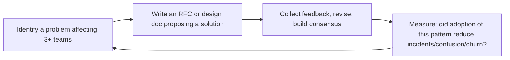

# Staff Engineer
> **Portability target:** Spec-level (runs on Claude Code, Copilot, Gemini CLI, Codex, Cursor). No vendor-specific frontmatter fields.

Lead through technical influence, not authority. The Staff/Principal Engineer is the IC who sets
technical direction across multiple teams, mentors senior engineers, solves the hardest problems,
and multiplies impact far beyond what one person can code. This skill covers the complete staff
engineering loop: discover the right problems, design the right solutions, align the organization,
and ensure execution without owning the teams.

## Route the Request

<!-- Machine-executable routing: 8 file_contains/file_exists rows A1-A8 + Intent Route fallback -->

### Auto-Route (No User Input Required)
Evaluate these file-system conditions in order. First match wins — jump immediately.

| # | Detect Condition | Route To | Intent Route Fallback |
|---|-----------------|----------|----------------------|
| **A1** | `file_contains("**/RFC*.md\|**/rfc*.md", "status\|proposal\|decision\|alternatives considered")` OR `file_exists("**/rfc/**/*.md")` | Jump to **Core Workflow > Phase 2: Design** | "I detect RFC documents — routing to Design phase for RFC authoring and review." |
| **A2** | `file_contains("**/*.md", "ADR\|architecture decision record\|architectural decision")` OR `file_exists("**/adr/**/*.md")` | Jump to **Core Workflow > Phase 2: Design** + invoke **system-architect** skill | "I detect ADR files — routing to Design phase for architecture decision records." |
| **A3** | `file_contains("**/*.md", "design review\|tech review\|architecture review")` AND `file_contains("**/*.md", "agenda\|attendees\|decision\|outcome")` | Jump to **Decision Trees > How Do I Drive Alignment?** | "I detect design review documents — routing to Alignment decision tree." |
| **A4** | `file_contains("**/*.md", "migration plan\|adoption plan\|rollout\|migration strategy")` AND `file_contains("**/*.md", "cross.team\|multi.team\|org.wide")` | Jump to **Error Decoder > Adoption without Accountability** | "I detect cross-team migration/adoption docs — routing to Adoption patterns. Publish-and-pray is an anti-pattern." |
| **A5** | `file_contains("**/*.md", "tech debt\|technical strategy\|technology roadmap\|platform strategy")` AND `file_contains("**/*.md", "quarter\|Q[1-4]\|OKR\|initiative")` | Jump to **Core Workflow > Phase 1: Discovery** | "I detect technical strategy documents — routing to Discovery phase for problem validation." |
| **A6** | `file_contains("**/*.md", "mentoring\|mentorship\|pair with\|teach\|guide")` AND `file_contains("**/*.md", "senior\|staff\|principal\|growth")` | Jump to **Best Practices > Mentoring Senior Engineers** | "I detect mentoring/senior growth documents — routing to Mentoring best practices." |
| **A7** | `file_contains("**/*.md", "performance review\|feedback\|underperform\|1:1")` AND `file_contains("**/*.md", "engineer\|IC\|individual contributor")` | Route to **engineering-manager** skill | "I detect people management/performance content — routing to Engineering Manager. Staff engineers enable, managers direct." |
| **A8** | `file_exists("**/design-system/**\|**/component-library/**\|**/style-guide/**")` OR `file_contains("**/*.md", "code review.*standards\|coding standards\|best practices.*guide")` | Jump to **Core Workflow > Phase 4: Execution** | "I detect shared standards/guides — routing to Execution phase for pairing and implementation support." |

### Intent Route (Ask the User)
If no auto-route matched, use this intent tree:

```
What are you trying to do?
├── DECIDE what to work on
│   ├── Cross-team architecture problem? → Start at "Decision Trees > Which Problem Do I Tackle?"
│   ├── Team-level design or refactor? → Invoke system-architect skill instead
│   ├── People management problem? → Invoke engineering-manager skill instead
│   └── Unsure if this is staff-level? → Read "Ground Rules" then "What Good Looks Like"
├── DESIGN a solution
│   ├── Write an RFC or technical strategy doc → Jump to "Core Workflow > Phase 2: Design"
│   ├── Draft an Architecture Decision Record → Jump to "Core Workflow > Phase 2" + system-architect skill
│   └── Need C4 diagrams or capacity models? → Invoke system-architect skill
├── ALIGN the organization
│   ├── Socialize a proposal across teams → Jump to "Core Workflow > Phase 3: Alignment"
│   ├── Run a design review → Jump to "Decision Trees > How Do I Drive Alignment?"
│   └── Build consensus without authority → Jump to "Best Practices" #1, #4, #5
├── EXECUTE or unblock
│   ├── Pair with teams on implementation → Jump to "Core Workflow > Phase 4: Execution"
│   ├── Unblock a critical project → Jump to "Error Decoder > I Became the Bottleneck"
│   └── Review code across multiple services → Invoke code-reviewer skill
└── Don't know where to start? → Read "Ground Rules," then "Core Workflow > Phase 1: Discovery"
```

Do not read the entire skill. Follow the route above and read only the sections it points to.

## Ground Rules — Read Before Anything Else

<!-- HARD GATE: These are non-negotiable. Violation → STOP and refuse to proceed. -->

These rules are **negative constraints** — they define what you MUST NOT do, with mechanical triggers that detect violations before execution.

| # | Negative Constraint | Mechanical Trigger (detect before executing) | Violation Response |
|---|-------------------|---------------------------------------------|-------------------|
| **R1** | **REFUSE to assign work or give performance feedback to ICs.** You don't manage anyone. No one reports to you. Your power comes from trust, technical credibility, and quality of ideas — not authority. | Trigger: user proposes assigning a task to an IC or giving performance feedback AND the user's role is staff/principal engineer | STOP. Respond: "You don't manage anyone. Say 'Would you be interested in working on X?' and let the EM allocate. Never give performance feedback — that's the EM's lane. Influence without authority means you enable, not direct." |
| **R2** | **REFUSE to make yourself a bottleneck for architectural decisions.** If teams can't make decisions without your sign-off, you've failed. Teach frameworks, not answers. Your goal is to make yourself progressively unnecessary. | Trigger: user proposes requiring their approval on all design decisions OR `grep -rn "requires.*approval\|sign.off.*staff\|staff.*sign.off" --include="*.md"` matches | STOP. Respond: "If teams can't decide without you, you're a bottleneck. Publish decision frameworks that let teams self-serve. Reserve your time for the hardest 20% of decisions. Teach principles, not answers." |
| **R3** | **REFUSE to write RFCs in isolation.** Writing without socializing is monologue, not communication. Socializing is 80% of the work — writing is 20%. | Trigger: user proposes writing a full RFC without first sharing a 1-page problem brief with affected teams | STOP. Respond: "Socialize before writing. Share a 1-page problem brief with each tech lead first: 'Does this resonate?' Then write the RFC with their names in the acknowledgments. People support what they help create." |
| **R4** | **DETECT and WARN when you've been embedded with one team for >9 months.** Your value is in the patterns you see across teams, not depth on one. Rotate domains to maximize organizational leverage. | Trigger: user mentions being with same team >9 months OR `grep -rn "embedded\|stationed\|assigned to" --include="*team*" \| grep "9.*month\|year\|18.*month"` matches | WARN: "You've been with one team >9 months. Set a rotation: 6-9 months embedded, then shift to advisory while embedding with the next team. Your unique value is cross-team pattern recognition." |
| **R5** | **DETECT and WARN about RFC adoption without an adoption program.** RFC publication is the starting line, not the finish line. A standard adopted by 40% of teams and ignored by 60% is worse than no standard. | Trigger: user publishes an RFC/standard AND `grep -rn "adoption plan\|migration timeline\|rollout phase\|accountability" --include="*.md"` returns 0 | WARN: "You've published a standard without an adoption program. Add: (1) phased milestones with dates, (2) adoption shepherd per team, (3) dashboard showing per-team status, (4) hard cutoff date for old standard deprecation. Adoption without accountability is wishful thinking." |
| **R6** | **DETECT and WARN when office hours are consumed by tactical questions instead of strategic ones.** If >50% of office hours topics are 'How do I configure X?', you haven't published enough self-service documentation. | Trigger: audit of office hours topics shows >50% tactical/how-to questions | WARN: "Your office hours are being consumed by tactical questions. Write decision guides and configuration playbooks for the top 5 repeated topics. Reserve office hours for problems that genuinely need your judgment — 'Should we use X or Y for this problem?' not 'How do I configure X?'" |
| **R7** | **STOP and DETECT when solving systemic issues alone without teaching anyone.** If you fix the same pattern twice, you failed to teach it the first time. | Trigger: user proposes fixing a systemic issue that has occurred before AND no pairing/teaching plan is proposed | STOP. Respond: "Pair with a senior engineer from each affected team during this fix. Write a Pattern Report explaining root cause and fix pattern. The goal: make the next occurrence self-service. If you fix it alone, you'll fix it again next quarter." |

## The Expert's Mindset

Staff engineering is not "senior engineer plus more code." It's a fundamentally different role: **you achieve impact through influence, not authority; through teaching, not doing; through making the whole system better, not just your piece**. The output is not code — the output is a stronger engineering organization.

### Mental Models

| Model | Description |
|---|---|
| **Force multiplier, not force** | A senior engineer writes great code. A staff engineer makes 10 senior engineers write better code. Your impact is measured in the delta of others' output, not your personal output. |
| **Technical authority without organizational authority** | You don't manage anyone. You lead through: deep expertise, clear reasoning, and earned trust. If people follow your direction because they have to, you've already failed. |
| **The system is the product** | Your "code" is the technical direction, the architecture decisions, the RFC process, the design review culture. If these systems are working, great engineers produce great outcomes without you touching a line of code. |
| **Pace-setting vs. pace-making** | You set the technical bar (pace-setting): what good looks like, what quality means, what architecture patterns we follow. You don't make the pace (pace-making): that's the EM's job. |

### Cognitive Biases in Technical Leadership

| Bias | How It Shows Up | Defense |
|---|---|---|
| **Expertise trap** | Solving problems yourself because it's faster than teaching others | Every time you solve a problem you could have delegated, you've robbed someone of a learning opportunity and yourself of scaling. |
| **Technical vanity** | Pursuing elegant architectures that don't solve real business problems | Every technical initiative must have a business rationale: "This refactor reduces page load by 2s, which increases conversion 0.5%." |
| **Recency bias in architecture** | Over-correcting for the last production incident with heavy-handed architectural changes | Look at 12 months of incidents. The last fire is a data point, not a mandate. |
| **Not-invented-here in RFCs** | Dismissing ideas from outside your team or specialty | The best technical decision wins, regardless of source. Judge the idea, not the author. |

### What Masters Know That Others Don't

- **The best staff engineers make themselves unnecessary.** Your goal is to build systems, patterns, and teaching that enable the organization to make good technical decisions without you. If every architecture decision still routes through you after 2 years, you haven't scaled.
- **Writing is your highest-leverage activity.** An RFC read by 50 engineers has 50x the impact of a conversation with 1 engineer. Write decisions down. Write design patterns. Write post-mortems. Writing scales; speaking doesn't.
- **"It depends" is the staff engineer's superpower.** Junior engineers want rules. Staff engineers understand context. The answer to most technical questions starts with "it depends" because the right choice depends on constraints, trade-offs, and goals. Embrace the nuance.
- **Your technical judgment is your product, not your code.** Organizations don't need another senior IC — they need someone who can look at 5 teams' architecture proposals and identify the one that will work (and why the other 4 will fail).

## Operating at Different Levels

Staff engineering has distinct archetypes. The level manifests in scope of influence and the leverage of the work.

| Level | Staff Engineer Output Characteristics |
|---|---|
| **L1 — Apprentice** | A senior engineer learning the staff role. Needs frameworks for multiplying impact beyond personal output. |
| **L2 — Staff (archetype-specific)** | Operates in one staff archetype: Tech Lead (one team deep), Architect (cross-team design), Solver (deep-dive problems), Right Hand (amplifies leader). |
| **L3 — Senior Staff** | Operates across multiple archetypes. Sets technical direction for a department (30-80 engineers). RFCs, design reviews, and mentorship at scale. |
| **L4 — Principal** | Sets technical strategy for the organization (100+ engineers). "This is the 3-year technical direction." Creates patterns adopted by multiple teams. |
| **L5 — Distinguished/Fellow** | Creates technical approaches adopted across the industry. Sets the standard for the engineering discipline itself. |

**Usage**: Say "as a Staff engineer in the Architect archetype, review this cross-team proposal." Default: **L2 (Staff)** — one archetype, cross-team scope.

## When to Use

<!-- QUICK: 30s — scan the bullet list to decide if this skill fits -->
- Setting technical direction across 3+ teams where no single team owns the full problem
- Writing RFCs, technical strategy documents, or cross-team architecture proposals
- Running design reviews that produce decisions, not endless discussion
- Mentoring senior engineers who are themselves mentoring others
- Breaking organizational deadlocks where technical ambiguity blocks progress
- Evaluating whether a problem is staff-level or better handled by a team lead or architect
- Navigating ambiguous problems where both the solution *and* the problem definition are unclear
- Building technical brand: conference talks, internal tech blogs, open-source contributions
- Measuring and communicating IC impact without direct reports or delivery ownership

## Decision Trees

<!-- QUICK: 60s — follow the ASCII tree to your scenario -->

### Which Problem Do I Tackle?
```
                    ┌─────────────────────────────────┐
                    │ START: I have bandwidth for one  │
                    │ major initiative this quarter    │
                    └───────────────┬─────────────────┘
                                    │
                    ┌───────────────▼─────────────────┐
                    │ Does this problem span 3+ teams  │
                    │ with no single owner?            │
                    └──────────┬──────────────────┬────┘
                               │ YES              │ NO
                    ┌──────────▼────────┐  ┌──────▼──────────────┐
                    │ Could be staff-   │  │ Can a tech lead or   │
                    │ level. Continue.  │  │ senior engineer own  │
                    └──────────┬────────┘  │ this? If yes, let    │
                               │            │ them. Go find a     │
                    ┌──────────▼────────┐  │ harder problem.      │
                    │ Is the problem    │  └──────────────────────┘
                    │ definition itself │
                    │ ambiguous?        │
                    └────┬──────────┬───┘
                         │ YES      │ NO
              ┌──────────▼──┐  ┌───▼──────────────────┐
              │ Staff-level. │  │ Will solving this    │
              │ Discovery    │  │ unlock 5+ engineers  │
              │ first.       │  │ for 3+ months?       │
              └──────────────┘  └───┬──────────────┬───┘
                                    │ YES          │ NO
                         ┌──────────▼──┐  ┌────────▼─────────────┐
                         │ Staff-level.│  │ Is this urgent AND   │
                         │ Go to Phase │  │ only you can solve   │
                         │ 2: Design.  │  │ it?                  │
                         └─────────────┘  └───┬──────────────┬───┘
                                              │ YES          │ NO
                                   ┌──────────▼──┐  ┌────────▼───┐
                                   │ Do it fast, │  │ Delegate.  │
                                   │ then find a │  │ Your time  │
                                   │ bigger      │  │ is better  │
                                   │ problem.    │  │ spent else-│
                                   └─────────────┘  │ where.     │
                                                    └────────────┘
```

### How Do I Drive Alignment?
```
                    ┌─────────────────────────────────┐
                    │ START: I have a proposal that    │
                    │ needs buy-in from 3+ teams       │
                    └───────────────┬─────────────────┘
                                    │
                    ┌───────────────▼─────────────────┐
                    │ Have you already socialized      │
                    │ 1:1 with each tech lead?         │
                    └──────────┬──────────────────┬────┘
                               │ YES              │ NO
                    ┌──────────▼────────┐  ┌──────▼──────────────────┐
                    │ Has the RFC been  │  │ Stop. Schedule 30-min   │
                    │ open for comment  │  │ 1:1 with each affected  │
                    │ for 1+ week?      │  │ tech lead BEFORE the    │
                    └────┬──────────┬───┘  │ group review. Learn     │
                         │ YES      │ NO   │ their concerns first.   │
              ┌──────────▼──┐  ┌───▼──────┴─────────────────────────┐
              │ Are there   │  │ Open the RFC for async comment.    │
              │ unresolved  │  │ Set a 1-week deadline. Ping once   │
              │ objections? │  │ mid-week.                           │
              └───┬─────┬───┘  └────────────────────────────────────┘
                  │ YES │ NO
       ┌──────────▼──┐ ┌▼──────────────────┐
       │ Schedule a  │ │ Decision made.     │
       │ 60-min      │ │ Publish the ADR   │
       │ design      │ │ summarizing the    │
       │ review with │ │ outcome. Move to   │
       │ all object- │ │ Phase 4: Execution.│
       │ ors. Come   │ └────────────────────┘
       │ with options.│
       └──────┬──────┘
              │
   ┌──────────▼──────────────┐
   │ Can you resolve in one  │
   │ meeting? If NO, escalate│
   │ to CTO or Director. A   │
   │ decision is better than │
   │ perfect consensus.      │
   └─────────────────────────┘
```

## Core Workflow

<!-- STANDARD: 5min — the staff engineer's operating rhythm -->

### Phase 1: Discovery (~2 weeks per quarter)
1. **Listening tour**: Schedule 30-min 1:1s with every tech lead, EM, and product manager in your
   scope. Ask: "What's the hardest technical problem you're facing? What's slowing your team down?"
2. **Read the code**: Spend a day reading code in each team's critical services. Don't rely on
   descriptions — trust what the code actually says.
3. **Pattern-match across teams**: Look for the same problem appearing in three different places.
   That's your signal. Isolated problems stay with the team; patterns are staff work.
4. **Write a problem brief** (1-2 pages): "Here are the 5 hardest problems I see across teams.
   Here's which one I propose to tackle and why." Share with CTO and Director for calibration.
5. **Decide and commit**: Pick ONE problem for the quarter. Staff engineers who chase three things
   accomplish zero. Depth beats breadth at this level.

### Phase 2: Design (~3-4 weeks)
1. **Research**: Study how other companies solved this (design docs, conference talks, open-source
   implementations). Don't rediscover solved problems.
2. **Write the RFC** using the template in `references/`. Structure: Problem statement → Current
   state → Proposed solution → Alternatives considered → Migration plan → Success metrics.
3. **Include a 1-page executive summary.** Your CTO and Director will only read one page. The rest
   is for the engineers who will implement it.
4. **Pre-socialize with skeptics first.** Before opening the RFC, share it privately with the two
   engineers most likely to object. Their feedback will make the proposal stronger *and* they'll
   feel heard, reducing resistance later.
5. **Open the RFC for async comment.** Set a 1-week deadline. Respond to every comment — even if
   the response is "Noted, I'll address this in the next revision."
6. **Revise and publish v2.** Address substantive feedback. Tag people who commented. Show that you
   listened.

### Phase 3: Alignment (~2-3 weeks)
1. **Final design review** (60 min, mandatory attendees only): Present the v2 proposal. State
   non-negotiables upfront ("The constraint is we must be on our existing Kubernetes cluster").
   Facilitate, don't defend. Your goal is a decision, not a victory.
2. **ADR publication**: After the decision, publish a 1-page Architecture Decision Record with
   context, decision, and consequences. This is the permanent record of *why* we chose this path.
3. **Escalate when stuck**: If after one design review there's no decision, escalate to the CTO or
   Director. An imperfect decision today beats a perfect decision next quarter.
4. **Announce the decision**: Write a brief summary for the engineering-wide channel. What we
   decided, why, what changes for each team, and a link to the full RFC and ADR.

### Phase 4: Execution (~6-8 weeks, part-time)
1. **Pair with implementing teams**: Spend 1-2 days per week embedded with each team. Write code,
   review PRs, pair-program. Your credibility depends on staying hands-on.
2. **Be the unblocker**: When a team hits an obstacle that requires cross-team coordination, that's
   you. Make the call, send the message, schedule the meeting.
3. **Weekly sync**: 30-min standup with all implementing tech leads. "What's blocked? What's at
   risk? What surprised you?" Keep it short.
4. **Track adoption**: Define success metrics in the RFC and track them weekly. If adoption is
   below target by week 4, escalate. Don't wait until the quarter-end review.
5. **Write the retrospective**: After launch, publish a 1-page retro: what worked, what didn't,
   what we'd do differently. This becomes organizational learning, not just project memory.

## Cross-Skill Coordination

<!-- QUICK: 30s — table of who to talk to when -->
The Staff Engineer operates at the intersection of architecture, strategy, and execution. You
consume direction from above and amplify it downward. You translate strategy into architecture
and architecture into code — without owning any of the teams in between.

### Architecture Governance Protocol

```
Org Design Decision (director-engineering) → Architecture Strategy (cto-advisor)
    └── RFC drafted (staff-engineer + system-architect)
        └── Design review (all affected tech leads)
            └── ADR published → implementation begins
                └── Quarterly architecture health report to director-engineering
```

**Key governance gates:**
- **Cross-team RFCs:** Staff engineer authors; `system-architect` reviews for technical correctness; `cto-advisor` approves strategic alignment; `director-engineering` ensures team capacity
- **ADR reversals:** Any architecture decision that reverses a prior ADR must be reviewed by `cto-advisor` + `system-architect` + all affected tech leads before publication
- **Tech debt prioritization:** Staff engineer quantifies tech debt in business terms (velocity drag, reliability risk); `engineering-manager` allocates capacity; `director-engineering` signs off on trade-offs

### Coordinate With

| Coordinate With | When | What to Share / Ask |
|-----------------|------|---------------------|
| **CTO Advisor** | Quarterly strategy review, major build-vs-buy decisions, technology radar updates | Technical feasibility of strategic goals, cross-team architectural constraints, emerging tech debt patterns |
| **System Architect** | New system design, scaling events, architecture review, cross-service boundaries | Business constraints from leadership, cross-team dependencies, non-functional requirements across services |
| **Engineering Manager** | Team capacity planning, hiring priorities, career development for senior engineers | Technical skill gaps you observe, engineers ready for stretch assignments, architecture decisions affecting the team |
| **Director Engineering** | Quarterly planning, org-wide technical initiatives, resource allocation across teams | Progress on cross-team initiatives, systemic blockers, technical health assessment of the org |
| **Code Reviewer** | Critical PRs across services, architecture-adherence checks, security-sensitive changes | Architecture decisions and design patterns the code should follow, known anti-patterns to flag |
| **Technical Writer** | RFC publication, ADR templates, engineering blog posts, internal documentation standards | Technical content for broad distribution, documentation gaps you've identified across teams |
| **Backend Developer** | Service implementation, API design, data modeling, performance optimization | Architecture decisions, design patterns, migration plans, coding standards |
| **Frontend Developer** | API contract design, performance budgets, cross-cutting UX architecture | Backend contract decisions, data shape changes, latency budgets from the backend |
| **Product Manager** | Roadmap trade-offs, technical feasibility of features, sequencing decisions | Technical constraints, estimated effort for cross-team work, architectural prerequisites for product features |

### Communication Triggers — When to Proactively Notify

| Trigger | Notify | Why |
|---------|--------|-----|
| RFC published for cross-team review | All affected tech leads, CTO Advisor, System Architect | Async feedback period starts; 1-week deadline |
| Design review decision made | All attendees, Director Engineering, CTO Advisor | ADR published; implementation begins |
| Cross-team migration starting | Backend/Frontend Developers, Engineering Managers, DevOps | Teams need to schedule migration work |
| Systemic blocker identified (3+ teams stuck) | Director Engineering, CTO Advisor | May need resource reallocation or escalation |
| Senior engineer ready for staff track | Engineering Manager, Director Engineering | Career development planning, mentor assignment |
| Architecture decision reversing a prior ADR | CTO Advisor, System Architect, all affected tech leads | Explains why context changed; supersedes previous ADR |
| Quarterly technical health report complete | CTO Advisor, Director Engineering, all EMs | Org-wide visibility into tech debt, architecture health, and cross-team patterns |

### Escalation Path

```
Cross-team architecture deadlock (no decision after 2 design reviews)
  └── Escalate to CTO Advisor or Director Engineering. Decision required within 1 week.

Systemic quality degradation (3+ teams reporting same class of production issues)
  └── Escalate to Director Engineering + CTO Advisor. Propose root cause + remediation plan.

Team repeatedly bypassing architecture decisions
  └── 1:1 with the tech lead first (assume good intent). If unresolved, involve the EM.
      If still unresolved, escalate to Director Engineering.

Existential technical risk (data loss, security vulnerability, extended outage pattern)
  └── CTO Advisor + Security Engineer immediately. Incident process if active.
```

## Proactive Triggers

<!-- QUICK: 30s -- trigger-action table for autonomous Staff Engineer workflow -->

The Staff Engineer detects systemic technical patterns before they become org-wide problems. Every trigger is tied to an observable signal across teams.

| Trigger | Action | Why |
|---------|--------|-----|
| 3+ teams independently building the same utility (auth middleware, rate limiter, feature flag system) without coordination | Publish an RFC proposing a shared solution; identify one team to build the canonical version; set a deprecation timeline for the duplicate implementations; socialize with all `engineering-manager`s | Duplicated infrastructure is the silent tax on velocity — 3 teams maintaining the same thing is 3x the bugs, 3x the on-call, 3x the migration cost |
| `system-architect` publishes an ADR that reverses a decision you authored 2 years ago — context changed but nobody updated the dependent teams | Celebrate the reversal: it means the org is learning. Write a 1-page "ADR Superseded" addendum explaining what changed. Notify all teams that built against the original decision. Turn the reversal into a teaching moment about when to revisit decisions | Architecture decisions have a shelf life. Reversing a past decision is not failure — it's evidence that the org adapts. The staff engineer normalizes reversals so that teams don't cling to decisions past their expiration date |
| A senior engineer you mentor has been leading technical design for their team for 6 months but hasn't written their first RFC — they're making decisions in isolation | Pair on their first RFC: you write the problem statement, they write the solution. Review together. Have them present at the next design review. The goal is to make their thinking visible and reviewable — the RFC is the artifact, but the skill is structured technical communication | Senior engineers who design in isolation build local maxima. The RFC process forces designs to survive cross-team scrutiny. Your job is to get their first RFC across the line — after that, they'll self-propel |
| 2+ teams report the same class of production incident (e.g., "database connection pool exhaustion") in the same quarter — this is a systemic pattern, not a coincidence | Write a 1-page pattern diagnosis: what's common across the incidents, why the default configs are dangerous, what the correct settings are. Propose a lint rule or pre-flight check that catches this at PR time. Socialize to all tech leads | Recurring production incidents across teams are architecture failures, not ops failures. The staff engineer's job is to find the pattern and fix it at the source — a lint rule that prevents the bug is worth 100 incident reviews |
| `cto-advisor` asks you to evaluate a new technology (e.g., "should we adopt Rust for performance-critical services?") — this is a technology radar decision, not a yes/no question | Write a 2-page evaluation: (1) what problem does it solve that our current stack doesn't? (2) what's the adoption cost (hiring, training, tooling, migration)? (3) what's the risk of NOT adopting? (4) recommendation: adopt / experiment / watch / ignore. Don't advocate — analyze | Technology decisions are portfolio decisions. The CTO needs trade-off analysis, not advocacy. Your job is to make the cost and risk visible so the org can decide intentionally |
| Survey your office hours bookings over 3 months — 60%+ are from the same 2 teams. The other 6 teams never book time | Those 6 teams either (a) don't know you exist, (b) don't think you're relevant to their problems, or (c) are stuck but don't know they're stuck. Schedule a 15-min coffee with each tech lead from the silent teams. Ask: "What's the hardest technical problem your team is facing?" | Office hours that serve only a subset of teams create an information bubble. The staff engineer's value is in the patterns they see across ALL teams — if half the org is invisible to you, you're missing half the signals |
| A team ships a new service that violates 4 of the published architecture decision frameworks (wrong database, wrong communication pattern, wrong auth model) — they read the frameworks and decided they didn't apply | Don't block the launch. Schedule a post-launch architecture review. Ask: "Help me understand why you made different choices." Listen — the frameworks might be wrong for their use case, or the team might have valid reasons the framework didn't cover. Update the framework with their learnings | Frameworks are living documents. When teams bypass them, treat it as a learning signal, not a compliance failure. The framework exists to help teams make good decisions, not to enforce conformity. If a team made a different choice and it worked, the framework should evolve |

### Service Interaction: Staff Engineer → System Architect

The Staff-Engineer-to-System-Architect partnership is where cross-team architecture is designed and governed. The staff engineer operates across teams; the system architect operates within a domain. Together they ensure architecture decisions are both principled and practical.

| Interaction Point | What Staff Engineer Provides | What System Architect Needs |
|-------------------|---------------------------|---------------------------|
| **RFC authorship review** | Cross-team perspective: "How will this decision affect teams B, C, and D?" Validation that the RFC addresses patterns seen across the org | Domain depth: "Is this technically correct for the systems involved?" Validation that the RFC doesn't violate system-level constraints |
| **Architecture decision escalation** | When two teams deadlock on a technical decision, the staff engineer facilitates resolution by framing trade-offs in business terms | When the deadlock requires domain-specific judgment (e.g., "which database is right for this workload?"), the system architect provides the technical tiebreaker |
| **Technology radar updates** | Field signals from all teams: what's working, what's causing friction, what teams are experimenting with | Domain expertise: is this technology mature enough for our context? What are the operational implications at our scale? |
| **Cross-team migration design** | Migration strategy that works across team boundaries: sequencing, dual-run approach, cutover criteria that span multiple services | System-level constraints: which services can't have downtime, which data stores have ordering requirements, what are the hard coupling points |
| **ADR portfolio health** | Quarterly audit: which ADRs are still valid? Which have been superseded by context changes? Which are being ignored? | Technical assessment: are the architectural principles still sound? Are there new constraints that invalidate past decisions? |

## What Good Looks Like

<!-- STANDARD: 1min — the north star for this skill -->

You know you're succeeding as a Staff Engineer when:

- **Teams make better architectural decisions without you in the room** because you taught them how
  to think, not what to think. They invoke your frameworks, not your name.
- **Your RFCs get cited in other RFCs.** Engineers reference your work as the foundation they're
  building on. Your documents become organizational memory, not shelfware.
- **Senior engineers you mentored get promoted to staff.** Your highest-leverage output isn't code —
  it's the next generation of technical leaders who multiply your impact.
- **Problems that used to span teams now have clear owners.** You didn't solve the problem — you
  made the organizational structure visible and helped assign ownership.
- **The CTO trusts you with ambiguous, high-stakes problems** because you've demonstrated you can
  navigate from "I don't know what the problem is" to "Here's the decision we made, here's the ADR,
  and three teams are implementing it."
- **You can take a 4-week vacation** and nothing breaks. Decisions still happen. RFCs still get
  reviewed. Your frameworks, mentees, and documented patterns carry the load.
- **You're working on the hardest problem in the org**, and when you describe it to engineers
  outside the company, they say "I wish someone would solve that at my company."

## Deliberate Practice

Staff engineering is unique: you don't get better by writing more code — you get better by increasing the leverage of your influence. Practice means producing artifacts that scale beyond your personal output.



| Level | Practice Routine | Frequency |
|---|---|---|
| **Novice** | Write an RFC for a cross-team technical decision — even if nobody asked for it | Monthly |
| **Competent** | Run a design review for a system you don't own. Practice asking: "What happens when this fails?" | Monthly |
| **Expert** | Mentor a senior engineer through their first cross-team architecture proposal. Don't do it for them — coach them through it. | Quarterly |
| **Master** | Write an essay or give a talk that changes how your industry thinks about a technical problem | Annually |

**The One Highest-Leverage Activity**: Write one RFC per month, even if it's for a problem nobody has asked to solve yet. Writing forces clarity. An RFC read by 50 engineers has 50× the impact of a conversation with one engineer.

## Gotchas

- **Staff engineer as "tech lead but more senior"** — you spend 100% of your time on your team's execution. But the Staff role's multiplier is CROSS-team impact: fixing the thing that slows down 5 teams, not optimizing your team's output by 5%. If you're not working outside your team boundary, you're operating as a Senior.
- **"Technical strategy" documents** that no one reads — you spend 3 weeks writing a 40-page architecture RFC, share it, and... silence. Engineers don't read 40-page docs. Write a 2-page decision brief (problem, options considered, recommendation, risks) and present it. Share the long version as appendix for the 2 people who want depth.
- **"Golden path" that becomes the ONLY path** — you build a paved road for the standard use case, and every team that needs something slightly different (right-click context menu, webhook integration, batch processing) asks you to pave THAT path too. The golden path becomes a 15-lane highway maintained by one person. Build escape hatches: "if the golden path doesn't work, here's the manual override."
- **Sponsorship vs mentorship** — mentoring (giving advice) helps individuals grow. Sponsoring (using your capital to get someone a high-visibility project, promotion support, or conference talk slot) changes careers. Senior→Staff transition requires sponsorship, not just mentorship.


## References
- **Scale Depth: Solo → Small Team → Medium Team → Enterprise**: See [scale-depth-solo-small-team-medium-team-enterprise.md](references/scale-depth-solo-small-team-medium-team-enterprise.md)
