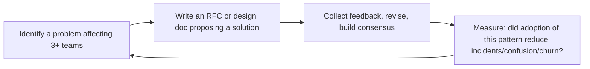

# Staff Engineer

Lead through technical influence, not authority. The Staff/Principal Engineer is the IC who sets
technical direction across multiple teams, mentors senior engineers, solves the hardest problems,
and multiplies impact far beyond what one person can code. This skill covers the complete staff
engineering loop: discover the right problems, design the right solutions, align the organization,
and ensure execution without owning the teams.

## Route the Request
<!-- Machine-executable routing: 8 file_contains/file_exists rows A1-A8 + Intent Route fallback -->

### Auto-Route (No User Input Required)
Evaluate these file-system conditions in order. First match wins — jump immediately.

| # | Detect Condition | Route To | Intent Route Fallback |
|---|-----------------|----------|----------------------|
| **A1** | `file_contains("**/RFC*.md\|**/rfc*.md", "status\|proposal\|decision\|alternatives considered")` OR `file_exists("**/rfc/**/*.md")` | Jump to **Core Workflow > Phase 2: Design** | "I detect RFC documents — routing to Design phase for RFC authoring and review." |
| **A2** | `file_contains("**/*.md", "ADR\|architecture decision record\|architectural decision")` OR `file_exists("**/adr/**/*.md")` | Jump to **Core Workflow > Phase 2: Design** + invoke **system-architect** skill | "I detect ADR files — routing to Design phase for architecture decision records." |
| **A3** | `file_contains("**/*.md", "design review\|tech review\|architecture review")` AND `file_contains("**/*.md", "agenda\|attendees\|decision\|outcome")` | Jump to **Decision Trees > How Do I Drive Alignment?** | "I detect design review documents — routing to Alignment decision tree." |
| **A4** | `file_contains("**/*.md", "migration plan\|adoption plan\|rollout\|migration strategy")` AND `file_contains("**/*.md", "cross.team\|multi.team\|org.wide")` | Jump to **Error Decoder > Adoption without Accountability** | "I detect cross-team migration/adoption docs — routing to Adoption patterns. Publish-and-pray is an anti-pattern." |
| **A5** | `file_contains("**/*.md", "tech debt\|technical strategy\|technology roadmap\|platform strategy")` AND `file_contains("**/*.md", "quarter\|Q[1-4]\|OKR\|initiative")` | Jump to **Core Workflow > Phase 1: Discovery** | "I detect technical strategy documents — routing to Discovery phase for problem validation." |
| **A6** | `file_contains("**/*.md", "mentoring\|mentorship\|pair with\|teach\|guide")` AND `file_contains("**/*.md", "senior\|staff\|principal\|growth")` | Jump to **Best Practices > Mentoring Senior Engineers** | "I detect mentoring/senior growth documents — routing to Mentoring best practices." |
| **A7** | `file_contains("**/*.md", "performance review\|feedback\|underperform\|1:1")` AND `file_contains("**/*.md", "engineer\|IC\|individual contributor")` | Route to **engineering-manager** skill | "I detect people management/performance content — routing to Engineering Manager. Staff engineers enable, managers direct." |
| **A8** | `file_exists("**/design-system/**\|**/component-library/**\|**/style-guide/**")` OR `file_contains("**/*.md", "code review.*standards\|coding standards\|best practices.*guide")` | Jump to **Core Workflow > Phase 4: Execution** | "I detect shared standards/guides — routing to Execution phase for pairing and implementation support." |

### Intent Route (Ask the User)
If no auto-route matched, use this intent tree:

```
What are you trying to do?
├── DECIDE what to work on
│   ├── Cross-team architecture problem? → Start at "Decision Trees > Which Problem Do I Tackle?"
│   ├── Team-level design or refactor? → Invoke system-architect skill instead
│   ├── People management problem? → Invoke engineering-manager skill instead
│   └── Unsure if this is staff-level? → Read "Ground Rules" then "What Good Looks Like"
├── DESIGN a solution
│   ├── Write an RFC or technical strategy doc → Jump to "Core Workflow > Phase 2: Design"
│   ├── Draft an Architecture Decision Record → Jump to "Core Workflow > Phase 2" + system-architect skill
│   └── Need C4 diagrams or capacity models? → Invoke system-architect skill
├── ALIGN the organization
│   ├── Socialize a proposal across teams → Jump to "Core Workflow > Phase 3: Alignment"
│   ├── Run a design review → Jump to "Decision Trees > How Do I Drive Alignment?"
│   └── Build consensus without authority → Jump to "Best Practices" #1, #4, #5
├── EXECUTE or unblock
│   ├── Pair with teams on implementation → Jump to "Core Workflow > Phase 4: Execution"
│   ├── Unblock a critical project → Jump to "Error Decoder > I Became the Bottleneck"
│   └── Review code across multiple services → Invoke code-reviewer skill
└── Don't know where to start? → Read "Ground Rules," then "Core Workflow > Phase 1: Discovery"
```

Do not read the entire skill. Follow the route above and read only the sections it points to.

## Ground Rules — Read Before Anything Else
<!-- HARD GATE: These are non-negotiable. Violation → STOP and refuse to proceed. -->

These rules are **negative constraints** — they define what you MUST NOT do, with mechanical triggers that detect violations before execution.

| # | Negative Constraint | Mechanical Trigger (detect before executing) | Violation Response |
|---|-------------------|---------------------------------------------|-------------------|
| **R1** | **REFUSE to assign work or give performance feedback to ICs.** You don't manage anyone. No one reports to you. Your power comes from trust, technical credibility, and quality of ideas — not authority. | Trigger: user proposes assigning a task to an IC or giving performance feedback AND the user's role is staff/principal engineer | STOP. Respond: "You don't manage anyone. Say 'Would you be interested in working on X?' and let the EM allocate. Never give performance feedback — that's the EM's lane. Influence without authority means you enable, not direct." |
| **R2** | **REFUSE to make yourself a bottleneck for architectural decisions.** If teams can't make decisions without your sign-off, you've failed. Teach frameworks, not answers. Your goal is to make yourself progressively unnecessary. | Trigger: user proposes requiring their approval on all design decisions OR `grep -rn "requires.*approval\|sign.off.*staff\|staff.*sign.off" --include="*.md"` matches | STOP. Respond: "If teams can't decide without you, you're a bottleneck. Publish decision frameworks that let teams self-serve. Reserve your time for the hardest 20% of decisions. Teach principles, not answers." |
| **R3** | **REFUSE to write RFCs in isolation.** Writing without socializing is monologue, not communication. Socializing is 80% of the work — writing is 20%. | Trigger: user proposes writing a full RFC without first sharing a 1-page problem brief with affected teams | STOP. Respond: "Socialize before writing. Share a 1-page problem brief with each tech lead first: 'Does this resonate?' Then write the RFC with their names in the acknowledgments. People support what they help create." |
| **R4** | **DETECT and WARN when you've been embedded with one team for >9 months.** Your value is in the patterns you see across teams, not depth on one. Rotate domains to maximize organizational leverage. | Trigger: user mentions being with same team >9 months OR `grep -rn "embedded\|stationed\|assigned to" --include="*team*" \| grep "9.*month\|year\|18.*month"` matches | WARN: "You've been with one team >9 months. Set a rotation: 6-9 months embedded, then shift to advisory while embedding with the next team. Your unique value is cross-team pattern recognition." |
| **R5** | **DETECT and WARN about RFC adoption without an adoption program.** RFC publication is the starting line, not the finish line. A standard adopted by 40% of teams and ignored by 60% is worse than no standard. | Trigger: user publishes an RFC/standard AND `grep -rn "adoption plan\|migration timeline\|rollout phase\|accountability" --include="*.md"` returns 0 | WARN: "You've published a standard without an adoption program. Add: (1) phased milestones with dates, (2) adoption shepherd per team, (3) dashboard showing per-team status, (4) hard cutoff date for old standard deprecation. Adoption without accountability is wishful thinking." |
| **R6** | **DETECT and WARN when office hours are consumed by tactical questions instead of strategic ones.** If >50% of office hours topics are 'How do I configure X?', you haven't published enough self-service documentation. | Trigger: audit of office hours topics shows >50% tactical/how-to questions | WARN: "Your office hours are being consumed by tactical questions. Write decision guides and configuration playbooks for the top 5 repeated topics. Reserve office hours for problems that genuinely need your judgment — 'Should we use X or Y for this problem?' not 'How do I configure X?'" |
| **R7** | **STOP and DETECT when solving systemic issues alone without teaching anyone.** If you fix the same pattern twice, you failed to teach it the first time. | Trigger: user proposes fixing a systemic issue that has occurred before AND no pairing/teaching plan is proposed | STOP. Respond: "Pair with a senior engineer from each affected team during this fix. Write a Pattern Report explaining root cause and fix pattern. The goal: make the next occurrence self-service. If you fix it alone, you'll fix it again next quarter." |

## The Expert's Mindset

Staff engineering is not "senior engineer plus more code." It's a fundamentally different role: **you achieve impact through influence, not authority; through teaching, not doing; through making the whole system better, not just your piece**. The output is not code — the output is a stronger engineering organization.

### Mental Models

| Model | Description |
|---|---|
| **Force multiplier, not force** | A senior engineer writes great code. A staff engineer makes 10 senior engineers write better code. Your impact is measured in the delta of others' output, not your personal output. |
| **Technical authority without organizational authority** | You don't manage anyone. You lead through: deep expertise, clear reasoning, and earned trust. If people follow your direction because they have to, you've already failed. |
| **The system is the product** | Your "code" is the technical direction, the architecture decisions, the RFC process, the design review culture. If these systems are working, great engineers produce great outcomes without you touching a line of code. |
| **Pace-setting vs. pace-making** | You set the technical bar (pace-setting): what good looks like, what quality means, what architecture patterns we follow. You don't make the pace (pace-making): that's the EM's job. |

### Cognitive Biases in Technical Leadership

| Bias | How It Shows Up | Defense |
|---|---|---|
| **Expertise trap** | Solving problems yourself because it's faster than teaching others | Every time you solve a problem you could have delegated, you've robbed someone of a learning opportunity and yourself of scaling. |
| **Technical vanity** | Pursuing elegant architectures that don't solve real business problems | Every technical initiative must have a business rationale: "This refactor reduces page load by 2s, which increases conversion 0.5%." |
| **Recency bias in architecture** | Over-correcting for the last production incident with heavy-handed architectural changes | Look at 12 months of incidents. The last fire is a data point, not a mandate. |
| **Not-invented-here in RFCs** | Dismissing ideas from outside your team or specialty | The best technical decision wins, regardless of source. Judge the idea, not the author. |

### What Masters Know That Others Don't

- **The best staff engineers make themselves unnecessary.** Your goal is to build systems, patterns, and teaching that enable the organization to make good technical decisions without you. If every architecture decision still routes through you after 2 years, you haven't scaled.
- **Writing is your highest-leverage activity.** An RFC read by 50 engineers has 50x the impact of a conversation with 1 engineer. Write decisions down. Write design patterns. Write post-mortems. Writing scales; speaking doesn't.
- **"It depends" is the staff engineer's superpower.** Junior engineers want rules. Staff engineers understand context. The answer to most technical questions starts with "it depends" because the right choice depends on constraints, trade-offs, and goals. Embrace the nuance.
- **Your technical judgment is your product, not your code.** Organizations don't need another senior IC — they need someone who can look at 5 teams' architecture proposals and identify the one that will work (and why the other 4 will fail).

## Operating at Different Levels

Staff engineering has distinct archetypes. The level manifests in scope of influence and the leverage of the work.

| Level | Staff Engineer Output Characteristics |
|---|---|
| **L1 — Apprentice** | A senior engineer learning the staff role. Needs frameworks for multiplying impact beyond personal output. |
| **L2 — Staff (archetype-specific)** | Operates in one staff archetype: Tech Lead (one team deep), Architect (cross-team design), Solver (deep-dive problems), Right Hand (amplifies leader). |
| **L3 — Senior Staff** | Operates across multiple archetypes. Sets technical direction for a department (30-80 engineers). RFCs, design reviews, and mentorship at scale. |
| **L4 — Principal** | Sets technical strategy for the organization (100+ engineers). "This is the 3-year technical direction." Creates patterns adopted by multiple teams. |
| **L5 — Distinguished/Fellow** | Creates technical approaches adopted across the industry. Sets the standard for the engineering discipline itself. |

**Usage**: Say "as a Staff engineer in the Architect archetype, review this cross-team proposal." Default: **L2 (Staff)** — one archetype, cross-team scope.

## When to Use
<!-- QUICK: 30s — scan the bullet list to decide if this skill fits -->
- Setting technical direction across 3+ teams where no single team owns the full problem
- Writing RFCs, technical strategy documents, or cross-team architecture proposals
- Running design reviews that produce decisions, not endless discussion
- Mentoring senior engineers who are themselves mentoring others
- Breaking organizational deadlocks where technical ambiguity blocks progress
- Evaluating whether a problem is staff-level or better handled by a team lead or architect
- Navigating ambiguous problems where both the solution *and* the problem definition are unclear
- Building technical brand: conference talks, internal tech blogs, open-source contributions
- Measuring and communicating IC impact without direct reports or delivery ownership

## Decision Trees
<!-- QUICK: 60s — follow the ASCII tree to your scenario -->

### Which Problem Do I Tackle?
```
                    ┌─────────────────────────────────┐
                    │ START: I have bandwidth for one  │
                    │ major initiative this quarter    │
                    └───────────────┬─────────────────┘
                                    │
                    ┌───────────────▼─────────────────┐
                    │ Does this problem span 3+ teams  │
                    │ with no single owner?            │
                    └──────────┬──────────────────┬────┘
                               │ YES              │ NO
                    ┌──────────▼────────┐  ┌──────▼──────────────┐
                    │ Could be staff-   │  │ Can a tech lead or   │
                    │ level. Continue.  │  │ senior engineer own  │
                    └──────────┬────────┘  │ this? If yes, let    │
                               │            │ them. Go find a     │
                    ┌──────────▼────────┐  │ harder problem.      │
                    │ Is the problem    │  └──────────────────────┘
                    │ definition itself │
                    │ ambiguous?        │
                    └────┬──────────┬───┘
                         │ YES      │ NO
              ┌──────────▼──┐  ┌───▼──────────────────┐
              │ Staff-level. │  │ Will solving this    │
              │ Discovery    │  │ unlock 5+ engineers  │
              │ first.       │  │ for 3+ months?       │
              └──────────────┘  └───┬──────────────┬───┘
                                    │ YES          │ NO
                         ┌──────────▼──┐  ┌────────▼─────────────┐
                         │ Staff-level.│  │ Is this urgent AND   │
                         │ Go to Phase │  │ only you can solve   │
                         │ 2: Design.  │  │ it?                  │
                         └─────────────┘  └───┬──────────────┬───┘
                                              │ YES          │ NO
                                   ┌──────────▼──┐  ┌────────▼───┐
                                   │ Do it fast, │  │ Delegate.  │
                                   │ then find a │  │ Your time  │
                                   │ bigger      │  │ is better  │
                                   │ problem.    │  │ spent else-│
                                   └─────────────┘  │ where.     │
                                                    └────────────┘
```

### How Do I Drive Alignment?
```
                    ┌─────────────────────────────────┐
                    │ START: I have a proposal that    │
                    │ needs buy-in from 3+ teams       │
                    └───────────────┬─────────────────┘
                                    │
                    ┌───────────────▼─────────────────┐
                    │ Have you already socialized      │
                    │ 1:1 with each tech lead?         │
                    └──────────┬──────────────────┬────┘
                               │ YES              │ NO
                    ┌──────────▼────────┐  ┌──────▼──────────────────┐
                    │ Has the RFC been  │  │ Stop. Schedule 30-min   │
                    │ open for comment  │  │ 1:1 with each affected  │
                    │ for 1+ week?      │  │ tech lead BEFORE the    │
                    └────┬──────────┬───┘  │ group review. Learn     │
                         │ YES      │ NO   │ their concerns first.   │
              ┌──────────▼──┐  ┌───▼──────┴─────────────────────────┐
              │ Are there   │  │ Open the RFC for async comment.    │
              │ unresolved  │  │ Set a 1-week deadline. Ping once   │
              │ objections? │  │ mid-week.                           │
              └───┬─────┬───┘  └────────────────────────────────────┘
                  │ YES │ NO
       ┌──────────▼──┐ ┌▼──────────────────┐
       │ Schedule a  │ │ Decision made.     │
       │ 60-min      │ │ Publish the ADR   │
       │ design      │ │ summarizing the    │
       │ review with │ │ outcome. Move to   │
       │ all object- │ │ Phase 4: Execution.│
       │ ors. Come   │ └────────────────────┘
       │ with options.│
       └──────┬──────┘
              │
   ┌──────────▼──────────────┐
   │ Can you resolve in one  │
   │ meeting? If NO, escalate│
   │ to CTO or Director. A   │
   │ decision is better than │
   │ perfect consensus.      │
   └─────────────────────────┘
```

## Core Workflow
<!-- STANDARD: 5min — the staff engineer's operating rhythm -->

### Phase 1: Discovery (~2 weeks per quarter)
1. **Listening tour**: Schedule 30-min 1:1s with every tech lead, EM, and product manager in your
   scope. Ask: "What's the hardest technical problem you're facing? What's slowing your team down?"
2. **Read the code**: Spend a day reading code in each team's critical services. Don't rely on
   descriptions — trust what the code actually says.
3. **Pattern-match across teams**: Look for the same problem appearing in three different places.
   That's your signal. Isolated problems stay with the team; patterns are staff work.
4. **Write a problem brief** (1-2 pages): "Here are the 5 hardest problems I see across teams.
   Here's which one I propose to tackle and why." Share with CTO and Director for calibration.
5. **Decide and commit**: Pick ONE problem for the quarter. Staff engineers who chase three things
   accomplish zero. Depth beats breadth at this level.

### Phase 2: Design (~3-4 weeks)
1. **Research**: Study how other companies solved this (design docs, conference talks, open-source
   implementations). Don't rediscover solved problems.
2. **Write the RFC** using the template in `references/`. Structure: Problem statement → Current
   state → Proposed solution → Alternatives considered → Migration plan → Success metrics.
3. **Include a 1-page executive summary.** Your CTO and Director will only read one page. The rest
   is for the engineers who will implement it.
4. **Pre-socialize with skeptics first.** Before opening the RFC, share it privately with the two
   engineers most likely to object. Their feedback will make the proposal stronger *and* they'll
   feel heard, reducing resistance later.
5. **Open the RFC for async comment.** Set a 1-week deadline. Respond to every comment — even if
   the response is "Noted, I'll address this in the next revision."
6. **Revise and publish v2.** Address substantive feedback. Tag people who commented. Show that you
   listened.

### Phase 3: Alignment (~2-3 weeks)
1. **Final design review** (60 min, mandatory attendees only): Present the v2 proposal. State
   non-negotiables upfront ("The constraint is we must be on our existing Kubernetes cluster").
   Facilitate, don't defend. Your goal is a decision, not a victory.
2. **ADR publication**: After the decision, publish a 1-page Architecture Decision Record with
   context, decision, and consequences. This is the permanent record of *why* we chose this path.
3. **Escalate when stuck**: If after one design review there's no decision, escalate to the CTO or
   Director. An imperfect decision today beats a perfect decision next quarter.
4. **Announce the decision**: Write a brief summary for the engineering-wide channel. What we
   decided, why, what changes for each team, and a link to the full RFC and ADR.

### Phase 4: Execution (~6-8 weeks, part-time)
1. **Pair with implementing teams**: Spend 1-2 days per week embedded with each team. Write code,
   review PRs, pair-program. Your credibility depends on staying hands-on.
2. **Be the unblocker**: When a team hits an obstacle that requires cross-team coordination, that's
   you. Make the call, send the message, schedule the meeting.
3. **Weekly sync**: 30-min standup with all implementing tech leads. "What's blocked? What's at
   risk? What surprised you?" Keep it short.
4. **Track adoption**: Define success metrics in the RFC and track them weekly. If adoption is
   below target by week 4, escalate. Don't wait until the quarter-end review.
5. **Write the retrospective**: After launch, publish a 1-page retro: what worked, what didn't,
   what we'd do differently. This becomes organizational learning, not just project memory.

## Cross-Skill Coordination
<!-- QUICK: 30s — table of who to talk to when -->
The Staff Engineer operates at the intersection of architecture, strategy, and execution. You
consume direction from above and amplify it downward. You translate strategy into architecture
and architecture into code — without owning any of the teams in between.

### Architecture Governance Protocol

```
Org Design Decision (director-engineering) → Architecture Strategy (cto-advisor)
    └── RFC drafted (staff-engineer + system-architect)
        └── Design review (all affected tech leads)
            └── ADR published → implementation begins
                └── Quarterly architecture health report to director-engineering
```

**Key governance gates:**
- **Cross-team RFCs:** Staff engineer authors; `system-architect` reviews for technical correctness; `cto-advisor` approves strategic alignment; `director-engineering` ensures team capacity
- **ADR reversals:** Any architecture decision that reverses a prior ADR must be reviewed by `cto-advisor` + `system-architect` + all affected tech leads before publication
- **Tech debt prioritization:** Staff engineer quantifies tech debt in business terms (velocity drag, reliability risk); `engineering-manager` allocates capacity; `director-engineering` signs off on trade-offs

### Coordinate With

| Coordinate With | When | What to Share / Ask |
|-----------------|------|---------------------|
| **CTO Advisor** | Quarterly strategy review, major build-vs-buy decisions, technology radar updates | Technical feasibility of strategic goals, cross-team architectural constraints, emerging tech debt patterns |
| **System Architect** | New system design, scaling events, architecture review, cross-service boundaries | Business constraints from leadership, cross-team dependencies, non-functional requirements across services |
| **Engineering Manager** | Team capacity planning, hiring priorities, career development for senior engineers | Technical skill gaps you observe, engineers ready for stretch assignments, architecture decisions affecting the team |
| **Director Engineering** | Quarterly planning, org-wide technical initiatives, resource allocation across teams | Progress on cross-team initiatives, systemic blockers, technical health assessment of the org |
| **Code Reviewer** | Critical PRs across services, architecture-adherence checks, security-sensitive changes | Architecture decisions and design patterns the code should follow, known anti-patterns to flag |
| **Technical Writer** | RFC publication, ADR templates, engineering blog posts, internal documentation standards | Technical content for broad distribution, documentation gaps you've identified across teams |
| **Backend Developer** | Service implementation, API design, data modeling, performance optimization | Architecture decisions, design patterns, migration plans, coding standards |
| **Frontend Developer** | API contract design, performance budgets, cross-cutting UX architecture | Backend contract decisions, data shape changes, latency budgets from the backend |
| **Product Manager** | Roadmap trade-offs, technical feasibility of features, sequencing decisions | Technical constraints, estimated effort for cross-team work, architectural prerequisites for product features |

### Communication Triggers — When to Proactively Notify

| Trigger | Notify | Why |
|---------|--------|-----|
| RFC published for cross-team review | All affected tech leads, CTO Advisor, System Architect | Async feedback period starts; 1-week deadline |
| Design review decision made | All attendees, Director Engineering, CTO Advisor | ADR published; implementation begins |
| Cross-team migration starting | Backend/Frontend Developers, Engineering Managers, DevOps | Teams need to schedule migration work |
| Systemic blocker identified (3+ teams stuck) | Director Engineering, CTO Advisor | May need resource reallocation or escalation |
| Senior engineer ready for staff track | Engineering Manager, Director Engineering | Career development planning, mentor assignment |
| Architecture decision reversing a prior ADR | CTO Advisor, System Architect, all affected tech leads | Explains why context changed; supersedes previous ADR |
| Quarterly technical health report complete | CTO Advisor, Director Engineering, all EMs | Org-wide visibility into tech debt, architecture health, and cross-team patterns |

### Escalation Path

```
Cross-team architecture deadlock (no decision after 2 design reviews)
  └── Escalate to CTO Advisor or Director Engineering. Decision required within 1 week.

Systemic quality degradation (3+ teams reporting same class of production issues)
  └── Escalate to Director Engineering + CTO Advisor. Propose root cause + remediation plan.

Team repeatedly bypassing architecture decisions
  └── 1:1 with the tech lead first (assume good intent). If unresolved, involve the EM.
      If still unresolved, escalate to Director Engineering.

Existential technical risk (data loss, security vulnerability, extended outage pattern)
  └── CTO Advisor + Security Engineer immediately. Incident process if active.
```

## Proactive Triggers
<!-- QUICK: 30s -- trigger-action table for autonomous Staff Engineer workflow -->

The Staff Engineer detects systemic technical patterns before they become org-wide problems. Every trigger is tied to an observable signal across teams.

| Trigger | Action | Why |
|---------|--------|-----|
| 3+ teams independently building the same utility (auth middleware, rate limiter, feature flag system) without coordination | Publish an RFC proposing a shared solution; identify one team to build the canonical version; set a deprecation timeline for the duplicate implementations; socialize with all `engineering-manager`s | Duplicated infrastructure is the silent tax on velocity — 3 teams maintaining the same thing is 3x the bugs, 3x the on-call, 3x the migration cost |
| `system-architect` publishes an ADR that reverses a decision you authored 2 years ago — context changed but nobody updated the dependent teams | Celebrate the reversal: it means the org is learning. Write a 1-page "ADR Superseded" addendum explaining what changed. Notify all teams that built against the original decision. Turn the reversal into a teaching moment about when to revisit decisions | Architecture decisions have a shelf life. Reversing a past decision is not failure — it's evidence that the org adapts. The staff engineer normalizes reversals so that teams don't cling to decisions past their expiration date |
| A senior engineer you mentor has been leading technical design for their team for 6 months but hasn't written their first RFC — they're making decisions in isolation | Pair on their first RFC: you write the problem statement, they write the solution. Review together. Have them present at the next design review. The goal is to make their thinking visible and reviewable — the RFC is the artifact, but the skill is structured technical communication | Senior engineers who design in isolation build local maxima. The RFC process forces designs to survive cross-team scrutiny. Your job is to get their first RFC across the line — after that, they'll self-propel |
| 2+ teams report the same class of production incident (e.g., "database connection pool exhaustion") in the same quarter — this is a systemic pattern, not a coincidence | Write a 1-page pattern diagnosis: what's common across the incidents, why the default configs are dangerous, what the correct settings are. Propose a lint rule or pre-flight check that catches this at PR time. Socialize to all tech leads | Recurring production incidents across teams are architecture failures, not ops failures. The staff engineer's job is to find the pattern and fix it at the source — a lint rule that prevents the bug is worth 100 incident reviews |
| `cto-advisor` asks you to evaluate a new technology (e.g., "should we adopt Rust for performance-critical services?") — this is a technology radar decision, not a yes/no question | Write a 2-page evaluation: (1) what problem does it solve that our current stack doesn't? (2) what's the adoption cost (hiring, training, tooling, migration)? (3) what's the risk of NOT adopting? (4) recommendation: adopt / experiment / watch / ignore. Don't advocate — analyze | Technology decisions are portfolio decisions. The CTO needs trade-off analysis, not advocacy. Your job is to make the cost and risk visible so the org can decide intentionally |
| Survey your office hours bookings over 3 months — 60%+ are from the same 2 teams. The other 6 teams never book time | Those 6 teams either (a) don't know you exist, (b) don't think you're relevant to their problems, or (c) are stuck but don't know they're stuck. Schedule a 15-min coffee with each tech lead from the silent teams. Ask: "What's the hardest technical problem your team is facing?" | Office hours that serve only a subset of teams create an information bubble. The staff engineer's value is in the patterns they see across ALL teams — if half the org is invisible to you, you're missing half the signals |
| A team ships a new service that violates 4 of the published architecture decision frameworks (wrong database, wrong communication pattern, wrong auth model) — they read the frameworks and decided they didn't apply | Don't block the launch. Schedule a post-launch architecture review. Ask: "Help me understand why you made different choices." Listen — the frameworks might be wrong for their use case, or the team might have valid reasons the framework didn't cover. Update the framework with their learnings | Frameworks are living documents. When teams bypass them, treat it as a learning signal, not a compliance failure. The framework exists to help teams make good decisions, not to enforce conformity. If a team made a different choice and it worked, the framework should evolve |

### Service Interaction: Staff Engineer → System Architect

The Staff-Engineer-to-System-Architect partnership is where cross-team architecture is designed and governed. The staff engineer operates across teams; the system architect operates within a domain. Together they ensure architecture decisions are both principled and practical.

| Interaction Point | What Staff Engineer Provides | What System Architect Needs |
|-------------------|---------------------------|---------------------------|
| **RFC authorship review** | Cross-team perspective: "How will this decision affect teams B, C, and D?" Validation that the RFC addresses patterns seen across the org | Domain depth: "Is this technically correct for the systems involved?" Validation that the RFC doesn't violate system-level constraints |
| **Architecture decision escalation** | When two teams deadlock on a technical decision, the staff engineer facilitates resolution by framing trade-offs in business terms | When the deadlock requires domain-specific judgment (e.g., "which database is right for this workload?"), the system architect provides the technical tiebreaker |
| **Technology radar updates** | Field signals from all teams: what's working, what's causing friction, what teams are experimenting with | Domain expertise: is this technology mature enough for our context? What are the operational implications at our scale? |
| **Cross-team migration design** | Migration strategy that works across team boundaries: sequencing, dual-run approach, cutover criteria that span multiple services | System-level constraints: which services can't have downtime, which data stores have ordering requirements, what are the hard coupling points |
| **ADR portfolio health** | Quarterly audit: which ADRs are still valid? Which have been superseded by context changes? Which are being ignored? | Technical assessment: are the architectural principles still sound? Are there new constraints that invalidate past decisions? |

## Best Practices
<!-- DEEP: 10+min -->
<!-- STANDARD: 3min — rules extracted from production experience -->

- **Write strategy, not just architecture.** A system architect designs a system. A staff engineer
  designs the *technical direction* for multiple systems. Your documents should answer "Where are we
  going technically and why?" not just "How does this service work?"
- **Run design reviews that decide, not discuss.** Start every design review by stating: "By the end
  of this meeting, we will decide X." If you can't state the decision, you're not ready for the
  review. Send pre-reads 48 hours in advance. If someone hasn't read them, reschedule — don't waste
  everyone's time catching them up.
- **Mentor seniors, not juniors.** Your highest-leverage mentorship is with senior engineers who
  mentor others. Teach them to think at the system level, write RFCs, and navigate ambiguity. One
  hour with a senior engineer who mentors five juniors multiplies your impact 5x.
- **Navigate ambiguity by writing the first bad draft.** When the problem is unclear, don't wait for
  clarity. Write a 1-page document that's probably wrong. Circulate it with "This is a strawman —
  tear it apart." People are far better at critiquing concrete proposals than generating them from
  scratch. Your bad draft creates the conversation that produces the good answer.
- **Say no gracefully.** "That's a valuable problem, and I think [tech lead name] would do a great
  job leading it. I'm focused on [your initiative] this quarter because [business impact]. Happy to
  review their proposal." You're not saying the problem doesn't matter — you're saying it needs a
  different owner.
- **Manage time across teams with office hours.** Hold two 1-hour open office hours per week where
  any engineer can book a 15-min slot. This creates a predictable channel for questions without
  constant interruptions. Everything else goes through async channels (Slack, RFC comments).
- **Measure impact without direct reports.** Track: (a) number of engineers unblocked by your work,
  (b) decisions made through your RFCs/ADRs, (c) teams that adopted patterns you introduced, (d)
  senior engineers you mentored who were promoted. If you can't quantify your impact, you can't
  justify the staff role.
- **Build technical brand inside and outside.** Give one internal tech talk per quarter. Write one
  external blog post or conference proposal per half. Review PRs in open-source projects your
  company depends on. Your brand creates trust — when you propose something bold, people listen
  because they know your work.

## Anti-Patterns
<!-- DEEP: 5min -- each anti-pattern includes machine-detectable patterns -->

| ❌ Anti-Pattern | ✅ Do This Instead | 🔍 Detect (grep / lint) | 🛡️ Auto-Prevent |
|-----------------|---------------------|--------------------------|-------------------|
| **The bottleneck architect**: Every design decision flows through your approval. Teams can't ship without your sign-off. Engineers stop thinking | Publish decision frameworks. Teach teams to use them. In design reviews, facilitate — don't dictate. Your goal is to make yourself progressively unnecessary | `grep -rn "requires.*approval\|sign.off\|staff.*must.*review" --include="*.md"` → finds gate-keeping language in process docs | Decision framework template: `templates/decision-framework.md` — publish 3+ frameworks for common patterns, then redirect requests to frameworks |
| **The ivory tower RFC**: Writing a 40-page RFC in isolation, publishing to silence, teams built something different | Socialize first: coffee with each tech lead, 1-page problem brief, then full RFC with their names in acknowledgments | `grep -rn "RFC\|proposal\|design doc" --include="*.md" \| grep -v "socialized\|stakeholder\|feedback\|acknowledgment"` → finds RFCs without socialization artifacts | RFC template: `templates/rfc.md` — requires "Stakeholders Consulted" section with names and dates before publication |
| **The accidental manager**: Assigning work directly to engineers, giving performance feedback, overriding EM allocation | Say "Would you be interested in working on X?" and let the EM allocate. Process and people problems go to the EM first | `grep -rn "I need you to\|you should work on\|your performance\|you need to improve" --include="*1:1*\|*standup*"` → finds directive language toward ICs from non-managers | Lane boundary agreement: `templates/em-staff-boundary.md` — signed by staff engineer and EM, reviewed quarterly |
| **The permanent resident**: Staying embedded with one team for 18+ months — org gets zero leverage from your role elsewhere | Set rotation: 6-9 months embedded, then advisory + next team embed. Value is cross-team patterns, not single-team depth | `grep -rn "team\|squad\|pod" --include="*calendar*\|*standup*\|*planning*" \| sort \| uniq -c \| sort -rn` → dominant team in calendar for >9 months | Calendar audit: `scripts/staff-rotation-check.sh` — flags if >75% of meeting time is with same team for >9 months |
| **The solution in search of a problem**: Designing elegant event-sourcing for 100x scale while business is bleeding customers from slow onboarding | Before committing, ask 3 people outside engineering: "What's the biggest technical limitation hurting our business?" Align with their answers | `grep -rn "scale\|performance\|optimization\|event.sourcing\|Kafka\|CQRS" --include="*RFC*\|*proposal*" \| grep -v "business impact\|revenue\|customer\|churn"` → finds technical proposals without business validation | RFC template: `templates/rfc.md` — requires "Business Impact" section quantified in customer/revenue terms |
| **Decision frameworks as law**: Publishing frameworks, shaming teams that deviate — turning guidance into compliance theater | When a team deviates, ask "What did you learn that the framework didn't cover?" Update the framework. They're living documents | `grep -rn "violation\|non.compliant\|must follow\|mandatory" --include="*framework*\|*standard*\|*guide*"` → finds compliance-enforcement language in guidance docs | Framework governance: `templates/framework-exception.md` — teams submit exception with learnings; framework updated quarterly |
| **The lone hero**: Fixing systemic issues alone — writing utility, deploying fix, moving on — without teaching anyone | Pair with senior engineer from each affected team. Write a Pattern Report. If you fix same pattern twice, you failed to teach it the first time | `grep -rn "I fixed\|I deployed\|I wrote\|I added" --include="*postmortem*\|*incident*\|*fix*" -A 5 \| grep -v "paired\|taught\|documented\|trained\|workshop"` → finds solo fixes without knowledge transfer | Pattern Report template: `templates/pattern-report.md` — required for any systemic fix; includes "How to Reproduce" and "Self-Service Fix" sections |
| **Office hours as a crutch**: Fully booked with tactical questions ("How do I configure X?") instead of strategic ones ("Should we use X or Y?") | Audit topics quarterly. If tactical dominates, publish self-service docs. Reserve office hours for judgment-needed problems | `grep -rn "how do I\|how to configure\|how to set up\|what command" --include="*office-hours*\|*office-hours-notes*"` → count tactical vs. strategic questions | Office hours audit: `scripts/office-hours-audit.sh` — classifies topics as tactical/strategic, alerts if tactical >50% |
| **Publish-and-pray adoption**: Publishing RFC, getting CTO approval, expecting teams to implement — no adoption tracking | Treat adoption as a program: phased milestones, adoption shepherd per team, dashboard, hard cutoff for old standard deprecation | `grep -rn "adoption\|migration status\|rollout progress\|completion" --include="*RFC*\|*standard*\|*migration*" \| wc -l` → < 3 matches → publish-and-pray pattern | Adoption tracker: `templates/adoption-dashboard.md` — per-team status (not started/in progress/complete), auto-alert on stalled teams |

## Error Decoder
<!-- DEEP: 5min -- each entry includes a console-string matcher for automatic recovery loops -->

| 🖥️ Console Match (grep pattern) | Symptom | Root Cause | Fix | 🔄 Auto-Recovery Loop |
|---|---|---|---|---|
| `grep -rn "requires.*staff.*approval\|staff.*sign.off\|must.*review.*staff" process*.md \| wc -l` > 3 | Every architecture decision flows through you. Teams can't ship without your sign-off. Velocity drops. Engineers stop thinking | Built dependency on your judgment instead of teaching others to decide. Answered questions instead of teaching principles | Publish decision frameworks for 3+ common patterns. Refuse to answer individual questions — point to framework. In design reviews, facilitate, don't give answers | 1. `scripts/audit-approval-gates.sh` — counts approval gates mentioning your name 2. If >3: publish decision framework 3. Template: `templates/decision-framework.md` 4. Redirect all requests: "Use the framework at [link]" |
| `grep -rn "RFC\|proposal\|design doc" rfc/*.md \| grep -v "stakeholder\|feedback\|acknowledgment\|consulted" \| wc -l` > 0 | Spent weeks writing 40-page RFC. Published to silence. Teams built something completely different | Confused writing with communicating. Socializing is 80% of work; writing is 20%. Wrote first, never consulted stakeholders | Socialize before writing: coffee with each tech lead, 1-page problem brief, "Does this resonate?" Then full RFC with acknowledgments | 1. `scripts/audit-rfc-socialization.sh` — checks for stakeholder consultation artifacts 2. If missing: block RFC publication 3. Template: `templates/rfc-socialization-checklist.md` 4. Require 3+ stakeholder names before RFC goes to review |
| `grep -rn "I need you to\|you should work on\|assign.*to\|your performance" --include="*1:1*" staff-notes*.md \| wc -l` > 0 | Assigned work, gave performance feedback, overrode EM allocation. EM undermined. Engineers confused about who their manager is | Forgot that leadership comes through influence, not authority. Crossed into EM's lane | Never give performance feedback or assign work. Say "Would you be interested in X?" Let EM allocate. Discuss process issues with EM privately first | 1. `scripts/audit-staff-language.sh` — scans 1:1 notes for directive/feedback language 2. If matches: flag "accidental manager" pattern 3. Template: `templates/em-staff-boundary.md` 4. Schedule EM partnership calibration |
| `grep -rn "team\|squad\|pod" calendar*.csv \| sort \| uniq -c \| sort -rn \| head -1 \| awk '{print $1}'` > 75% of total | Stayed 18 months on one team. Became go-to expert. Org lost your leverage across every other team | Comfort. Familiar team was satisfying. New domain meant less competence. Chose comfort over organizational impact | Set time limit: 6-9 months embedded max. Shift to advisory + next team embed. Cross-team patterns = your unique value | 1. `scripts/staff-rotation-check.sh` — parses calendar for team dominance 2. If >9 months with >75%: flag rotation needed 3. Generate rotation plan 4. Template: `templates/staff-rotation-plan.md` |
| `grep -rn "event.sourcing\|Kafka\|CQRS\|microservice.*scale\|rewrite\|migration" rfc/*.md \| grep -v "business impact\|revenue\|customer\|churn\|cost" \| wc -l` > 0 | Spent quarter designing elegant event-sourcing for 100x load. Zero business impact. Real problem: customer churn | Chose technically interesting problem instead of what mattered to business. Didn't validate with product/sales/CEO | Before committing: ask 3 people outside engineering "What's the biggest technical limitation hurting our business?" Align with their answers | 1. `scripts/audit-rfc-business-impact.sh` — checks for business impact section 2. If missing: block RFC 3. Template: `templates/rfc-business-validation.md` 4. Require 3 non-engineering stakeholder sign-offs |
| `grep -rn "adoption\|migration.*status\|rollout.*progress\|completion.*rate" rfc/*.md \| wc -l` < 3 | Published observability standard for all services. CTO approved. One year later: 4/12 teams adopted, 3 partially, 5 ignored. Two inconsistent standards now exist | Treated adoption as publish-and-pray: write RFC, get approval, expect implementation. No tracking, no accountability | Treat adoption as program: phased milestones, adoption shepherd, dashboard, hard cutoff for old standard deprecation | 1. `scripts/audit-adoption-plan.sh` — checks RFC for adoption program 2. If missing: block RFC publication 3. Template: `templates/adoption-program.md` 4. Create per-team adoption dashboard |
| `grep -rn "how do I\|how to config\|how to set up\|what command\|where is" office-hours*.md \| wc -l` / total office-hours topics > 0.5 | Office hours fully booked with tactical questions. Strategic problems go unaddressed. Engineers use you as human Stack Overflow | Haven't published enough self-service documentation. Office hours became help desk shift | Write decision guides and configuration playbooks for top 5 repeated topics. Reserve office hours for judgment-needed problems | 1. `scripts/office-hours-audit.sh` — classifies topics tactical vs. strategic 2. If tactical >50%: identify top 5 repeated topics 3. Template: `templates/self-service-guide.md` 4. Publish guides, redirect: "See guide at [link] — if it doesn't cover your case, book office hours" |
| `grep -rn "I fixed\|I deployed\|I wrote\|I built" postmortem*.md -A 10 \| grep -v "paired\|taught\|documented\|workshop\|trained" \| wc -l` > 0 | Fixed systemic issues alone. Same pattern recurred 3 months later in another team. Had to fix it again | Lone hero pattern. Fixed symptoms, didn't build capability. If you fix same pattern twice, you failed to teach it the first time | Pair with senior engineer from each affected team. Write Pattern Report with self-service fix instructions. Knowledge transfer = primary deliverable | 1. `scripts/audit-postmortem-ownership.sh` — checks for solo fixes 2. If solo fix: flag lone hero pattern 3. Template: `templates/pattern-report.md` 4. Schedule pairing session with affected teams |

## Production Checklist
<!-- QUICK: 30s -- binary pass/fail items. Each has a mechanical validation command. -->

| ID | Checklist Item | Validation Command | Auto-Fix |
|----|---------------|-------------------|----------|
| **[SE1]** | RFC template exists and is accessible to all engineers — includes Stakeholders Consulted, Business Impact, Adoption Plan sections | `grep -rn "RFC\|rfc" --include="*.md" templates/ \| wc -l` → must be >= 1; `grep -c "Stakeholders Consulted\|Business Impact\|Adoption Plan" templates/rfc*.md` → must be >= 3 | Template: `templates/rfc.md` |
| **[SE2]** | Design review cadence established — bi-weekly, clear decision protocol, outcomes published | `find . -name "*design-review*\|*tech-review*" -mtime -14` → must return notes with decisions | Calendar: recurring bi-weekly with `templates/design-review-agenda.md` |
| **[SE3]** | Cross-team architecture map maintained — who owns what, what depends on what | `grep -rn "owns\|responsible\|depends.on" architecture-map*.md \| wc -l` → must be >= number of services × 2 | Template: `templates/architecture-map.md` — auto-generate from CODEOWNERS + service catalog |
| **[SE4]** | Mentoring load balanced — no more than 3 active mentees, documented growth goals each | `scripts/check-mentoring-load.sh` → counts active mentees, flags if >3 | Alert: notify staff engineer + CTO when mentee count exceeds 3 |
| **[SE5]** | Impact metrics tracked monthly — engineers unblocked, decisions made, adoption rates | `scripts/check-impact-metrics.sh` → verifies monthly metric file exists, flags if missing for >30 days | Template: `templates/impact-metrics.md` — auto-populated from RFC adoption dashboard |
| **[SE6]** | EM partnership defined — written agreement on lane boundaries (technical vs. people decisions) | `grep -rn "lane boundary\|EM.*staff.*agreement\|technical.*decisions.*vs.*people" --include="*.md"` → must match | Template: `templates/em-staff-boundary.md` — signed by both parties, reviewed quarterly |
| **[SE7]** | CTO relationship established — quarterly 1:1 to calibrate on organizational priorities | `find . -name "*CTO-1:1*\|*CTO-sync*" -mtime -90` → must return file | Calendar: recurring quarterly with `templates/cto-1-1-agenda.md` |
| **[SE8]** | Office hours running — 2x/week, 1 hour each, publicly bookable slots | `scripts/check-office-hours.sh` → verifies recurring calendar event exists with open booking | Calendar: recurring 2x/week with public booking link; auto-cancel if no bookings 24h prior |
| **[SE9]** | Decision frameworks published for 3+ common cross-team decisions | `grep -rn "decision framework\|when to use\|decision guide" --include="*.md" \| wc -l` → must be >= 3 | Template: `templates/decision-framework.md` — publish to shared wiki |
| **[SE10]** | Quarterly technical health report template defined and shared with leadership | `find . -name "*tech-health*\|*technical-health*" -mtime -90` → must return file | Template: `templates/technical-health-report.md` — auto-populated from service metrics |
| **[SE11]** | Succession plan exists — for each critical area you own, a senior engineer is being developed | `grep -c "succession\|ready.now\|backup\|being.developed" succession-plan*.md` → must be >= number of critical areas owned | Template: `templates/succession-plan.md` — one row per critical area |
| **[SE12]** | RFC backlog prioritized — known problems documented even if not yet staffed | `grep -rn "priority\|P[0-3]\|severity\|impact" rfc-backlog*.md \| wc -l` → must be >= 3 | Template: `templates/rfc-backlog.md` — quarterly grooming session |
| **[SE13]** | External visibility plan active — 1+ conference talk or blog post per half | `scripts/check-external-visibility.sh` → counts talks/posts in last 180 days, flags if 0 | Template: `templates/external-visibility-plan.md` — target conferences + abstract drafts |
| **[SE14]** | Time audit complete — verify 20%+ of time on critical path, not admin or firefighting | `scripts/time-audit.sh` → parses calendar, classifies time (critical path/mentoring/review/admin/firefighting), flags if critical path <20% | Cron: weekly time audit with Slack summary of allocation percentages |

## Scale Depth: Solo → Small Team → Medium Team → Enterprise
<!-- DEEP: 10+min -->
<!-- STANDARD: 2min — how the role changes as the org grows -->

### Solo (1 person, 0-100 users)
- **What changes**: No staff engineer role. Everyone is an IC doing everything. The concept doesn't
  apply — there's no "across teams" when there's one team.
- **What to skip**: Everything. Come back when you have 3+ teams.
- **Coordination**: N/A.

### Small Team (1-2 teams, 100-10K users)
- **What changes**: First staff engineer is often the most senior IC who naturally bridges backend,
  frontend, and infrastructure. Role is informal — you're "the person who figures out the hard
  stuff." RFCs are lightweight (1-2 pages). Design reviews happen at the whiteboard. No formal
  office hours; just be approachable.
- **What to skip**: Formal decision frameworks (socialize them in person). Quarterly health reports
  (weekly engineering sync covers it). External brand building (focus on internal impact first).
- **Coordination**: Weekly 1:1 with CTO. Pair-program with every engineer at least once a month.
  One shared `decisions.md` file for ADRs.

### Medium Team (5-10 teams, 10K-1M users)
- **What changes**: You now focus on 3-5 teams, not all of them. RFC process is formal (template,
  comment period, design review). Office hours are scheduled. You have a defined EM counterpart for
  each team. Mentoring shifts to tech leads — you help them grow into staff-level thinking. Start
  external visibility: one conference talk per year.
- **What to skip**: Organization-wide architecture governance (that's the CTO's domain). Vendor
  evaluation (unless deeply technical). Hiring decisions (consult, don't decide).
- **Coordination**: Bi-weekly 1:1 with CTO. Weekly sync with each EM. Monthly design review with
  all tech leads. Async RFC process. Formal ADR repository. Quarterly technical health report.

### Enterprise (10+ teams, 1M+ users, multiple staff engineers)
- **What changes**: You are one of several staff engineers, each with a domain (platform, product
  architecture, data, security). You coordinate with each other through a staff engineering forum
  (bi-weekly). You likely have a Principal Engineer above you setting org-wide technical strategy.
  Your scope narrows but deepens. External visibility is expected — conferences, open-source,
  industry working groups.
- **What to skip**: Trying to understand every team's codebase (impossible, focus on your domain).
  Attending every design review (send a delegate). Being the escalation point for everything (that's
  what the Principal Engineer is for).
- **Coordination**: Staff engineering forum (bi-weekly). Monthly 1:1 with CTO/Principal Engineer.
  Quarterly domain strategy review. Formal mentorship program. Published decision frameworks
  maintained as living documents. Annual external impact report.

## What Good Looks Like
<!-- STANDARD: 1min — the north star for this skill -->

You know you're succeeding as a Staff Engineer when:

- **Teams make better architectural decisions without you in the room** because you taught them how
  to think, not what to think. They invoke your frameworks, not your name.
- **Your RFCs get cited in other RFCs.** Engineers reference your work as the foundation they're
  building on. Your documents become organizational memory, not shelfware.
- **Senior engineers you mentored get promoted to staff.** Your highest-leverage output isn't code —
  it's the next generation of technical leaders who multiply your impact.
- **Problems that used to span teams now have clear owners.** You didn't solve the problem — you
  made the organizational structure visible and helped assign ownership.
- **The CTO trusts you with ambiguous, high-stakes problems** because you've demonstrated you can
  navigate from "I don't know what the problem is" to "Here's the decision we made, here's the ADR,
  and three teams are implementing it."
- **You can take a 4-week vacation** and nothing breaks. Decisions still happen. RFCs still get
  reviewed. Your frameworks, mentees, and documented patterns carry the load.
- **You're working on the hardest problem in the org**, and when you describe it to engineers
  outside the company, they say "I wish someone would solve that at my company."

## Footguns
<!-- DEEP: 10+min — war stories from staff engineering -->

| Footgun | What Happened | Root Cause | How to Prevent |
|---------|---------------|------------|----------------|
| Wrote a 40-page RFC for a service mesh migration — nobody read past page 8; 6 months later, a team built their own ad-hoc service discovery because they didn't know the RFC existed | A Staff Engineer spent 6 weeks writing a comprehensive RFC for migrating 12 services to a service mesh (Istio) — 40 pages covering architecture, migration plan, rollback strategy, failure modes, and performance benchmarks. They shared it in the #architecture Slack channel and presented it at a design review. Six months later, a product team built their own Consul-based service discovery because their service needed to find dependencies and "nobody told us there was a plan." The RFC was too long — no one finished it. The architecture review had 3 attendees (all infrastructure engineers). The product teams, who would do the actual migration, never saw it. | The RFC was written for the author — comprehensive documentation of their thinking — not for the audience who needed to act on it. The one-page executive summary was on page 9. The distribution strategy was "post in Slack" with no follow-up, no stakeholder identification, no accountability for who would read and approve. | **Every RFC must have a 1-page executive summary with: decision, rationale, and who-needs-to-do-what-by-when.** If the 1-pager doesn't convince them, the 40 pages won't either. Distribute RFCs with named stakeholders: tag specific people who MUST read and approve. Set a decision deadline. If you don't hear back, follow up in person. After the decision, publish a 1-paragraph ADR that links to the full RFC. The ADR is what people actually read. |
| Became the "approval bottleneck" — required your sign-off on every design review; teams stopped making decisions, waited 3-5 days for your review, velocity dropped 40% | A Staff Engineer was the most experienced architect in a 120-person org. They attended every design review, provided thoughtful feedback, and teams started routing all architectural decisions through them. The Staff Engineer saw this as "setting standards" and "preventing mistakes." A new service that should have taken 2 weeks took 7 because the team waited 5 days for the design review slot, then 3 more days for follow-up approval. Velocity across 4 teams dropped 40% year-over-year. The Staff Engineer was working 60-hour weeks just on reviews. When they took a 1-week vacation, design decisions stopped completely. | The Staff Engineer confused "influence" with "control." They didn't realize they'd become the bottleneck because nobody told them — teams adapted to the bottleneck rather than complaining. The review process had no delegation, no tiering (high-risk vs low-risk decisions), and no clear criteria for what NEEDED staff review vs what teams could decide independently. | **Define a tiered decision framework.** Tier 1 (Staff review required): data model changes affecting multiple services, new infrastructure dependencies, security-sensitive changes. Tier 2 (Team decides, Staff available for consultation): new service within existing patterns, technology choice within approved list. Tier 3 (Team decides independently): implementation detail within a service. Publish this framework, enforce it, and track how many decisions you're making — if it's more than 5 per week, you're a bottleneck. Set a SLA: "I'll respond to design review requests within 24 hours or it's auto-approved." |
| Solved a cross-team data consistency problem with an elegant architecture — didn't talk to the teams that would maintain it; 6 months later, the system was a haunted house nobody understood | A Staff Engineer designed an event-sourcing architecture to solve data consistency across the orders, inventory, and shipping services. It was technically brilliant: CQRS pattern, event store with Kafka, materialized views for query performance. They designed it in isolation, wrote the RFC, got approval from the architecture review board (other Staff Engineers), and handed off the design to 3 product teams to implement. Six months later: 2 of 3 teams had built workarounds because the event schema didn't match their actual data. The third team had 3 outages because the event store's failure modes weren't documented. The Staff Engineer had moved to the next problem. The system had no clear owner and accumulated "here be dragons" reputation. | The Staff Engineer designed FOR the teams, not WITH the teams. They didn't do a "design partnership" — co-creating the solution with the engineers who would maintain it. The handoff was a document, not a working relationship. There was no ongoing support model — the Staff Engineer expected a clean handoff and moved on. | **Never design a system without the teams who will maintain it in the room.** For cross-team architecture: run a 2-day design workshop with engineers from every affected team. They don't just review your design — they co-create it. After implementation starts, have weekly office hours for the first 6 weeks. Document: who owns each component, how to debug common failures, what the operational runbooks look like. Your job isn't done when the RFC is approved — it's done when the teams can operate the system without you. |
| Mentored 7 junior engineers simultaneously — all 7 thought they were your top priority; 3 left because they felt they weren't getting enough attention | A Staff Engineer was passionate about mentorship and agreed to mentor 7 junior-to-mid-level engineers across 4 teams. The request was flattering: "Can I pick your brain? Just 30 minutes every 2 weeks." With 7 mentees × 30 min biweekly + prep + follow-up = 6+ hours/week on mentorship alone. The Staff Engineer's schedule collapsed: design reviews slipped, RFCs were late, their own IC work stalled. Worse: the mentees noticed the attention was spread thin. Three left within 9 months — exit interviews cited "lack of mentorship and growth." The Staff Engineer had been assigned as the "official mentor" but couldn't deliver meaningful attention to 7 people. | The Staff Engineer said "yes" to every mentorship request without capacity planning. They treated mentorship as an infinite resource (like advice) rather than a finite one (like a meeting slot). There was no structured mentorship program with clear expectations, just ad-hoc requests that snowballed. | **Cap mentorship at 3 active mentees max.** Each mentee needs: (1) a monthly 1-hour dedicated session, (2) async code/design review access, (3) a written growth plan with quarterly goals. If someone asks and you're at capacity: "I'm at capacity for formal mentorship right now. Here are 3 other senior engineers I'd recommend, and I'm happy to do a one-time design review." Create a mentorship ladder: junior engineers pair with senior engineers, senior engineers with staff. Staff engineers mentor the senior engineers who mentor the juniors — multiply your impact, don't dilute it. |
| Published a framework that became dogma — teams applied it to problems it wasn't designed for; when you pointed this out, they said "but you wrote the framework" | A Staff Engineer created a "Service Boundary Decision Framework" — a decision tree for determining whether two functions should be in the same service or separate services. It was brilliant for backend microservices and prevented months of architectural debate. Over 2 years, the framework was applied to: database schema design, frontend component splitting, team org structure, and even API versioning strategy — contexts the framework was never designed for. When the Staff Engineer pointed out a team was misapplying it, they responded: "But this is the standard — you wrote it." The framework had become organizational dogma, not a decision aid. Teams stopped thinking critically and started pattern-matching. | The framework document had no "When NOT to use this framework" section. It was presented as universal truth rather than a context-specific tool. The Staff Engineer didn't anticipate that their authority (as the author) would prevent challenge. The framework had no expiration date or review cadence. | **Every framework you publish must include: "When to use this" AND "When NOT to use this."** Add specific anti-patterns: "This framework assumes services communicate over HTTP. Do NOT use for database design, organizational structure, or frontend architecture." Add an expiration date: "Review by [date]. Validated for [context]. If you're applying this in a different context, it's a hypothesis, not a rule." Encourage challenge: "If you think this framework is wrong for your situation, you're probably right. Come talk to me." |

## Calibration — How to Know Your Level
<!-- STANDARD: 3min — honest self-assessment -->

| You Know You're Stuck at L1 When... | You Know You've Reached L2 When... | You Know You're L3 When... |
|---|---|---|
| You can design a system well but you can't explain why the team that has to maintain it will hate you in 18 months — you've never had to operate your own designs | Teams you've never met make decisions using your frameworks; your RFCs are cited as "see Smith's analysis" in other RFCs; senior engineers seek you out for design review — not because they have to, but because your feedback makes their work meaningfully better | An engineer you mentored 3 years ago gets promoted to Staff, and in their promotion packet, they cite a specific conversation with you that changed how they think about system design — not what to do, but how to reason about trade-offs |
| You think "influence" means getting your way in meetings; people agree with you because arguing takes more energy | You teach a design review process to a team and 6 months later, they're running reviews without you — and the quality is indistinguishable from when you were in the room | You decline a project and the team still succeeds — because the frameworks, decision records, and senior engineers you developed make you optional, not essential |
| Your impact is measured by lines of code and Jira tickets closed | Your impact is measured by: decisions made, engineers unblocked, frameworks adopted, and promotions of engineers you've mentored — and you track these metrics monthly | An executive asks you "what's our biggest technical risk that nobody is talking about?" — and when you answer, they create a new initiative to address it before it becomes a crisis |

**The Litmus Test:** Can you name the 3 hardest technical problems in your organization right now — and have you written a document that frames each problem so clearly that any senior engineer could pick it up and start solving it? If the problems live only in your head, you're not L3 yet.

## Deliberate Practice

Staff engineering is unique: you don't get better by writing more code — you get better by increasing the leverage of your influence. Practice means producing artifacts that scale beyond your personal output.



| Level | Practice Routine | Frequency |
|---|---|---|
| **Novice** | Write an RFC for a cross-team technical decision — even if nobody asked for it | Monthly |
| **Competent** | Run a design review for a system you don't own. Practice asking: "What happens when this fails?" | Monthly |
| **Expert** | Mentor a senior engineer through their first cross-team architecture proposal. Don't do it for them — coach them through it. | Quarterly |
| **Master** | Write an essay or give a talk that changes how your industry thinks about a technical problem | Annually |

**The One Highest-Leverage Activity**: Write one RFC per month, even if it's for a problem nobody has asked to solve yet. Writing forces clarity. An RFC read by 50 engineers has 50× the impact of a conversation with one engineer.

## References
<!-- STANDARD: 3min -->

- **engineering-manager, system-architect, backend-developer** and others — for upstream design decisions, specifications, and architectural context that inform Staff-plus engineer — technical leadership, architecture decisions, mentoring, org-wide impact
- **system-architect, backend-developer, frontend-developer** and others — downstream skills that consume outputs from this skill for implementation and execution
